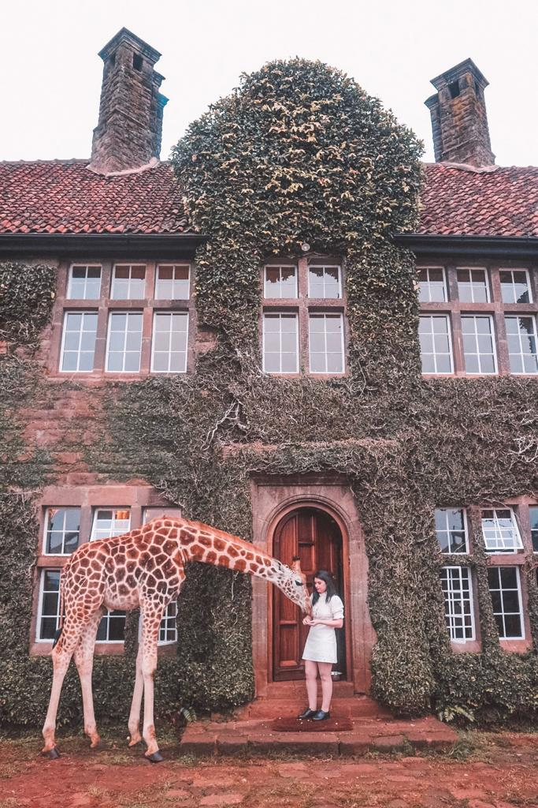
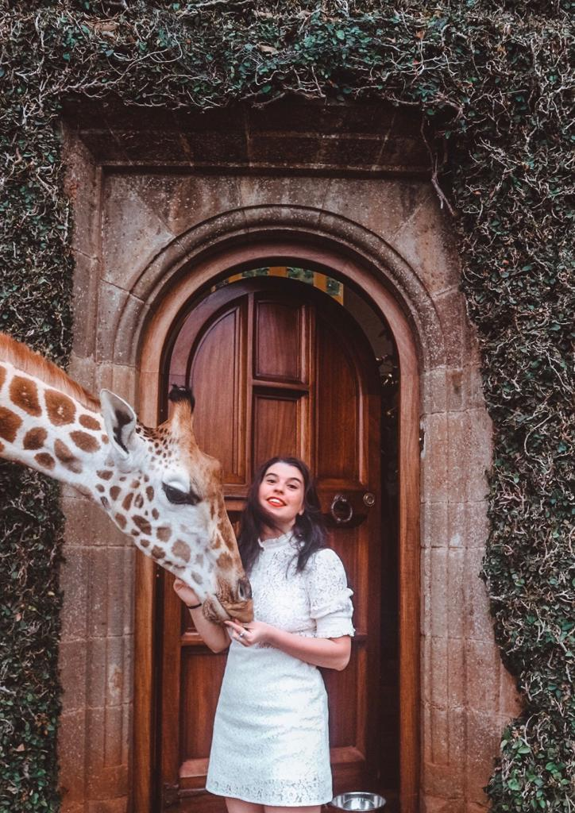
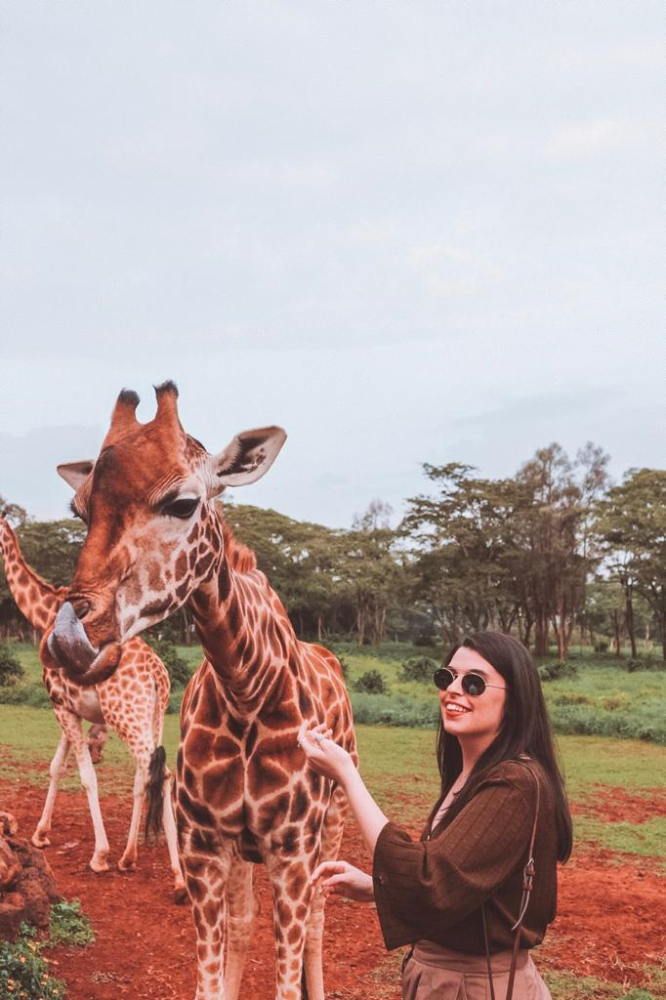

### Giraffe Manor was the best place I have ever stayed at. When I found out about this place years and years ago, I have always dreamt of how beautiful it might have been to just share breakfast with giraffes and feed them from the terrace of your room after waking up.

During our dinner at the Giraffe Manor, everybody was telling us how hard it was to book their stay and how important it is to do it in advance. We were lucky enough to find Daisy’s Room available only two months before our holiday but I would highly recommend booking your stay there long before.

We stayed in Daisy’s room and we absolutely loved it. I loved all about it and the terrace was just so beautiful. You will also find some giraffes’ snacks and you will be able to feed your new friends in the morning just by yourself. I also fell in love with the painting above the bed. That giraffe looked just so real that I couldn’t avoid taking a picture with it.

If you are staying at Giraffe Manor after your arrival in Nairobi, you can book your transfer with them which is included in the price. Once you are at Giraffe Manor, you will meet the friendliest staff ever. Tony, the manager, welcomed us in such a friendly way and he is one of the funniest guys ever. You will get all the holidays’ vibes. The nicest thing about Giraffe Manor is that it only has twelve rooms and not many guests and that is why you also get all the attention from the staff.

As you arrive, you will get offered some coffee or tea and you can sit and admire some of the giraffes just chilling out. After the check-in, you will have an hour to relax and you will then get lunch and what a lunch!!! We had some delicious dishes and dessert was just amazing! 

After lunch, you get a few hours to just relax and do what you feel best for you. Staying in your room or just sitting outside. We decided to go to the little shop for buying some souvenirs and I found this special ring with a little giraffe on it and I just needed to buy it. I will have a memory of this experience forever with me. 

Around 4 PM, you can go outside and wait for some tea and delicious treats. And not just treats for you but also for the giraffes. They will come closer and you can feed them and just enjoy your time with them. You will have plenty of time for getting as many pictures as you want and the staff will offer to take some pictures too. We really got some of the best pictures ever and I can’t wait to frame them and add them to my photo albums.

After tea, you will just want to stay there and look at those amazing creatures. The baby ones were full of energy and just jumping around. I wish I could just stay there for longer than only one night, but I think staying longer would make it feel like routine and I wouldn’t be able to appreciate how special it really is.

Dinner was absolutely amazing. I had this calamari starter and I just loved it so much and all the other meals including the crumble for dessert were just so yummy. They also offer some wine and soft drinks that are included in the price of the stay. The nice thing about dinner was that most of the guests had dinner together inside around a big table and it is so special to share a moment with some random people and tell each other all the crazy stories about your previous travels. You really understand how different cultures are and how interesting is to embrace them all. 

After an amazing sleep on one of the most comfortable beds ever, we got up around 6 AM to get ready for feeding our new friends. Around 6.30 AM the sun appeared and some giraffes came to our terrace to look for some food. It was amazing to just feed them without anybody telling us what to do and how to do it.

After feeding the giraffes from the room, you can get ready for the real breakfast with giraffes. Our table was just perfect as we had one window on each side of the table and got to sit between two giraffes. It was amazing to just see the giraffes from so close and feed them around our breakfast table. I had so much fun and got some of the best pictures ever. This is possibly the best moment of the whole stay and certainly one I will never forget.

So, as everybody says, traveling is expensive and staying at Giraffe Manor is not that cheap. But does having breakfast with giraffes have a price? I surely have no regrets and I am looking forward to going there again. See you soon, Giraffe Manor. 

 
 
 

