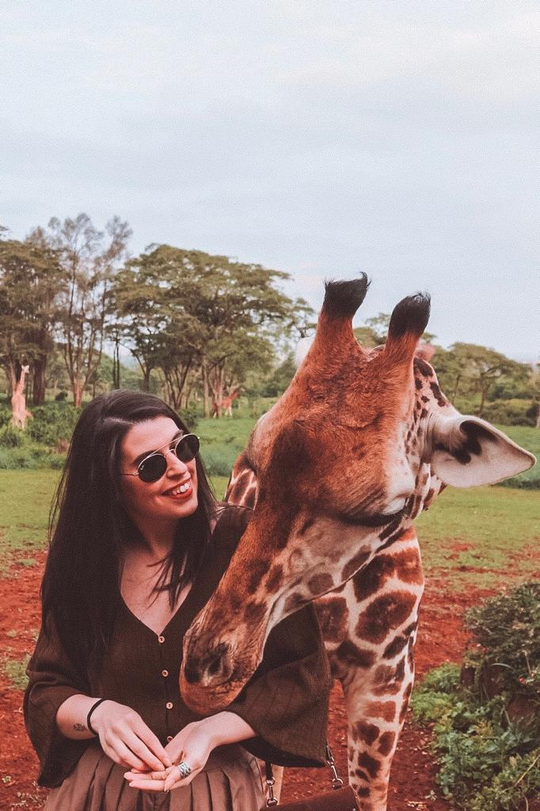
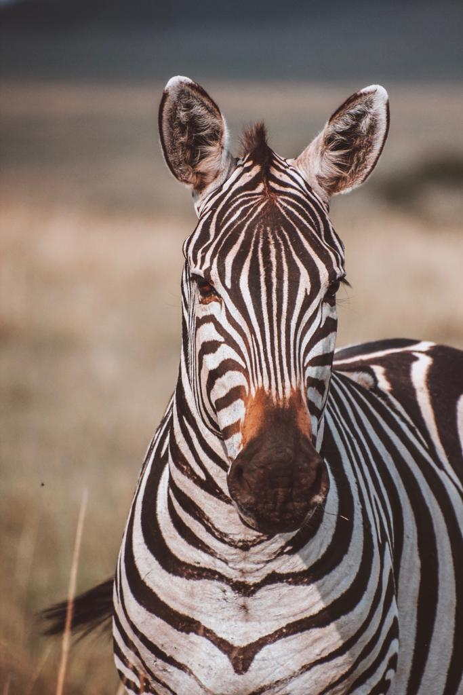
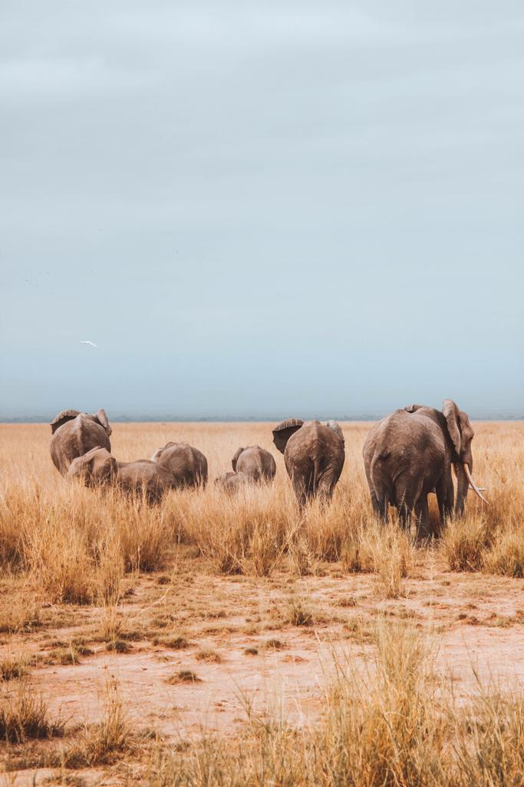
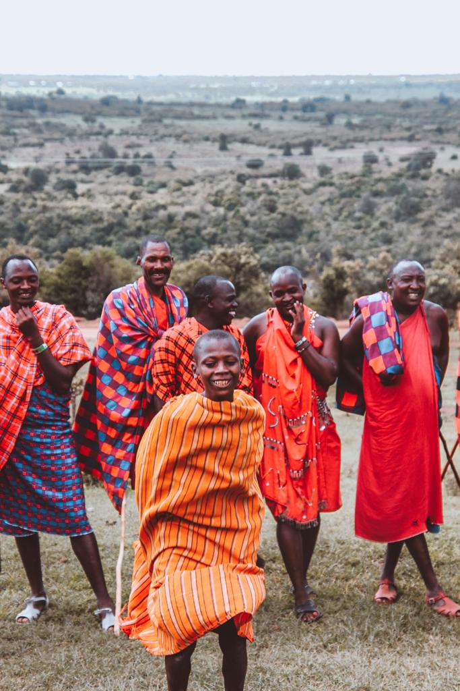

### If you are looking for an adventurous, relaxing and unforgettable experience, Kenya might be the destination you are looking for.

We decided to book the craziest flight ever to get to Nairobi. We flew from Tallinn and made our first stop in Copenhagen. Waited for 10 hours (went to Tivoli Gardens to kill the boredom). We then caught our flight from Copenhagen to Doha and we only had an hour before the flight to Nairobi. We nearly missed the flight but luckily we managed to get to the gate on time and catch our very last flight before the start of the real holiday. Only less than 6 hours and we were in Kenya, dreaming of giraffes and elephants.

#### Day 1: Giraffe Manor

We booked Daisy’s Room for our one night stay at Giraffe Manor. There was only that one spot available and it is very rare you find something available if you are trying to book a few months in advance. Make sure you book it way before. I think one night is enough if you want to enjoy the giraffes, feed them and share the breakfast with them. You can decide to stay for an extra night. That will surely allow you to enjoy your time even more and not rushing but one night was perfect for us. If you want to know more about our stay at Giraffe Manor, you can click [here](/blog/destinations/posts/africa/kenya/a_night_at_giraffe_manor_and_a_yummy_breakfast_with_giraffes/).

We decided to spend our first night at Giraffe Manor as we wanted to get a rest after the long and crazy flight. Most people decide to spend the night there at the start of the itinerary or on the very last day. I think both choices will work well, so it is really up to you.

We decided to book it at the start of our itinerary because we knew we could get a free transport from Jomo Kenyatta International Airport to Giraffe Manor two hours after our arrival (check-in and check-out times at Giraffe Manor are very strict so make sure you arrive before 10.30 AM and you can easily be brought to what became for me the most amazing place ever). 

You will not need to worry about buying snacks, food or water as you will have breakfast, lunch and dinner included and soft drinks and great wine are also included in the price.

#### Day 2: David Sheldrick Wildlife Trust and arrival in Nairobi

During your stay at Giraffe Manor, make sure to organise a trip to David Sheldrick Wildlife Trust, an elephant orphanage centre. It was extremely interesting to know more about the elephants that were rescued and helped. It was also very sad to see one of the elephants with a broken trunk because of what happened to him in the past due to a human trap. Humans are real enemies and we can all do something together for these beautiful creatures. This centre is really doing such an amazing job and you can help by donating money or adopting one of the elephants. You can do that before your trip (<a href="https://www.sheldrickwildlifetrust.org/orphans" target="_blank" rel="noopener noreferrer">click this link</a> if you decide to adopt an elephant) and get to book an extra visit to the centre in the evening. You will get to spend more time with these creatures and get to touch them and feed them too. We decided to book our transfer from Giraffe Manor to David Sheldrick Wildlife Trust around 10.30 AM, just after sharing breakfast with giraffes. The elephant orphanage centre only opens at 11 AM and people can start queuing and purchasing the ticket (entry ticket costs around 4 $). The visit lasts for an hour and you can really embrace the hard work and the positive vibes that live throughout the elephants. A great way to spend your morning.

We then went to Nairobi and spent the night in Villa Rosa Kempinski. When I booked this place, I really didn’t know what to expect. It was a great deal and it really is an amazing place to stay. Fancy hotel and not too pricey. You can book your stay at Villa Rosa Kempinski <a href="https://www.kempinski.com/en/nairobi/hotel-villa-rosa/rooms-and-suites/" target="_blank" rel="noopener noreferrer">here</a>.

#### Day 3: Amboseli National Park

There are many different parks you can choose to visit during your stay in Nairobi. Many people were obviously deciding to visit Nairobi National Park, but we opted for Amboseli National Park. It is quite far and the roads are very bumpy. You could stay at Amboseli National Park for the night or just book a tour from Nairobi to Amboseli and back to Nairobi as we did. Visiting the Amboseli National Park was a very last minute decision. We booked our stay at Villa Kempinski for two nights and I accidentally or fortunately found this tour company called Natural World Kenya Safaris. If only I knew them before. They were absolutely great with communication, organizing at the very last minute and offering one of the best tours ever. Of course, it would have been nicer to have more days available. They offer a wide range of tours so if you have some extra days, check them out <a href="https://www.naturaltoursandsafaris.com/" target="_blank">here</a> and book the tour of your life. 

Amboseli was just incredible. We had to get up at 4 AM, but I didn’t regret it. We saw so many elephants, giraffes, hippos, birds and other animals. The landscape is incredible and you can get to see a spectacular view of Mount Kilimanjaro. You also get a delicious breakfast and a perfect lunch too. If you are interested in this one day trip to Amboseli National Park, you can see more <a href="https://www.naturaltoursandsafaris.com/out-of-nairobi-day-trips/amboseli-national-park-day-trip/" target="_blank" rel="noopener noreferrer">here</a>. 

#### Day 4: Maasai Mara

We chose to fly to Masai Mara. We decided to book our two nights stay at Mara Serena Lodge which I highly recommend. We flew with Safarilink and the flight from Wilson Airport brings you straight into the park in an hour. We booked our transfer from there to Mara Serena Lodge through the hotel (that’s really the only way unless you decide to drive or book a tour with a different company). Once you arrive to the park, you have to pay a park fee of 70 $ per person per night. 

Serena Lodge was absolutely amazing. You can really experience the African adventure there. The price of the stay includes breakfast, lunch, and dinner and you can add safari drives and visits to the Maasai Village. There are two safari drives per day, one at 6.30 AM (best time of the day to see lions as they seem to be more active in the morning) and one at 4 PM. You can add other extra activities and get to experience it all based on your tastes. 

#### Day 5: Maasai Mara

During day 5, we went for our first safari drive for the day. We woke up at 6 AM and we went to look for some lions. We saw two lions, hyenas, elephants, giraffes, and many zebras. Around 9 AM, we went back to the lodge and had breakfast there. Around 11 AM we went for our visit to the Maasai village. It was one of the best experiences ever. The happy vibes you get from those people are just amazing. They told us so much about their life, how they live, what they do for a living, how they build their houses and why they wear those red outfits. Those dresses are like a passport for them. The way we can travel from Estonia to Italy with our passport, they can travel from Kenya to Uganda thanks to their red dress. We also visited one of the houses and saw how they actually live. You really realize how easy your life is and how much you have. We saw their dance and they welcomed us in a way that we will never forget. We will surely remember this day for the rest of our lives. If you stay at Maasai Mara Park, make sure you organize a trip to the Maasai village. We were the only two people going that day and we still wonder why. It is an experience that makes you reflect and gives you positive vibes. 

#### Day 6: Last safari and back to Nairobi airport for the flight home

Last day but not least. We saw an entire family of lions on the very last day. We absolutely loved it! They were just there chilling out and cuddling. I personally loved seeing the little ones. At the start, we were thinking about canceling the last safari because of the long flight we would have had a few hours later. But then we thought that things happen once in life. We were in Kenya that day and who knows when we were going back. That was the best decision ever. Every single moment on a trip needs to be lived and getting up at 6 AM might not be the best way to start your morning if you have three flights to catch, but it could turn out to be one of the best days of your life!

Pity that we only stayed for six days, but with the early mornings and all the activities we have done, we felt like it was way longer than six days! The only bad thing about Africa is that once you go, you just want to go back! 

 
 
 
 

