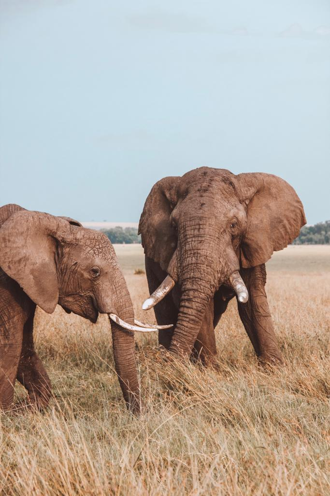
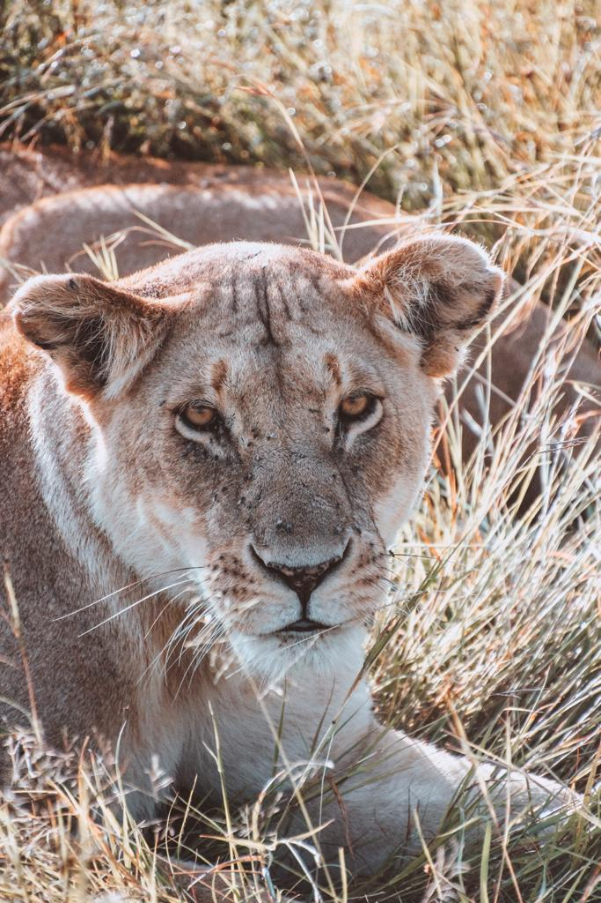
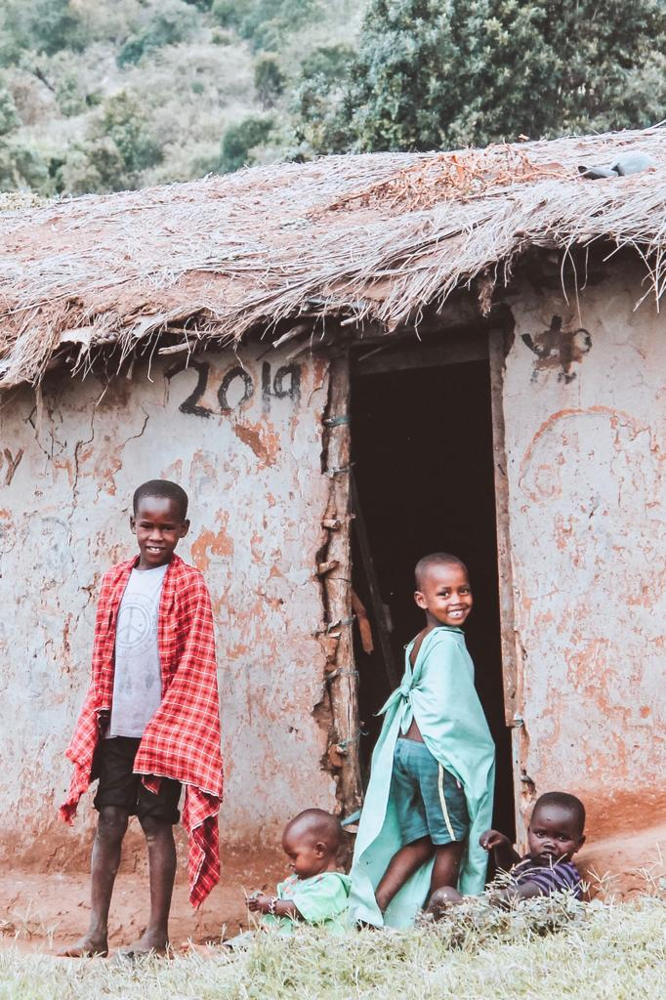

### When I started planning my trip to Kenya, I knew I wanted to visit Maasai Mara. I have always been fascinated by different cultures and I really wanted to experience the African culture in all its facets.

Maasai Mara is situated at the border with Tanzania. It is massive and has a wide range of different species of animals. The only animal we didn’t have the chance to see was the leopard (other people staying at our hotel saw it during our last morning there), but we were happy enough to have seen 4 out of the big 5 in Africa (rhino, lion, elephant, and buffalo). 

We decided to go to Africa at the end of June and that turned out to be the best choice ever. Around that time of the year, the dry season is starting and all the animals migrate. That’s why it is possible to see way more animals in the national parks. If you are not sure about when to go to Africa, the end of June might be a perfect time. 

We booked a two nights stay at Mara Serena Lodge and I couldn’t have picked a better place. Everybody there was so friendly and the guides know so much about the animals and tell you all the most interesting things about them. 

You can make your own itinerary there and the staff will try to plan it the best way possible. We opted for four game drives, two in the afternoon at 4 PM and two in the morning at 6 AM. We also booked a visit to the Maasai Village that turned out to be one of the best experiences of our lives. 

We got to Maasai Mara by air with Safarilink. We arrived in the middle of nowhere around 1 PM and our guide was there to pick us up. You will need to pay for the Park fee there before going to your final destination. The Park fee is about 70 $ pp (this is the price for non-residential). 

Once we got to the hotel, we did the check-in and had our lunch. After lunch, we just relaxed for a couple of hours and took the advantage to just stay outside and admired the landscape around us while having a few drinks. 

Around 4 PM we went for our first safari in Maasai Mara and it was amazing. Only one day and we had already seen lions. We previously went on a day trip to Amboseli National Park where we had the chance to see amazing elephants, giraffes, and zebras, but we didn’t have the chance to spot any lion. It was amazing to finally see the king of the jungle. We also made a stop at the border with Tanzania and we also drove into Serengeti Park for a little while. It was amazing to be at the border and couldn’t avoid getting a picture in front of the jeep between Kenya and Tanzania!

After a two hours game drive, we went back to the lodge and had our dinner around 7.30 PM. Breakfast, dinner, and lunch are all included in the price of your stay and everything was just delicious. The room was just so cute and perfect for a stay in the middle of the wild! 

After a really good and well-deserved sleep, we woke up at 6 AM for the morning game drive. Some people might not want to get up so early if they are on holiday, but you go to Africa maybe once in your life and all you want to do is going for as many game drives as you can. Some people may wonder why so early? Lions seem to be way more active during the early hours of the day. And I can guarantee it. So, if you are doubting about going for a game drive so early or not, just go. You might see many lions and some leopards!

After coming back from the game drive and after having a delicious breakfast, we got ready for going to visit the Maasai Village which was about an hour away from Serena Lodge. We were pretty curious to know why nobody else booked the visit to the Maasai village that day. I know that many people go to Kenya mainly for the animals and the landscapes, but learning about the cultural aspects of a country is as important or, at least, that is how it should be. 

The Maasai welcomed us in a way we will never forget. We danced with them and learned things that we didn’t know and that changed our perspective of life. They showed us how they set up a fire, where they eat, where they live and what they do for a living. They also explained to us why they wear those red dresses. The red dresses are like a passport for them. They get recognized and they can easily move from country to country just because of their outfit. How cool is that? They also invited us to go inside one of the houses and we saw how the house looks inside. We understood how different life is and how hard living that life would be for us or people like us. But what warmed our hearts up was the constant smile on their faces. They did not stop smiling. We then managed to purchase some souvenirs, and could not stop saying thanks for the great opportunity and for letting us understand their culture in a better way. 

We were so thrilled and so happy that we decided to book the visit to the Maasai village. We came back and just kept watching the many videos they took of us dancing with them. We had our lunch and around 4 PM it was time for our third game drive. Our guide planned on going to look for some hippos and crocodiles. We saw many of them and it was such a crazy experience. After that, we noticed that our guide (he communicated something in Swahili to some of his colleagues through the little radio in the jeep) started driving faster. After ten minutes, we understood it was because one of the guides found two rhinos and we were heading to the place for admiring them. I could finally cross out another animal of the big five’s list. But the drive wasn’t finished. Our driver started driving faster again and we reached to this spot where a magnificent lion was just chilling out and sleeping beside one of the African trees. It was one of the moments I’d possibly remember the most for the rest of my life. 

It is crazy how many things happen on a safari and how you don’t even get the time to get thrilled for one thing that something else is about to happen. We had a yummy dinner and went to sleep sad that our last day in Kenya was about to come. 

During our last morning, we went for the very last game drive. We weren’t expecting so much as we had seen enough animals by then. We were about to get back to the lodge when we saw this entire family of lions. It was incredible to see around 15 lions and the baby ones were just the cutest. They were enjoying nature and the moms were cuddling their little ones. We didn’t expect to see any lions and we certainly didn’t expect to see the whole family there! 

We then went for our breakfast before our transfer to the airstrip. When we left, we were tired because of the intense adventure and the early mornings, but so overwhelmed. We were leaving Maasai Mara but we left a piece of our heart with the wild and the animals. 

