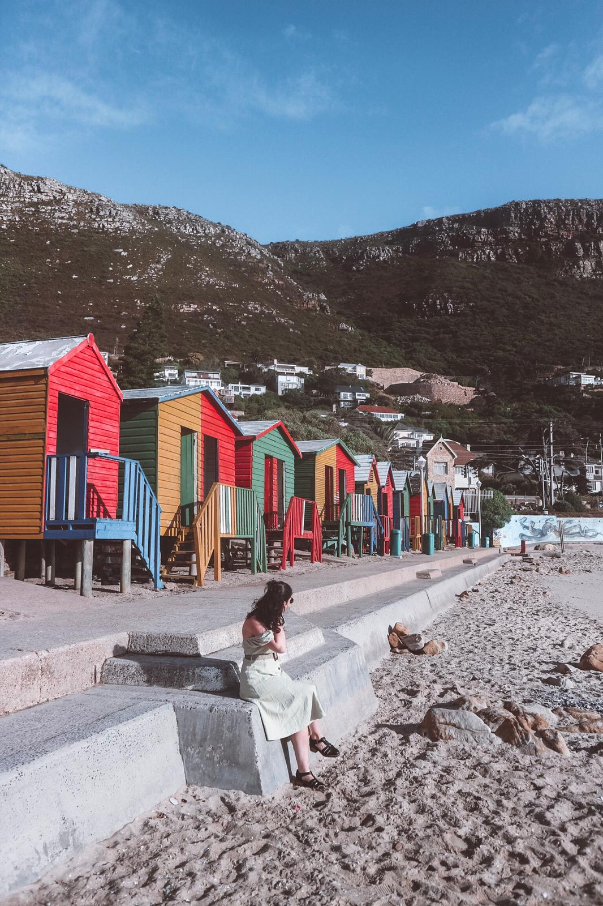

### If you have on mind the idea of planning a visit ot Cape Town, there is a list of places that I would highly recommend adding to the must do list.

#### 1. Wander around Kirstenbosch National Botanical Garden

If you are in Cape Town, you cannot miss out on a visit to the botanical gardens. The entry fee is R75 and it is a really nice way for spending a morning while walking and enjoying the sun. There is not a particular itinerary to follow once you are at the gardens. You can require the map at the entrance by paying just a few extra South African Rands and just enjoy exploring the beautiful landscapes around. I would recommend heading to the gardens around 8AM so that you will have the place just for yourself and you could head to Kirstenbosch Tree Canopy Walkway which has been my favourite place within the botanical gardens. 

#### 2. Visit Table Mountain

Table Mountain is definitely a must if you are visiting Cape Town. You have many different ways for reaching the top of the mountain. The bravest decide to hike it and that must be an unforgettable experience. If you do not have much time in Cape Town, you could opt for the funicular. I would recommend heading there in the afternoon after 1PM as tickets would be a bit cheaper after that time. People tend to go there for sunrise or sunset, but expect to find a big crowd, no matter what time you decide to head to Table Mountain at. The return ticket is R300 and it is definitely worth it. I would recommend getting a Uber up to the starting point and then getting the cableway. It is usually very windy at the top, so make sure you bring a jacket with you and expect a lot of clouds too. Despite the wind and the clouds, Table Mountain is definitely something to see!

#### 3. Eat at V&A Food Market and shop at the Watershed

If you have some time and you like souvenirs and markets, then the two places cited above are the perfect spots for you. The area itself is really nice and very touristic. It is very relaxing to just walk around and there are many restaurants if you are looking for a place to eat. The Watershed is full of stands that sell clothes, souvenirs, handmade products. If you are looking for some souvenirs to bring home or for some typical clothes, then this is the perfect spot for you. If you think that the restaurants are a bit too pricey, you may found some cheaper food at the stands at V&A Food Market. I would recommend heading to Unframed Ice Cream, a little stand at the V&A market where you can find some of the best ice cream in the world! 

#### 4. Have at least one breakfast at Jason's Bakery

Try some delicious pastries at this amazing cafe! As soon as we tried some pastries, we fell in love with it that we kept going back each morning for a great start of the day! There are many places that are worth trying but if you love pastries and good coffee, then Jason’s Bakery is definitely one of the ones you should try out. It did not disappoint us and I hope it will not disappoint you. 

#### 5. Organise a trip to the vineyards and enjoy the nature

Just an hour away from Cape Town there are many different vineyards that are surrounded with amazing landscapes. Make sure to have an extra day for visiting the vineyards as you would be able to taste some delicious wine and feel immersed into the nature. There are many vineyards that you can choose from and all of them would be worth a visit. Just pick a few and enjoy your visit! 

#### 6. A trip to Boulders Beach

Who would go to Cape Town and not head to see the penguins? Considering penguins are my favourite animal, I could not miss out on having the chance to see them in their natural habitat. An early visit to Boulders Beach is what could add even more excitement to the already thrilling trip!

#### 7. Drive around Cape Peninsula

Driving in South Africa is amazing! Renting a car is very cheap and it gives you the freedom to just enjoy the landscapes around. Once you are out of Cape Town, you can relax and enjoy the drive around the beautiful scenarios. Make sure you visit Chapman’s Peak and drive towards it and make sure to stop as many times as you would like. Enjoy the views and do not rush it. South Africa has so much to offer.

If you have enough time, head to the Cape of Good Hope. The weather there was not amazing, but you may be lucky enough to see some beautiful birds and other pretty animals. If you have a limited time there, then that is a place I would skip. 

#### 8. Early morning at Saint James

You probably came across a picture of plenty of lovely little colourful houses that face the sea. I personally believe that Saint James is a place that just makes you happy. Muizenberg is also a touristic place, especially for surfers. We went to both places and I just preferred Saint James. Muizenberg was always very crowded and definitely worth a visit, but Saint James is perfect if you are looking for a quieter spot. 

#### 9. Eat fish at Kalk Bay

Kalk Bay is a little village that is situated just beside the harbour. It is on the way to Boulders Beach or Saint James and it could be a stop to add to your itinerary if you are craving some seafood. Live Bait was such a good place to eat and I loved it so much that we went back for another meal on the following day. I would highly recommend it. Cheap but really good quality and the staff were super friendly. Also, you may find some sea lions to keep you company while enjoying a walk at the harbour and the village itself is very characteristic. 

#### 10. Fall in love with graffitis at Woodstock

Get an Uber to Woodstock and wander around the streets. There are many walking tours that you could opt for but we preferred heading there by ourselves and just explored the narrow streets around us by ourselves. We also had the pleasure to meet a local who told us a bit more about the history of the surroundings and told us to be careful but not to be scared and to be welcomed in the area. Honestly, if you are scared or feel like something could happen, do book a free walking tour. We have the idea that if something has to happen, it would happen anywhere in the world, so we do feel comfortable enough to visit these less touristic places while traveling, but you know yourself better. And whatever way you choose, Woodstock will amaze you with all the beautiful art that has to offer. 

