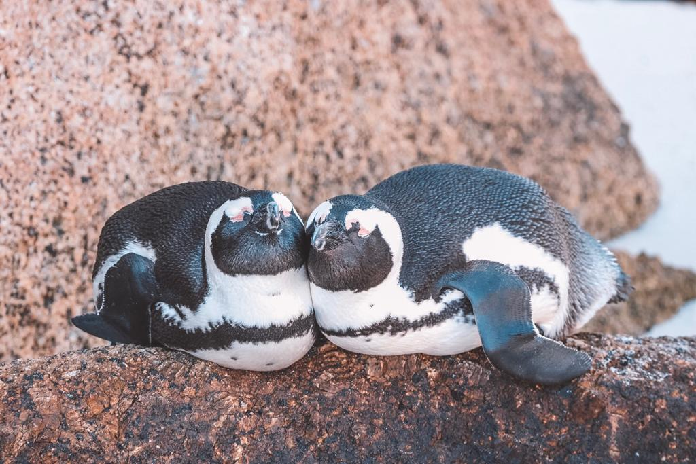

### While planning your trip to Cape Town, you probably came across some pictures of African penguins and heard about Boulders Beach.

There are many different ways for visiting the Southern part of South Africa. You could take a train from the main station to Simons Town and book an Uber to Boulders Beach. You could book a private tour that usually covers Boulders Beach and Cape of Good Hope. What we opted for was renting a car for three days and driving towards Simon’s Town. 

#### Rent a car and stop for some breathtaking views along the way

If you love breathtaking landscapes and road trips, then driving towards Chapman’s Peak would be the perfect trip for you. Renting a car would give you total freedom for stopping along the way and you can just manage your own time and add as many stops as you desire.

Once you are out of the city, driving is really easy and no hassle at all. There are many cyclists who decide to try an adventure on two wheels and many bends that accompany the imposing rocks and cliffs. You will find plenty of spots for stopping by and the landscapes will not disappoint you. 

Just remember to have some cash with you if you decide to venture along the Cape Peninsula. Before passing by Chapman’s Peak, there will be a toll and 50 R are needed for entering (50 R is around 3 euros and that is the amount of money needed for cars). 

Many people decide to explore the southern part in a day. I would recommend staying for at least three days. In that way, you will have the chance to enjoy the good weather and to explore the surroundings with no rush. If you are looking for a place to stay, <a href="https://www.booking.com/hotel/za/boulders-beach-apartment.en-gb.html?aid=304142;label=gen173bo-1DCCsoggI46AdICVgDaGmIAQGYAQm4AQfIAQzYAQPoAQH4AQqIAgGYAgSoAgO4ArvGgPIFwAIB;sid=7ca9cbe0ebce295a599b1e487b15d2f0;dest_id=-1283450;dest_type=city;dist=0;from_beach_key_ufi_sr=1;group_adults=2;group_children=0;hapos=1;hpos=1;no_rooms=1;room1=A%2CA;sb_price_type=total;sr_order=popularity;srepoch=1581264519;srpvid=8f8b7183c5fa0013;type=total;ucfs=1&#hotelTmpl" target="_blank" rel="noopener noreferrer">Penguins View Guesthouse</a> could be the ideal place for you. 

If you plan a trip to see some cute and lovely African penguins at Boulders Beach, then Penguins View Guesthouse is just a few minutes away from it. We decided to stay at the Luxury Studio Apartment with Sea-view Deck and we were so happy with the view that the apartment had to offer. We were so lucky to spot a few penguins from the apartment during our first day. 

#### A morning at Boulders Beach

If you are planning on taking a trip to Boulders Beach, I would recommend heading there in the morning at 8AM as you will have the beach just for yourself. The entry is 152 R (about 9 euros) per adult for non residents and it is totally worth it! 

Once you pay and pass the gates, you will see some penguins. Some people stop there and do not venture further. If you keep going straight, you will see some rocks that block the way to the other side of the beach. You can climb those rocks or if you feel like having a swim, just wear a swimsuit and swim towards the other side. You will find less people and so many more penguins that relax and play in the water and around the rocks (like the two ones below that made me took what has become my favourite picture ever!)

We loved spending our time there and we could not stop taking pictures and observing the funny moves of these beautiful loyal animals. Seeing the penguins has been one of my biggest dreams and Boulders Beach is definitely a must if you are a lover of penguins!

Two or three hours is the time people usually spend there. You could decide to spend more time if you plan on staying for a longer length of time. We spent about two hours and then we drove towards Kalk Bay. 

#### Lunch and souvenirs shopping at Kalk Bay

Kalk Bay is a little village which is definitely worth a visit. There are many touristic places to add to the list such as Muizenberg or James Bay, but Kalk Bay is definitely one of the most characteristic and distinctive ones. The harbour is pretty cool and you could be able to meet some of the sea lions there. Eating some fish at Kalk Bay is definitely something you should consider about doing when visiting Cape Town and surroundings.

If you are looking for a good place to eat that is not too expensive, I would recommend heading to <a href="http://livebait.co.za/" target="_blank" rel="noopener noreferrer">Live Bait</a>. I had a portion of prawns and they were delicious and all for a very reasonable price. Make sure you make a reservation as the place gets packed up very quickly!

Kalk Bay is also worth a visit if you are looking for some special souvenirs to bring home. There are many shops that sell handmade pieces of art. We managed to buy a really special painting close to the harbour for only 10 euros and I also got some lovely earrings which are made in South Africa and got a few extras as a present for my best friend. Head to Kalk Bay and you will find the right souvenirs to bring home!

Also, if you only have a limited time for exploring what is for me the nicest area around Cape Town, I would recommend to choose Boulders Beach and Kalk Bay over the Cape of Good Hope. I did prefer spending time with the penguins and eating delicious seafood, even though seeing the most south western part of Africa has its charm and seeing a Caracal Cat while driving was far from being a bad experience, but I will tell more about it in my following blog… 

