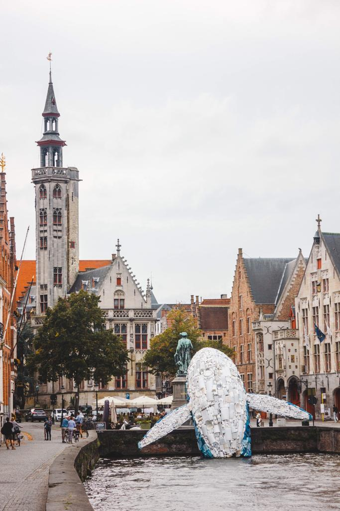
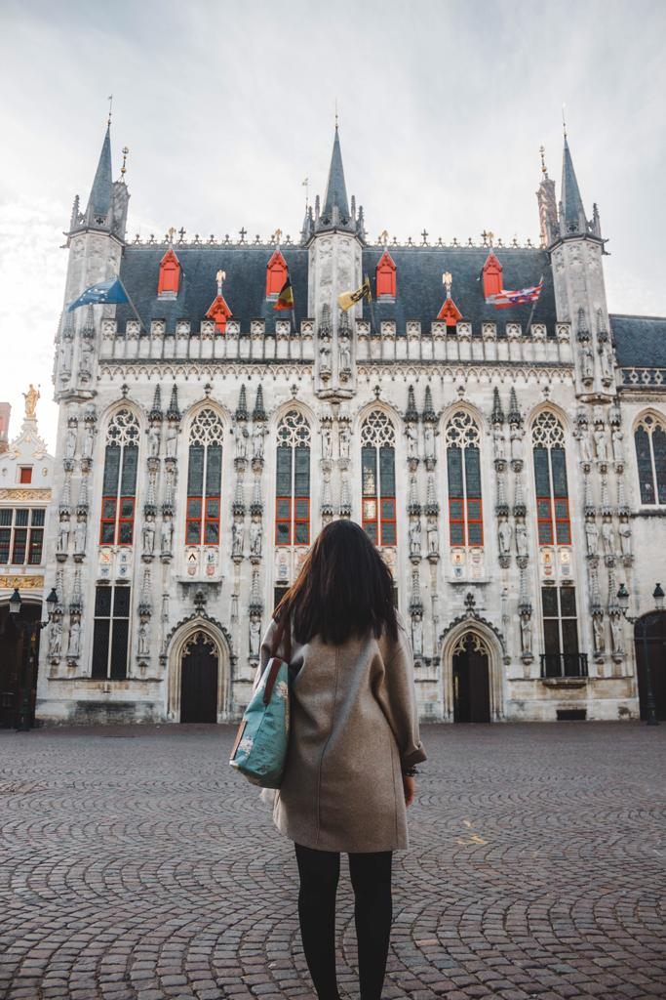

### "You are unlikely to tire of Bruges no matter how long you stay."

#### Enjoy an early morning in Burg Square

If you like taking pictures when people are still asleep, wake up around 7 AM and head to Burg Square. The architectures in Bruges are stunning and really impressive. It is a mix of Neoclassicism and Gothic art and you can’t get disappointed by it. It is just such a nice feeling to walk around and have the entire square for yourself. And you will feel to be back to the past and feel like a character of history.

I would suggest to see it in the afternoon too. I always like to see the main squares, or the places that more capture my interests, at least twice. I like to see them without people around and full of life. You get two contrasted feelings and you see details that you wouldn’t notice going only once.

#### Walk around the main square and admire the beauty of the Belfry

It is a beautiful medieval tower that will leave you speechless. I know it really depends on the tastes, but this bell tower would render anyone speechless. It is a little city that has so much to offer. I got only positive vibes from it. People were kind and friendly and the atmosphere around is just the right atmosphere for making a place unforgettable. There are also plenty of little shops and waffle places but I could only recommend one.

#### Grab a waffle at Chez Albert

A little inside shop selling some waffles not far from the Belfry of Bruges is definitely the best I can recommend. We tried a few different ones and just loved these ones with dark chocolate sauce. You can just get a takeaway waffle and enjoy it while walking and admiring the medieval buildings.  How cool is that? Also, make sure you know that there are two different types of waffles: Liege waffle and Brussels waffle. The first ones have uneven edges, they are sweeter and, in my opinion, are way nicer. The second ones are rectangular with defined edges and they have deeper holes. It is really up to you, but I preferred the Liege waffle way more.

#### And grab some Belgian fries at Chez Vincent and walk around

There can’t be waffles without fries in Belgium. Belgian fries are really the best fries I have ever tried in my life. My favorite is the ones I tried in Brussels in the Friterie du Café Georgette, but the fries in Chez Vincent were so tasty. If you go to Bruges, give it a try and let me know what you think about them. I also tried sausage too and it was delicious. I was pretty full after waffles and fries, but I would have liked to have more and more. And while having your fries, you can just enjoy an evening walk around the square and discovering the hidden gems of Bruges.

#### Admire and reflect looking at Skyscraper (The Bruges Whale)

We weren’t sure if this amazing masterpiece would have still been there, but luckily it was. We loved it! 5 tons of plastic waste pulled out of the Pacific Ocean, turned into a whale for the 2018 Bruges Triennial. It is incredible and so talented. But also sad that, nowadays, people don’t respect the environment and that so much plastic was found in the ocean. It is a pretty cool art piece that makes me reflect. You can see the beauty of a marine creature and realize how the world is different and beautiful. But also, it makes you realize how the man is destroying it and that the future is in real danger. If you are going soon, I hope you will have the chance to see this whale and appreciate art the way I did.

If you go to Bruges and you have some extra time, go explore the little medieval Bruges. It takes only an hour and a half by train from Brussels and one day would be enough. Don’t forget to grab some waffles after your walk and try some Belgian fries. Grab a beer too. Belgian beer is the best!

