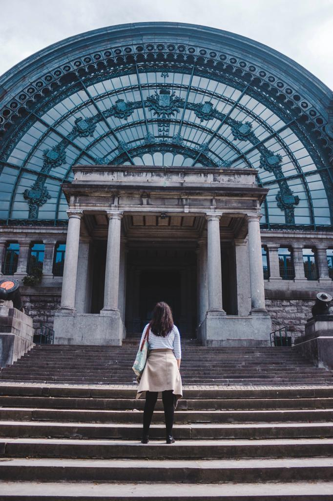
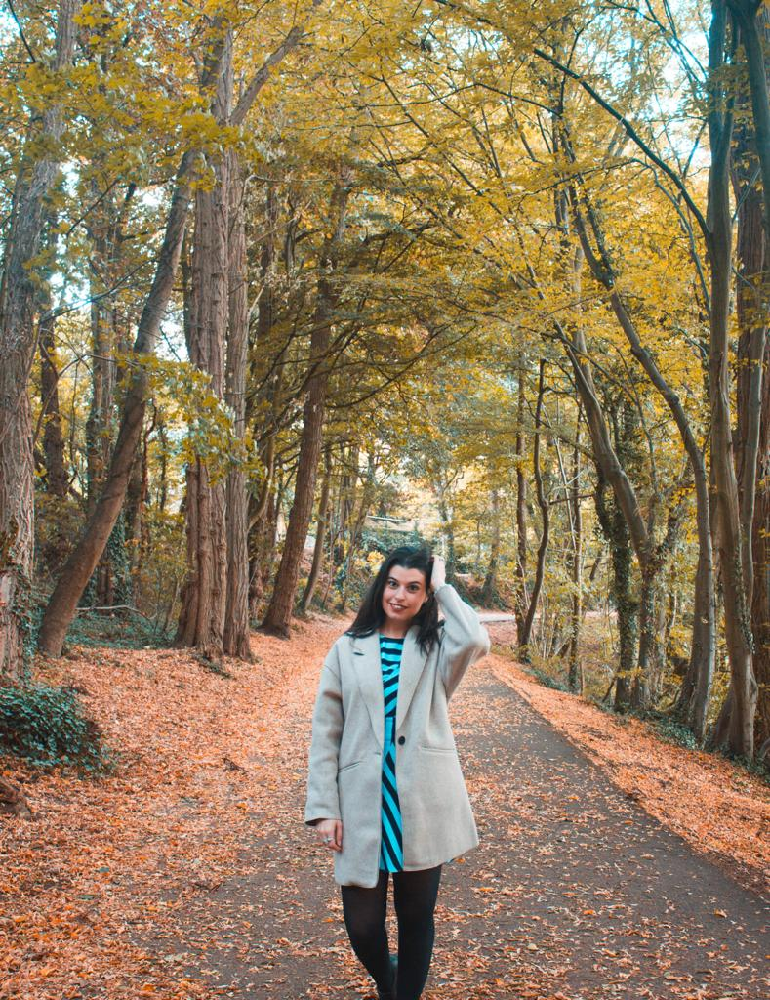

### "The mind loves the unknown. It loves images whose meaning is unknown since the meaning of the mind itself is unknown."

Rene Magritte

 
 

#### Walk to the Parc Du Cinquantenaire

It doesn’t matter if you decide to walk or take the metro, but make time for seeing Parc du Cinquantenaire which is a large public urban park situated in the East side of Brussels. In honor of the independence of Belgium, most of the buildings were commissioned by the same government. The park used to be full of waterfalls and little gardens, and it has now become a leisure park. When the weather is good, you can just chill out and relax on a bench while admiring the famous arch. What people possibly don’t know is that the Military Museum is also located in the park. I am not really interested in military museums but this building is a must see. The structure, the entire design of it is incredible. It really blew me away and if you like the picture above, just make some time for standing in front of it. If you want to visit it, entrance is free and you can find out more about the Second World War and the Waterloo war. It is really up to your tastes!

#### Walk around the main square and earn fries from Friterie Du Café Georgette

Just go exploring the main square (I would recommend going early in the morning for having the places entirely for yourself). All the best buildings, churches, cathedrals and the famous Manneken Pis statue are around the main square. And after the morning walk, you definitely will deserve to grab some fries at what became our favorite fries spot: Friterie du Café Georgette. The fries are fresh, crunchy on the outside and soft inside. You can choose any sauce and enjoy some of the best fries in Belgium!!

#### Enjoy the city view from the best spot ever

If you want to enjoy the view of Brussels from above, walk to the Justice Palace, keep going straight and you will see an elevator. You can’t miss it! From there, you can enjoy the view and the most enjoyable thing is that it is never overcrowded. Chill out and breath the essence of Brussels. Enjoy the smell of waffles that comes directly from a little van always parked on the side.

#### Get away from the city and enjoy the forest (Yes, a forest not far from the centre)

If you have a daily metro ticket, you can get the metro to the stop Hermann-Debroux. From there, you can walk about 10 minutes and finally get to the Sonian Forest which has been inscribed as a UNESCO World Heritage Site. Due to human influence, several plants and animals have become extinct. It is the perfect spot for enjoying cycling or walking around. Perfect for a picnic outside too. If you need to take a break from the crazy city life, just take a metro and enjoy a walk or a cycle in the Sonian Forest. Or like me, enjoy a coffee and chill out!

#### Walk around the Royal Gallery of Saint Hubert

Get up early in the morning and go to explore the Gallery of Saint Hubert in Brussels when there is nobody around. The designs are amazing and the lights around make the place even better. You just get an amazing vibe walking around this gallery and if you need some perfect shots, the symmetry of this place will help you with that. It is not always easy to wake up so early, but definitely worth it for seeing the real beauty of places. You wouldn’t be able to admire the essence of this gallery if it was overcrowded.

#### Enjoy a visit to the Magritte Museum and visit the shop on the first flooer

For the lovers of Art and paintings, the Magritte museum in Brussels is a must. The entrance ticket is 10 euros and gives you the chance to see so many of its beautiful paintings and retrace Magritte’s life. From the most famous paintings like ‘The Empire of Light’ to less famous artworks, you will surely enjoy it! You can get to see his early influence by Futurism and Impressionism and some of its best surrealistic subjects. Surrealism is an art to know about. It just plays with your feelings and your ways to see things. What’s behind the reality? Do you ever ask yourself what’s behind it? Magritte’s paintings have a hidden symbolism behind and you can surely see it in all the paintings displayed in the museum!

