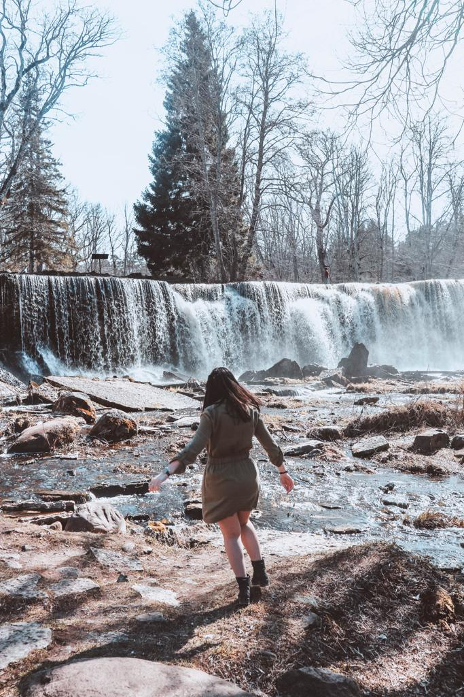
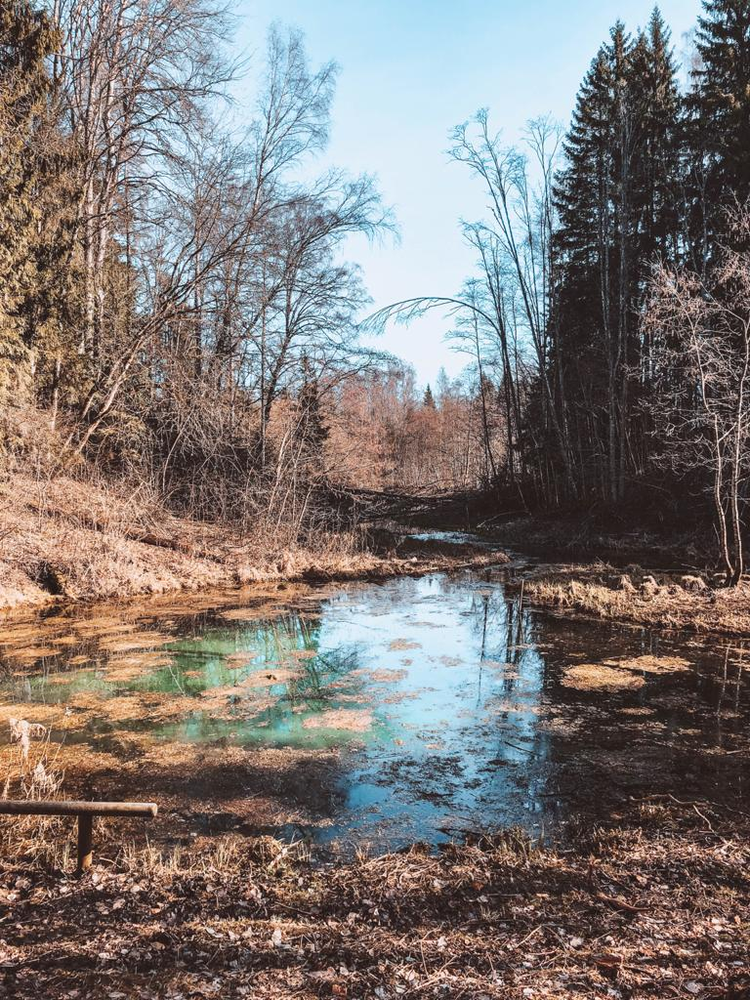

### If you are wondering what to visit during your stay in Tallinn, the capital of Estonia, you are reading the right blog. In this blog, I will tell you about the road trip I organized, which places I have seen and how long you should spend in each place.

Buses are really good in Estonia and you could discover the country traveling by bus if you can’t afford to rent a car or you are traveling by yourself. If you are traveling with someone, renting a car would be the easiest and cheapest way of traveling around. We rented a Nissan with Sixt, a car company that I would highly recommend.

We collected the car from the airport around 9 AM and started our journey to Saula Siniallikad, the Blue Springs of Saula. I saw pictures of these blue springs and since then I always wanted to go. I hope to go back during summer as I think these springs would be way more impressive when there is a lot of green around, but I would recommend stopping by for a walk into the wild and for admiring the green/blue water which is quite fascinating. It only takes around 30 minutes to get from the airport to Saula Siniallikad and it is definitely worth a visit.

The great thing about going on a road trip in April is that there are not many people around. The roads are really easy to travel and you can have places all for yourself. We really loved walking around the wood and when we found the Blue Springs, we were overwhelmed by the bright color of the water. We just sat there and admired nature for as long as we needed to.

Around 11 AM, we were ready to get back to the car and driving for 50 minutes towards what has become an underwater prison. Rummu Quarry is a must stop in Estonia if you ever decide to do a road trip in the country. You will see a private property that used to be a prison during the Soviet Union times. The prisoners left the quarry in a hurry and the lake flooded after that, and you can still find many treasures underwater. You can swim and scuba dive under an instructor’s control and explore more of the prison. When we arrived, we discovered that the prison was not open over this season but after contacting the owner, we were allowed to go in with a Finnish couple that was there for visiting as well.

As April is not opening season for the prison, we were only allowed to stay and explore for only an hour which is enough time if you consider the fact we had the whole place for ourselves. A guide let us in and he locked the gate behind us. It was quite scary to think that we were locked in what was a prison and it was quite a relief when they unlocked the gate to let us out.

If you go during the summer season, you will be able to swim and dive but remember that it can be dangerous because of all the sharp metal pieces that you may find underwater. It must be a unique experience and I can’t tell if it is worth it or not, but the visit to the prison itself is quite unique. You can look at the prison from above surrounded by crystal clear water, hike the mountain and feel like you are in a desert. Also, there are some murals that don’t go unnoticed. I would highly recommend stopping there. After all, visiting an underwater prison is not an everyday thing!

Last but not least, Keila waterfalls. There are different waterfalls you can spot in Estonia and I really can’t wait to go back to this place during winter and see some icing waterfalls. I love chasing waterfalls, no matter where I go and the Keila ones are some pretty ones. It only takes 30 minutes to get from Rummu to Keila waterfalls and it is a stop I would add to your list. Make sure you find some time to see Jägala waterfalls too. It is really up to you if adding the last place to the itinerary. If you have an extra day to spend in Estonia, you can get the bus for only a couple of euros and have more time to explore the area around which is really nice if you want to immerse yourself into the nature. Whatever your choice is, you won’t get disappointed!

