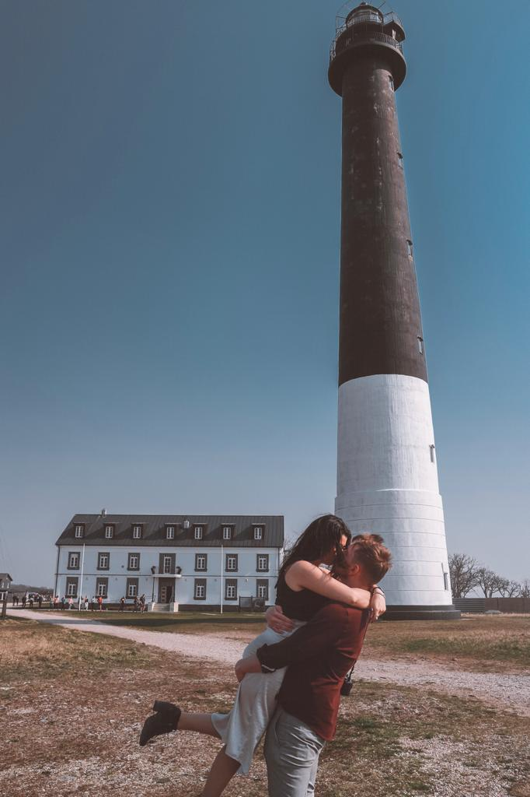
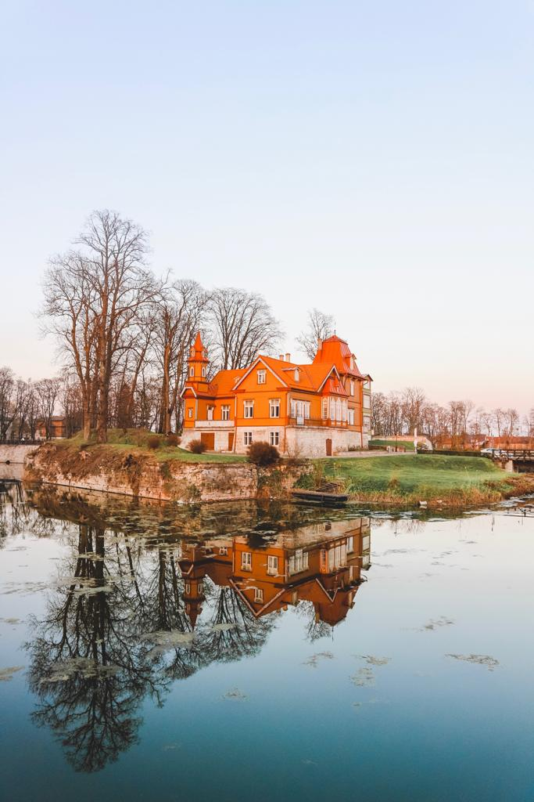

### Since when I moved to Tallinn, I have always wanted to go explore the Islands. Estonia has many different islands which offer so much history and diverse flora and fauna.

Saaremaa is the largest island in Estonia and the first island I decided to visit during my stay in Estonia. There are different ways of reaching the island if you are staying in Tallinn. If you are renting a car, you can head to Virtsu, take the ferry, cross Muhu Island and drive to the final destination in Saaremaa. Renting a car might be expensive and you don’t want to risk damaging the car on the ferry (quite crowded ferry). If you are opting for a safer and way cheaper option, you could get a bus. I booked my tickets with Lux Express (I used to travel with them from Riga to Tallinn and never had problems with that company). Depending on the time of the day, the price of the tickets can vary. You can also find some deals and get your ticket for only 7 euros. With only 14 euros you can get a return ticket which includes your journey on the ferry and will bring you from Tallinn to Kuressaare and from Kuressaare back to the Estonian capital. 

I would recommend staying in Kuressaare for two nights. Kuressaare is a little town that is definitely worth a visit. Kuressaare has the highest number of saunas per capita in the world, so if you love saunas, Kuressaare is the place for you! It also has some really cute restaurants and if you go around April/May, on a sunny day, you can rent a bike and just wander around. A must do in Kuressaare is seeing the castle, one of the most interesting and best-preserved castles in Estonia. Go during sunset and just watch the sun going down on the hill that surrounds the castle. Not many people will be there at that time of the day and you can have the place all for yourself.

If you are in Saaremaa, you need to rent a car or book some tours. We looked at some tours available and they were all quite expensive. Renting a car was the cheapest option and you get the freedom to make up your own itinerary. We asked for some advice on rental companies, but we weren’t really sure about which one to go with. We decided to go with Europcar. You can rent your car for a day and pick it up at the Honda dealership close to the Auriga Shopping Centre.

Once you have your car, you can really make up your own itinerary and visit pretty much the whole island in a day. The most popular choices would be Panga cliffs and Kaali Meteorite Crater Field. We decided not to go to the first one as it was quite windy and preferred not to rush the rest of our stops (we are thinking of going back to the island during the summer and will visit Panga cliffs too).

We went to Kaali Meteorite Crater Field and got disappointed. I don’t know if it was the wrong day or the wrong time of the year, but there was nothing special about it. We might come back the next time, but all we got from the place was a pure disappointment.

We really wanted to see Sõrve lighthouse so we headed to the South-West part of the island. Head there early in the morning and you will avoid the crowd coming with the many tours. The lighthouse is 52 meters high and during the summer you can also climb up the highest lighthouse of the Baltic Sea. They also say you can see Riga from up there. What is amazing is that Sõrve is surrounded by the Baltic Sea from three sides and it is a beautiful destination if you want to admire nature in all its beauty. We had the place all to ourselves and just felt it was one of the most romantic spots ever! Don’t you think so as well?? 

After that, we headed to the East and the North part of the island. There are so many other spots you can stop at. Angla Windmill Park is a very cute spot, especially if you are visiting the island with kids. Another interesting spot is the Orthodox Church of the Holy Trinity in Ooriku, a really quite unique church. It felt like driving in the middle of nowhere and like nobody was living there. But the little church itself is worth a visit. And if you drive up in the North-East, just enjoy the long pines around the road and stop at some beaches.

We only stayed for a full day and loved it so much that we can’t wait to go back and visit Vilsandi National Park too. If you are looking at things to do in Estonia, Saaremaa is definitely a place to consider going to. Immerse yourself in the island and take a few days away from city life!

