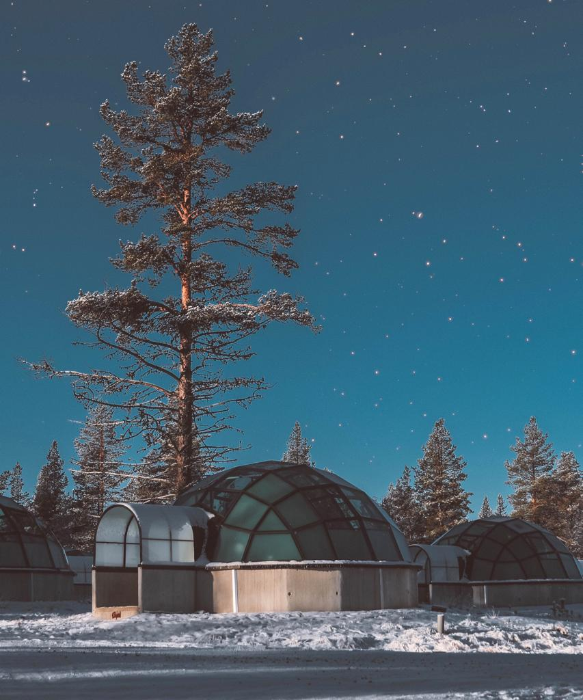
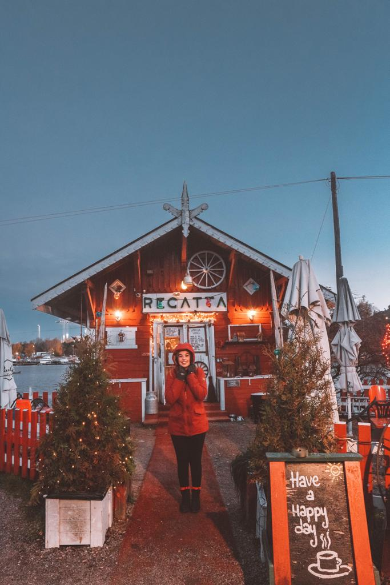

I am finally working on my blog about my Finnish experience. Not many people consider Finland as a place to visit, especially during winter time. October is a great time for visiting Santa’s country but don’t expect to find warm weather. We had from 0 degrees to minus 10. I know, you are probably asking why someone would even go to such a cold country when you can just catch a flight and go for a summer holiday somewhere. But Finland would not be the same on a summer day.

Helsinki was a big surprise. I have been to Norway, Sweden, Denmark and I loved all these Scandinavian countries. The lifestyle is completely different. People seem to live in a happier way and without too many worries. People are very friendly despite the cold weather around. I knew I would have liked Helsinki, but I didn’t expect me to like it as much. We spent three full days in the capital and we have seen so much. There are many different attractions and places to see, but I am going to recommend the ones that most captured my attention.

#### Helsinki Cathedral

Helsinki Cathedral is very different compared to other cathedrals you can see in the rest of Europe. A Greek cross with four equilateral arms around the main square is the plan used for building this impressive architecture. It belongs to the Neoclassicism, a style that I am pretty fond of. We went there around 8.30 am and there was nobody around. We are not really used to seeing empty squares and attractions at that time of the day. But Helsinki gave us the impression to be a quiet city. The sun was low and it was brightening up the entire building. You don’t even feel the cold anymore when you are there. You just think about how some architectures can be truly amazing.

#### Café Regatta

If you are looking for a cute and different café, this is a place you must try. Have you ever imagined how Santa’s home looks like? I have. And I just imagined it like this little café. Christmas trees around, a red carpet at the entrance, a tiny little house that makes you feel like you are back to your childhood, more Christmas trees and tables to sit outside (for the bravest ones) and some red decorations for underlining the winter vibes. It is a unique cozy café and their cakes were delicious. We had a cinnamon bun and a blueberry tart and they tasted so yummy. The inside is so cozy and just as cute as the outside.

#### Market Square

We were lucky enough to have a snowy day and see the Market Square with the sun and with the snow. I have to say that it is way more fascinating when it is covered in white. You can see the harbor, the Ferris wheel and get emotional while looking at this amazing little square. There are only a few stands outside, but remember to go inside and try some of the delicious food that they are selling. There are some stands for fish and some little cute cafes where you can sit and get warmer. All you need with the cold weather.

#### Suomenlinna

Did you know that the archipelago of Helsinki consists of around 330 islands? It would be impossible to see them all but you must see what became a UNESCO World Heritage site thanks to its interesting military architecture. Suomenlinna is a perfect spot for getting away from the city. You can take a ferry from Market Square for only 5 euro for a return ticket! It is the biggest sea fortress in Finland and it is worth a visit. You can admire some beautiful views and have a picnic if it is not too cold! We just walked around and loved the little yellow houses on the island. We would love to own one and maybe one day we will. We can still keep dreaming.

#### Porvoo

Porvoo is the second oldest town in Finland. It is a day trip from Helsinki that I would highly recommend doing. You can get the bus from the Kamppi Station (from where you can admire the Chapel of Silence). You can go to this shopping center and wait for your bus inside. I’d say they have built the station inside for keeping passengers warm from the cold. You can get the bus 848 and be in Porvoo in an hour. It is really a little gem just outside the Finnish capital. The houses are so colorful and you really get to see a traditional Finnish village. Don’t forget to walk along the waterfront for admiring the beautiful red colored houses and to visit the cathedral.

#### Ivalo

If you have some extra days, you should visit Ivalo. From Helsinki, you can fly to Ivalo with Norwegian Air. If you decide to spend the night at the Kakslauttanen Arctic Resort, you can ask for a shuttle service for 29 euro each way. We decided to spoil ourselves and spend a night at the glass igloo. I know it is expensive, but we all live only once. And looking at the sky, waiting for the Northern lights and sleeping in an igloo are all unforgettable memories that you can keep forever. There are plenty of activities you can choose from. We decided to visit the husky farm and the puppies. We had an amazing time and we learned so many things about some of my favorite animals. Dinner and breakfast are included and you can get to relax on a bed that faces right at the sky from where you can admire many stars.

Finland is a great country and I really hope to go back for a working experience soon. I love the cold. I love the winter and I love huskies. There is nothing better than living at Santa’s home and I could work as an elf. It would be like so much fun, wouldn’t it?

