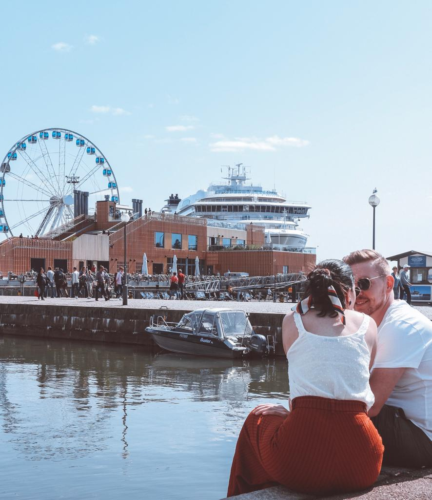

### If you live in Tallinn or any other place which is not too far from Helsinki, you should really consider heading to the Finnish capital for a day trip!

Coming from Tallinn, we opted for a ferry trip. We chose <a href="https://www.tallinksilja.com/book-a-cruise" target="_blank" rel="noopener noreferrer">Tallink Silja</a> to travel with and everything was just perfect. The ferry ride is only 2 hours and by the time you have your breakfast on board, it will already be time to get off and explore the city. If you buy a return ticket for the same day, you will find a cheaper price. You might be able to find a 40 euros deal for a return ticket!

Once you get to the West Terminal of the harbor, you will need to get into town. If you only visit Helsinki for the day, a great option would be renting a bike and just riding around the city. Transport in Helsinki is quite pricey and a bike would work out to be the cheapest option.

One day for exploring Helsinki might not be enough and that is why I would recommend staying at least one night. We were over in October for 5 days and had enough time for seeing all the sights (read more about our previous trip to Finland here), so the day trip was just to see how Helsinki looks like during summer days and just go back to the places we loved the most over our first visit. 

If you are thinking about visiting Helsinki for only a couple of days and you would like to rent a bike, I would highly recommend Bicyclean Helsinki. The staff was super friendly and you can have a great city bike for 10/15 euros a day. 

If you are arriving by ferry, you can get to <a href="https://bicycleanhelsinki.com/" target="_blank" rel="noopener noreferrer">Bicyclean Helsinki</a> by getting the tram and by walking for 5 minutes after that. They are located not far from the city center and that makes it so much easier for visiting all the main sights around.

Helsinki during summer is just a totally different city. So many tourists around and way more bikes too. I loved it when we first saw it surrounded by snow but I have to say that the summer vibes made me fall in love with it even more. 

We took the ferry at 7.30AM and arrived in Helsinki city center around 10 AM. Our itinerary included a quick stop at the Helsinki Cathedral, a ride to the cute Regatta café and a lunch stop at Johan and Nyström, one of our favorite cafes ever! 

Cycling in Helsinki is just super easy and you will find cycle paths all around. I always loved cycling around and I really miss having my own bike. So, I am super happy when I get to cycle in some new places I visit.

If you get the ferry and opt for just walking or using transport, I would recommend downloading the App HSL where you can purchase a ticket for 2 euros (for zone A and B) instead of nearly 3 euros and it is just way easier if you do it that way. The ticket will last for about 90 minutes from the time of validation. 

If you plan on staying for longer, there are many alternatives you can add to your itinerary. Did you know Helsinki has got around 330 islands? I personally didn’t know that before going to Finland and I think it is such a crazy amount! If you are heading to Helsinki during the summer, make sure to have some extra time for visiting some of the islands.

I would recommend visiting Suomenlinna, a sea fortress and nature area which is reachable only by water. You can easily take the ferry (around 5 euros) from the Market Square to Suomenlinna and the ride is just 15-20 minutes. We went to Suomenlinna during October, the sky was clear and we personally loved it. It is a very enjoyable place and you will feel immersed by nature and cliffs.

Do not forget to add a stop at <a href="http://caferegatta.fi/" target="_blank" rel="noopener noreferrer">Regatta Café</a>. I have personally never seen such a cute café that reminds me of Santa’s house! I have to say that going there during the summer wasn’t as Christmassy as when we had the chance to see it surrounded by snow. But it is definitely worth a visit. Grab a cinnamon bun and enjoy Santa’s house!

And if you love almond croissants as much as I do, you definitely need to try <a href="https://www.facebook.com/johanochnystrom/" target="_blank" rel="noopener noreferrer">Johan and Nyström</a> café. After my first visit in October, I was craving going back just for trying their almond croissant and it didn’t disappoint me! It is such a cute and cozy place and it is a perfect spot if you want to have lunch or just take a break and relax.

No matter what time of the year you decide to visit Finland, you will surely love it. It is really up to you. If you are looking for some winter activities or some northern lights, then October – February is the period of time you should consider. If you are looking for a relaxing time in the nature, then you should consider booking around March-May. If you are just interested in a sunny summer break, July and August are the perfect months. I loved seeing Helsinki in a different light, but seeing Lapland sunken with snow, sleeping in an igloo, doing winter activities with huskies was possibly what I preferred. Even though, hikes in the summer and the parks are definitely something that doesn’t leave you that indifferent.

I mean, Finland without snow is just such a peculiar thing to think about. Santa’s home without snow, what kind of world is that?

