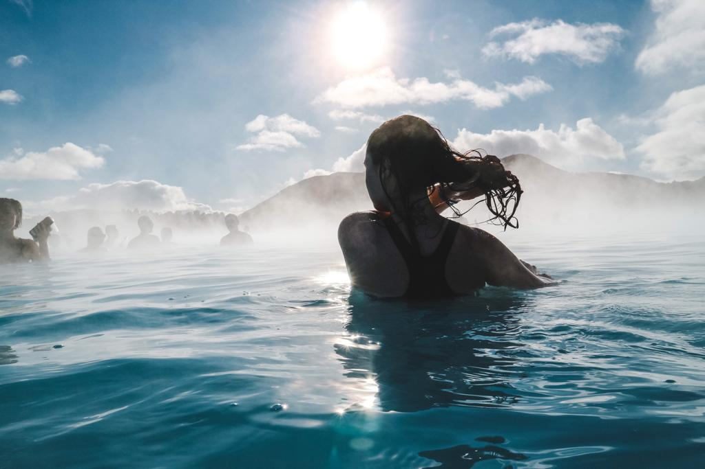
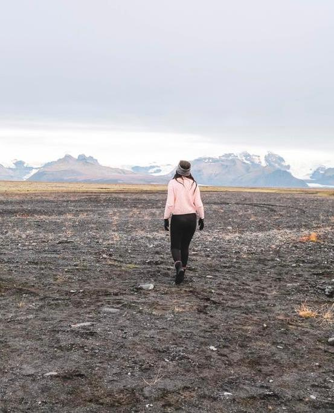
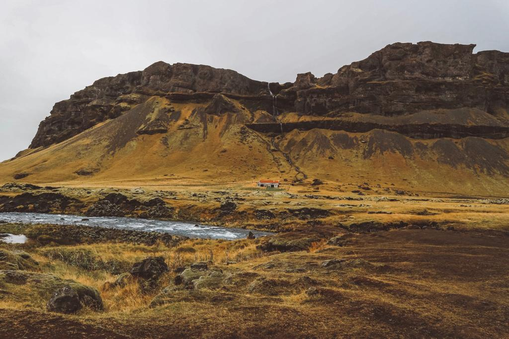
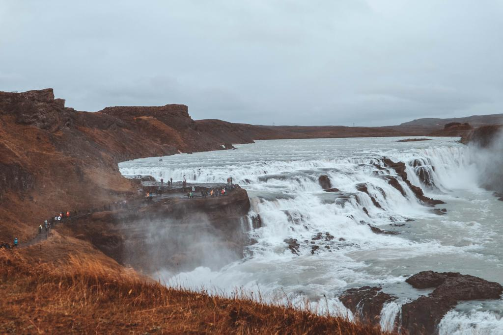

### If you want to take a break from the crazy city life and soak in the wilderness, then Iceland is the right place for you. Just be aware that you will be a changed person once you will be back to reality.

There is not really a right way of travelling around this marvellous Scandinavian country but the best way for seeing it in all its wondrousness is renting a camper van. You don’t really need to make a plan ahead. All you need is pointing out on a map the places that you would love to see most. Many more will come up while you will be driving on the Ring Road and you will stop a lot more than you expect, that’s for sure. There is several companies you can choose from for renting what will be your new home for the journey you are about to pursuit. The one I opted for is called ‘Happy Campers’ and they give you all you need for your adventure. We arrived in Keflavik Airport at 11.45pm of the 4th of October and decided to stay there for the night as we could only get our camper from 8.15am on the following morning. There is also different kind of campers that you would be able to rent. We chose the Happy 1, the perfect camper van for two people. It has all you need for sleeping and cooking. The prices are not excessively expensive as we spent about 1200 euros for ten days. What I would highly recommend is to get an inverter for charging your phones and your cameras and wifi for a sum of 60 euros all together. I decided to opt for Happy campers also because it comes with a heating system. You wouldn’t think that the heat makes a big difference but it really does, especially in October, when the weather starts to get cold and wet. They also offer a pick up in the airport for free which is a great way for saving a bit of money. We got picked up at the airport around 8.15 am and got our camper once arrived at the Happy Campers base.

We didn’t really decide which side of Iceland to visit first but we went for the South as the first place we planned to stop at was the Blue Lagoon.

We booked our tickets for the 5th of October at 11am and the price was around 70 euro each. Make sure you book your ticket in advance because it gets fully booked very quick and go for a standard ticket, bring your own towel from home as you will save money and live the same experience. Also, book it for the first day or the last day of your journey as it would be an amazing experience and a relaxing way for starting/finishing your trip. I know there is other ways of enjoying the natural hot spots in Iceland and maybe for cheaper, but the Blue Lagoon is one of those must that you have to write on your bucket list. And if your self-esteem is not as high, do not worry about taking a shower completely naked with many other women/men, you will never see them again! But if you really want to avoid the crowd, go early in the morning or just before closing time. Make sure you wash your hair thoroughly with the complimentary Blue Lagoon shampoo and conditioner that you will find in the shower area as the water might affect your hair. You will also be able to get a mud mask and a couple of hours will be more than enough for enjoying this marvellous touristic geothermal pool.

Happy Campers gave us a map with all the campsites still open over the season. So after the Blue Lagoon, we decided to go to the Thingvellir National Park for the night. Don’t expect to camp for free anywhere. You will need to pay around 10/15 euro pp every time you stay at a campsite but might not need to pay if you arrive late at night and leave early in the morning. On our way to Thingvellir we stopped several times and the view from our new home’s window was something I always wanted to see from my window at home. Going to bed in one place and waking up in a totally different one was always something I dreamed of for my entire life and there is not better place than Iceland for experiencing it.

For our second day of road-trip, we decided to go to Geysir and continue our journey to Gullfoss, meeting some new friends along the way. Geysir is one of those places everybody hears about and sees in documentaries. It is that place that you try to create an image of in your mind, but only when you actually see it in person, you understand the strength and force of nature. You stand right there, only a few steps away from those cavities, you see the water bubbling and know that something is about to explode. Then your heart pounds and starts beating louder until the storm passes and there you are, feeling thrilled again to the idea of seeing this geological event recurring every 10/15 minutes. It took us a while to accept the fact that we couldn’t stay there forever and that there were so many other places to see and when we eventually found the courage to leave, we drove up to Gullfoss, which has known for one of the most beautiful waterfalls in all the country. Gullfoss gives you a view of the beauty of untouched nature. It makes you understand how powerful nature can be and how the world is worth to be seen. I was lucky enough to meet some new friends on the way back down from Gullfoss. They were very happy when I gave them some candies for horses, gave them my phone number to keep in touch but I am still waiting for the call to come…

For the night we chose to stay in Skogafoss and the view didn’t leave us with regrets! Time flies and day 2 has already passed but still so much to see. We were exhausted and fell asleep so early that night. We woke up on day 3 in Skogafoss, with a magnificent waterfall in front of our window. ‘Could I be any happier?’

