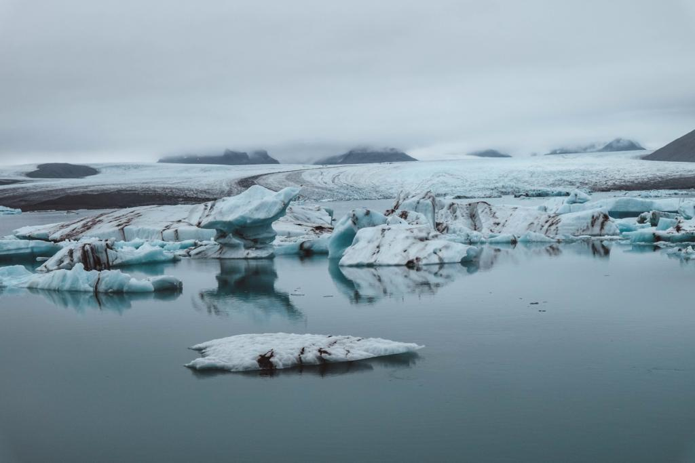
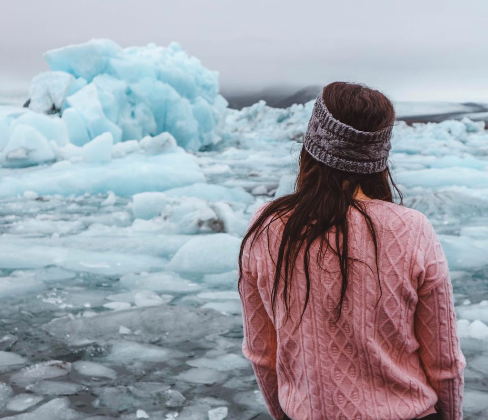
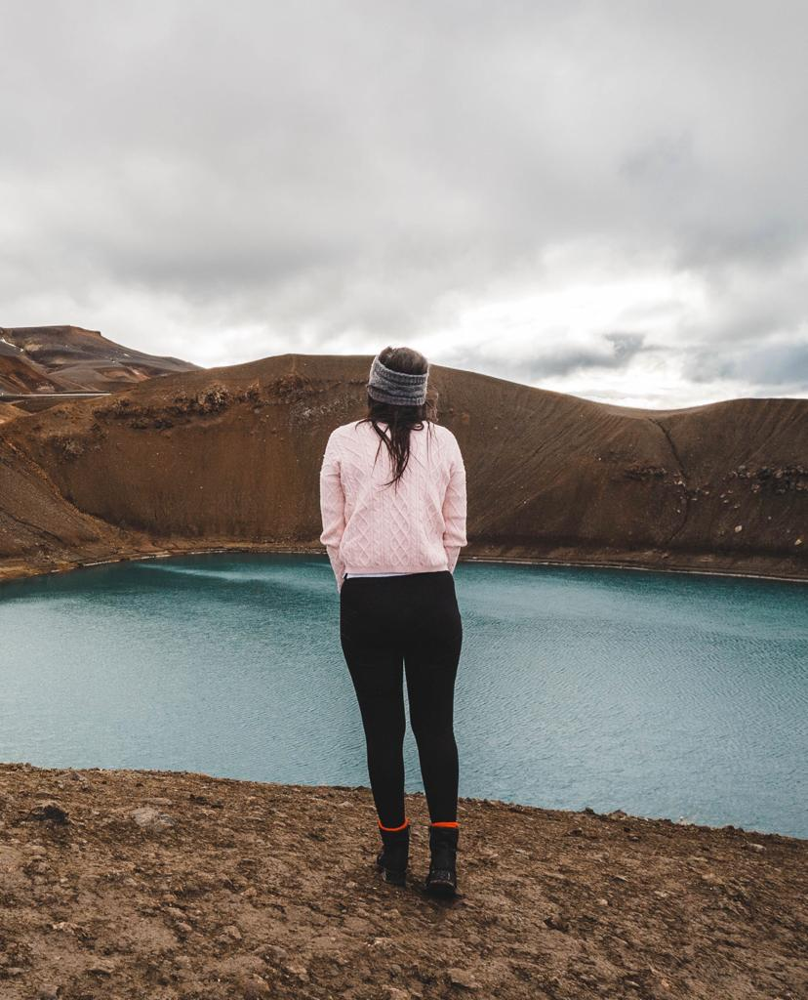
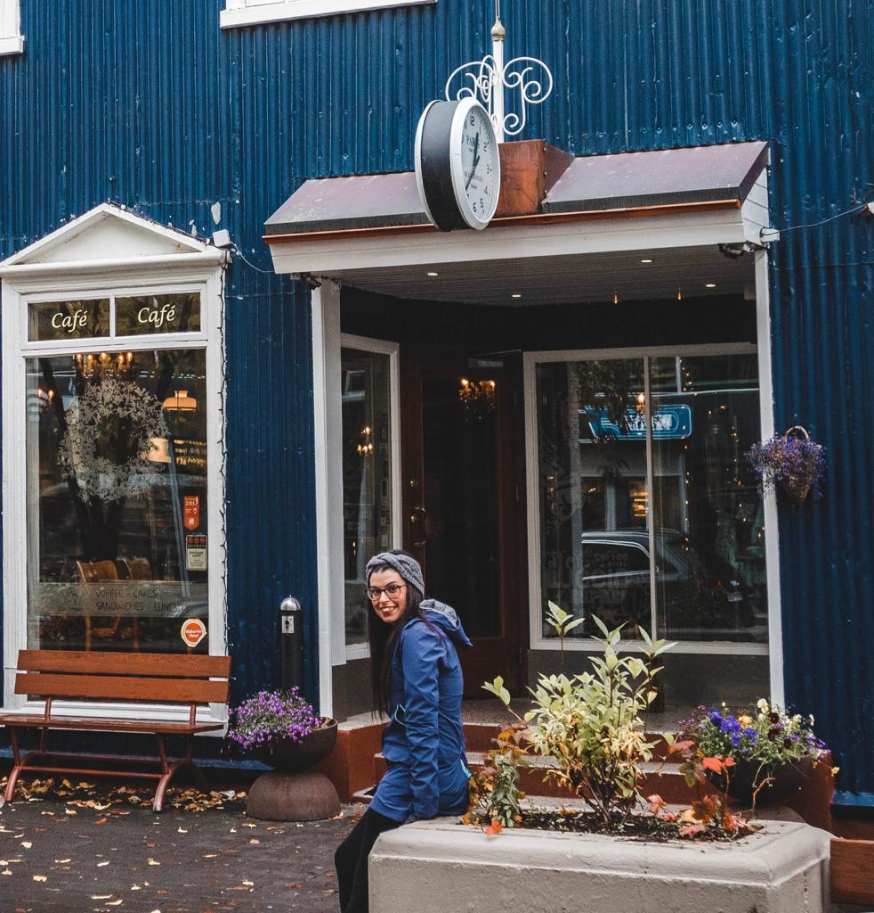

‘No, I certainly couldn’t.’
But I was surely wrong about that. Why? You will find it out as the story develops. But now let me go in order.

Let me see, where was I? Oh yes. On the third day, we decided to continue our way to the East. We stopped at least fifteen times on the way to the Diamond Beach.

Iceland is like another planet and it is crazy to think that there is a place on Earth where you can find all the different kinds of landscape. You are driving on the Ring Road and you see the desert on the left, the sea on the right and a massive mountain right in front of you. You drive for an hour or more and there is no other car except for yours on the road. That’s when you really feel immersed in its own majesty. And you are free. Free from all the things that bother you. Free from all the thoughts that occupy your mind. It is only you, nature and your heart that gently becomes wild and free.

We decided to drive more than we had in the past two days because we wanted to get to have enough time for exploring the East, the North and the West parts too. Around 2 pm we arrived at what became the place that probably changed me most. I could not even imagine that a place like this existed. It is like being in a fairy tale with the difference that you are not a princess but only an adventuress that didn’t even take a shower in two days. We have a ‘smelly’ brave adventuress as the main character and a camper van as a house that could sound quite bizarre but we also have a surrealistic place as a location. A bit like in one of Magritte’s paintings where mundane objects or people are placed in unusual contexts. And it is those contexts that create that sense of mystery which evokes and challenges suppositions based on appearance.

The Diamond Beach is all that Magritte tried to represent through his vision of art. And like his paintings, the Diamond Beach coaxes you in the same way. You start thinking that he was right when he said ‘Everything we see hides another thing, we always want to see what is hidden by what we see’. And when you see a place like that, trust me, you want to see more than what’s on the surface. There is a hidden intriguing sense of madness that makes you want to discover more and more about it. I sat there and looked. Looked at that painting. Read that fairy tale. But once was not enough. I did it again and again until the sky was not as bright anymore.

We found our campsite for the night in Vatnajokull National Park but it was difficult to fall asleep. ‘Everything we see hides another thing, we always want to see what is hidden by what we see.’

That was the only thing I could think of. I wanted to know more about that place. I wanted to read more about it and look more at it. And that’s why we decided to go to the Diamond Beach on the following day too when we discovered different views and felt countless emotions.

