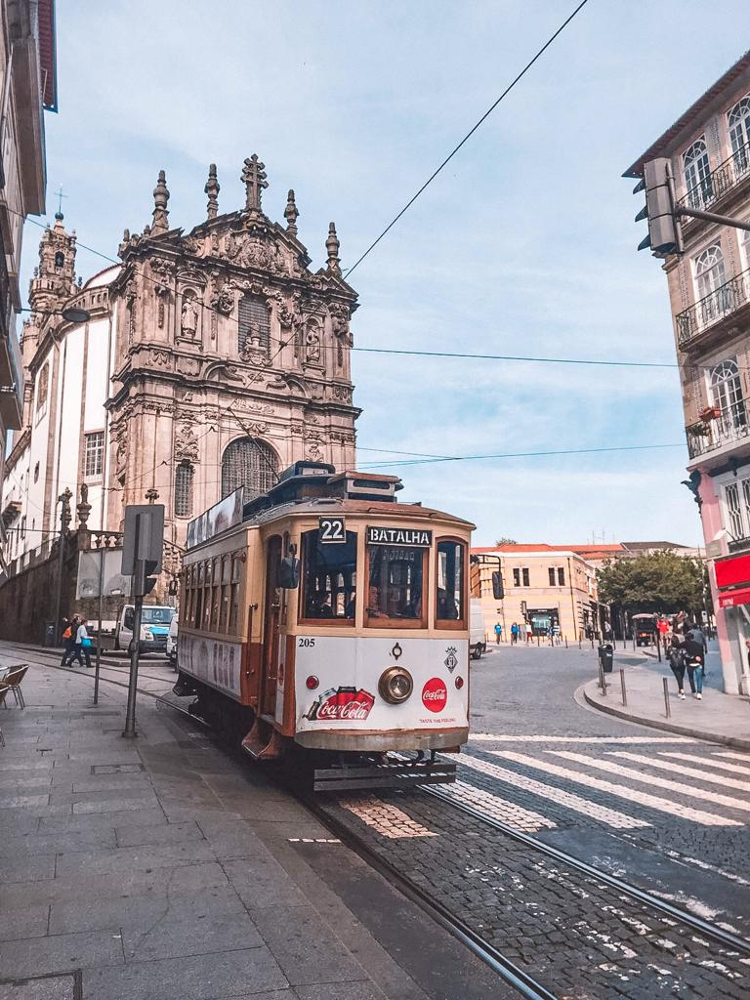
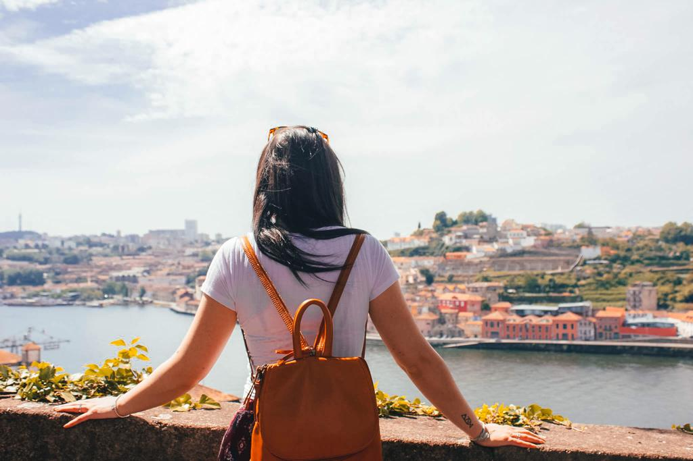

### Porto is that magical city that gives off warmth and emotions and makes you feel like home.

There is nothing more warmly than a combination of colors and pigments, and Porto is the perfect example that encloses a valuable collection of nuanced details. Nuanced details that can be seen in the Ribeira (riverside) Square, the historical center of the city, designated World Heritage by UNESCO. I still remember me walking down by the river, on the typical narrow streets and my mind be certainly feeling free with lightheartedness and giddiness. Giddiness that is enlarged and extended once I get to the top of the hill and get to see the city in all its splendor.

A magnificent splendor that is emphasized by the scale of colors that characterizes the buildings of the city. It could be described as a heart-stealer color palette of an indexed image that goes from the pastel tones to the brighter colorful ones of tons of bricks. And all I can think is that Porto really has that magical something that leaves you speechless.

I remember me walking onto the innumerable streets and me being astonished by the art of ceramic that distinguishes the architecture of this Portuguese city. I look around and I get surprised by a large number of churches and structures that see blue and white azulejo tiles as the main feature of their walls. From Santa Catarina Church to São Bento Train Station, everything achieves that special handicraft that leaves a remarkable impression.

I keep walking up to the road and I see the Torre dos Clérigos that stately moves vertically away from the surface and my mind is absolutely blown away.

And, at the end, I finally see one of the many traditional trams that are usually represented on most of the postcards and I start to daydream. And with my moony face, while I am eating a couple of delicious Pasteis de Nata, I start to imagine and fantasize about what comes next.

