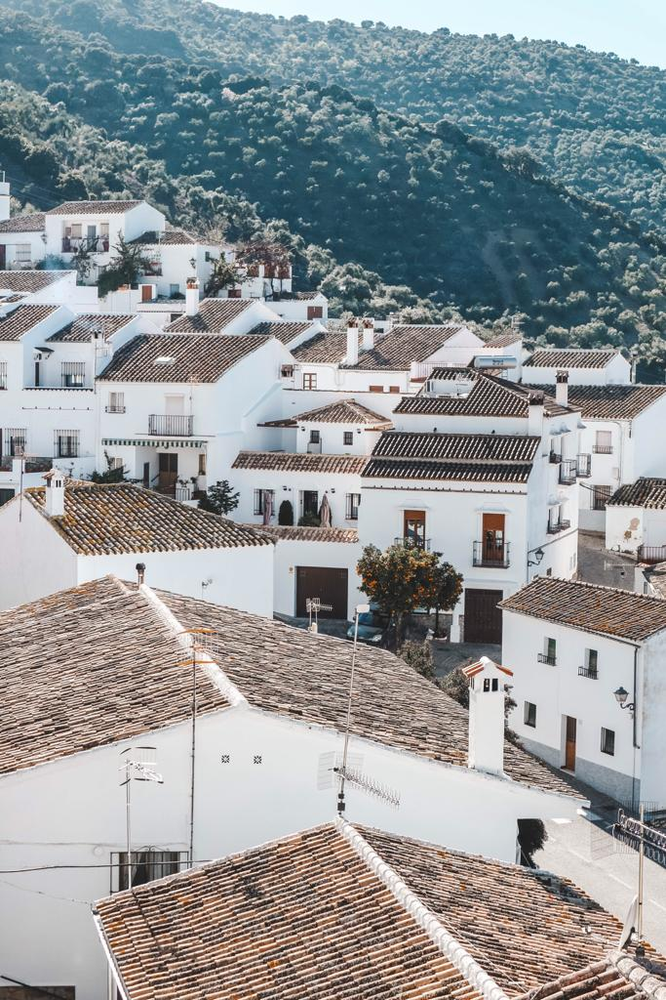
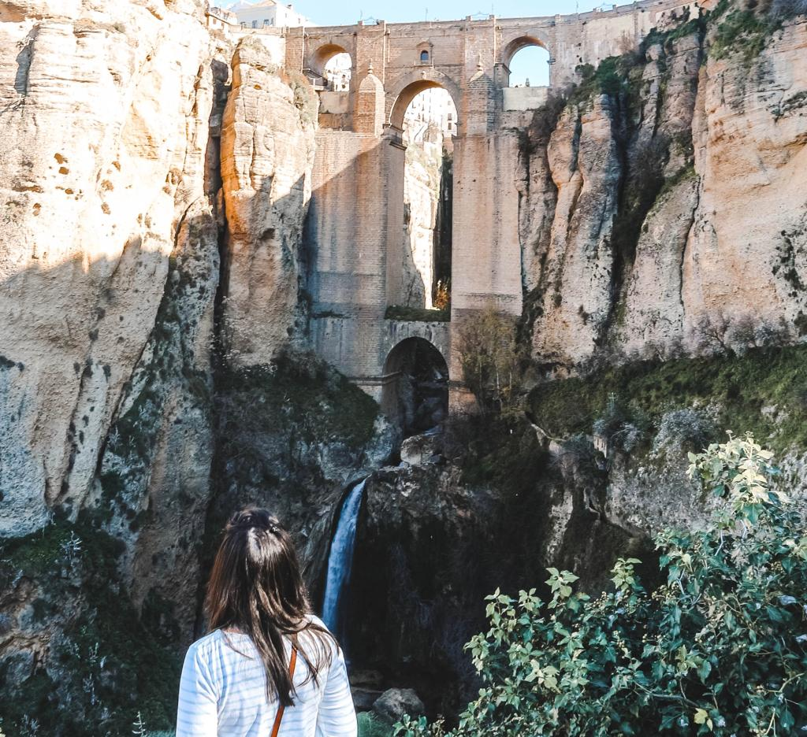

### If you are staying more than a couple of days in Seville, think about the possibility to do a road trip around Andalusia, from Seville to the little town Ronda.

I remember when I was looking online for things to do around Seville and I came across a picture of the Puente Nuevo in Ronda. I was so in love with it that I just opened Google Maps and checked how far Ronda is from Seville. When I found out it was only two hours away, that was it. Everybody talks about how beautiful Andalusia is and Ronda is just the perfect excuse for renting a car and enjoying the charming road that goes through Andalusia.

We decided to rent our car with Centauro and if you fly with Ryanair, just book through their website and be sure to enjoy their discounts. We got a little Fiat 500 and it was just perfect for the day. It was three of us and we spent a total of 75 euros including petrol and insurance. 

We woke up around 7am, collected our car for the day around 7.30am and that was the start of our road trip. We just took our time and made sure we weren’t missing any piece of this beautiful part of Spain. It is amazing to see so much green and amazing views all around, especially on a sunny day. We went in January and the weather was just perfect, not too hot and an average of 20 degrees.

Arrived in Ronda, we parked the car in one of the multiple car parks (we just didn’t feel like leaving the car somewhere outside and preferred to pay a few euros instead of having some issues afterward) and we were ready to go to see the majestic bridge. We didn’t expect so many people in a little town like Ronda.

You have to know that Ronda inspired so many writers and Hemingway wrote about the beauty of Ronda in many of his works. He said that there is ‘‘one town that would be better to see your first bullfight in if you are only going to see one, and that that town is Ronda’’. He spent many summers in the little Spanish town and was fascinated by it. And not only fascinated by it because of the bullfighting but also because of the mountains, the views, the narrow streets and just the essence of the whole town. He also writes that Ronda “is where you should go if you ever go to Spain on a honeymoon or if you ever bolt with anyone. The entire town and as far as you can see in any direction is romantic background.” And these are only two of the multiple quotes you will find in his works. Hemingway is remembered by the Paseo de Ernest Hemingway, a pathway that runs from the top of El Tajo to the new part of town and provides amazing views (find the vertiginous balconies that look straight down to the beautiful landscape) that you certainly don’t want to miss!!

We decided to walk all the possible ways and we found a great spot for having a picture with the Puente Nuevo. It happens a lot to see pictures online and be disappointed when you are standing in front of the places. Puente Nuevo was far from being disappointing. It is really like it looks in the pictures you find on the internet and it made me fall in love with Ronda, a town that I didn’t even hear about before my last trip to Spain.

We enjoyed our walk in the narrow streets and we found so many cute and little souvenir shops where we purchased some painted postcards and bookmarks. We didn’t want to stay until late and 3 hours was enough for embracing the beauty that belongs to Ronda. 

On our way back to Seville, we decided to add a last minute stop in Zahara. We just decided it at the last minute and didn’t expect much from it. If you go to Ronda by car, make a stop in Zahara, a white paradise. I just felt so happy when surrounded by an entire village made with white houses, a white church, and white restaurants and bars. We went on a Saturday and it was so nice to see all the locals out and sit at tables enjoying their tapas and drinks. And there are also so many viewpoints where you can admire special views from. We stopped for an hour and if we could go back, we would do the exact same thing!

I know there are many tours and many ways to travel from place to place, but renting a car is quite a must if you go to Andalusia. Ronda is something you should see once in your life and Zahara is white heaven. Feel and see how the locals live, meet the real heart of Spain and enjoy the many sceneries while driving on the road.

