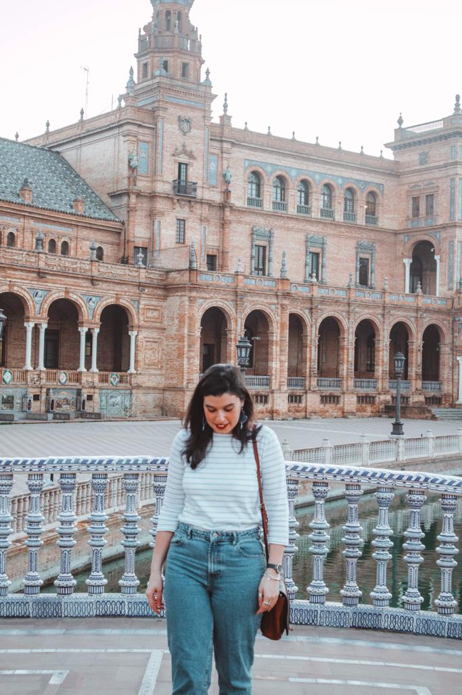

### After our trip to Valencia in October, we decided to go back to Spain for exploring the southern part, especially Seville and Granada.

Seville has all you want to see in a city: innovation, tradition, Arabic influences and a lot of stories to go with it. If you are dreaming of a stay in Morocco, but you don’t have enough time or it is just a place way too far for you, Seville and Granada are two great replacements. In fact, you can feel like in a Moroccan riad and dream while looking at the detailed and colorful mosaics and the wide gardens with many mandarin trees all around. It is amazing to see how profound the Arabic influences have been when it comes to Spanish cities, their architecture, and art. No matter where you go, you will always see specific references to Islamic art, especially in the Southern part.

If you really want to experience an Islamic and Spanish art full immersion, you must visit the Real Alcázar of Seville. Be aware that you need at least a full morning for visiting the whole site and what I recommend is booking the tickets online. You will only spend 1 euro more for the online purchase but at least you won’t need to wait in a long queue for an hour or so. The general entrance ticket is 11.50 euros and it is worth every single cent. I would suggest booking the 9.30 am tickets, as soon as it opens. By the time you are finished, you will see a huge crowd coming in and if you want to fully experience the Real Alcázar, you need to do it when it is not overcrowded. I don’t think there is a right way to visit this masterpiece. You can just walk around and get lost in the vastness of beauty.

If you are in Seville, make sure you have time for seeing Las Setas, which is translated with mushrooms for its mushroom-shaped parasols. It is something you don’t expect to see in a normal Plaza but it makes you understand how grate the combination between tradition and innovation can be. Las Setas is a wooden structure and it is approximately 26m high. Go there when it is nearly sunset, book an entry till the very top (only 3 euros including a free drink and a free postcard that you can collect just at the shop opposed to the tickets place). You will be able to see the ability put into this project and you can just admire the view of the city when the sun is about to set. Could you ask for more?

And even if you are on holiday and you like sleeping until late, make a sacrifice and wake up around 7 am and head to the Plaza de España. I personally like seeing a city while everybody is still asleep. You will love that sense of freedom that the crowd wouldn’t be able to give you. You can always head back there after for comparing what is like to have the place all for yourself and share it with everybody else.

Plaza de España is a semi-circular blend of bricks and tiles. You will find a tower at both ends and you will fall in love with the decorations, all the blue tiles, its fountains and the 500m canal that goes all around and that is crossed by four bridges. Also, you can rent a small boat for 6 euros for 35 minutes and enjoy your time while rowing a boat on the canal. You will feel like transported to an older Venice with some Renaissance references.

For eating, if you are around the Plaza de España, only 20 minutes away by foot, there is this little place called ‘Ovejas Negras’ where you can taste delicious tapas for a right amount of money. I loved their goat cheese with honey and herbs and their patatas bravas were just delicious!

If you are looking for a cheap place to stay at, Cerrajería is the right place for you. It is little and has all you need for a short stay right in the heart of Seville. Only 5 minutes by foot from Las Setas, Cerrajería is in the perfect location if you want to discover the Old Town and all its narrow streets. 

There are many places you can go to from Seville. We opted for renting a car and decided to head to Ronda while driving around Andalusia. Stay tuned for the next blog about my road trip in Spain!

