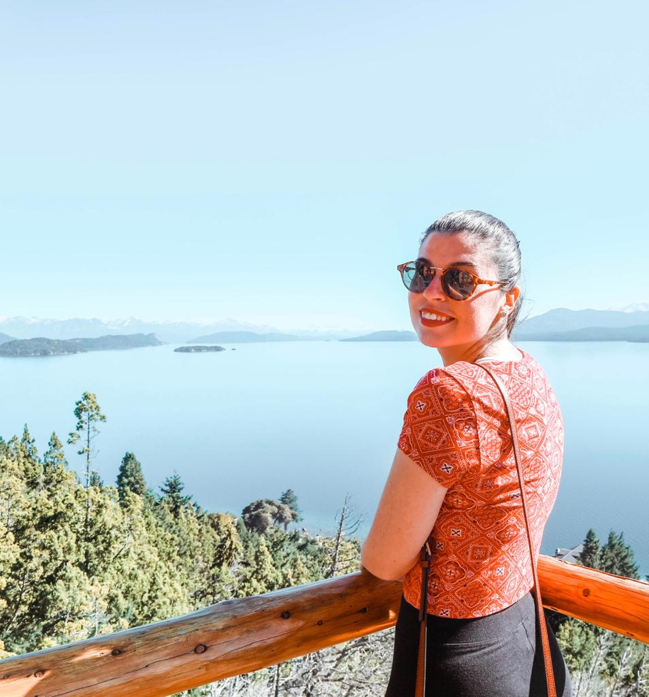

### Here we are, on our way to Argentina, more precisely to Bariloche. Let's proceed by order.

We decided to take the eight hours bus from Puerto Montt to Bariloche. It was actually the best bus we have taken so far. AndesMar is a great bus company to travel with. Despite the quite short journey, they gave us plenty of snacks and beverages and they also broadcasted a couple of movies so time definitely flew by. It was our first time to travel to a different country in South America and we did not know what to expect at the border crossing. Arrived at Chile’s border crossing, we got our exit stamps and about half an hour after we were at the Argentinian side, waiting in a long queue for getting our much-needed entrance stamps. Bags were fine and we were on the bus again for our final part of the trip to Bariloche.

And a few hours later we arrived at the Bus Terminal and we have no Argentinian Pesos and, of course, there is no ATM at the station. The closest one is in town, only 2.5 km away from where we are. We decided to take a taxi and asked if we could stop at an ATM on the way to the hotel. No problem at all and it was the best decision ever: the taxi was only 160 pesos, around 6 euros and we were just too tired for a walk on the mountain streets and our backpacks wouldn’t have helped.

Here the best part: our Junior Suite at the Design Suites Bariloche! After staying in hostels and sharing places with people from all over the world, a stay in a four-star hotel was well needed. Of course, we wouldn’t have booked it if we hadn’t found a super deal on <a href="https://www.booking.com/index.en-gb.html?label=gen173nr-1DCAEoggI46AdIM1gEaGmIAQGYAQm4AQfIAQzYAQPoAQGIAgGoAgO4AoaiivYFwAIB;sid=6305502ed15bb7e0d85b82f2cc5e4fdb;keep_landing=1&sb_price_type=total&" target="_blank" rel="noopener noreferrer">booking.com</a>. Two nights in the Junior suite, with a hot tub facing the Andes Mountains for only 150 euros. We decided to spoil ourselves for two nights and get to relax before the planned 27 hours bus journey to El Calafate.

A dream coming true! The first thing we did was filling the hot tub and getting into it for a relaxing bath facing la Cordillera. We stayed in it for an hour or so and the sun started to set and the sky became pinkish. It was really like being in a dream.

I highly recommend this hotel. Staff is very friendly and the food in the restaurant is quite cheap and delicious. They took care of us and helped us a lot with everything we needed.

Also, the hotel is situated in a beautiful location. Only a few steps away you find the magical Rio Negro.

On the following day, we decided to go for a long walk along the river. The weather was so good and the sky was so blue that was intersecting with the similar color of the water. On the way to town, we were so lucky to find a chairlift site. We obviously decided to do it and we had zero regrets! The chairlift gave us the chance to admire the beauty of Bariloche from the very top and gosh, how beautiful it is. Nature is just so innocently beautiful and I am happy to be lucky enough to have the chance to admire it every day of my life.

