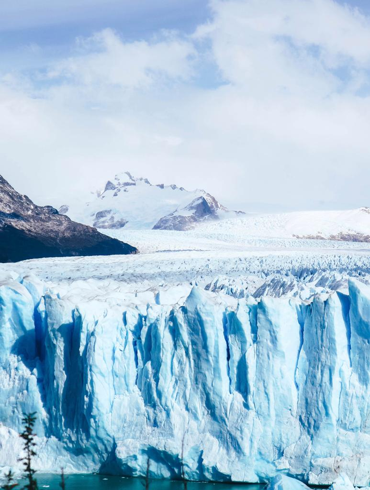
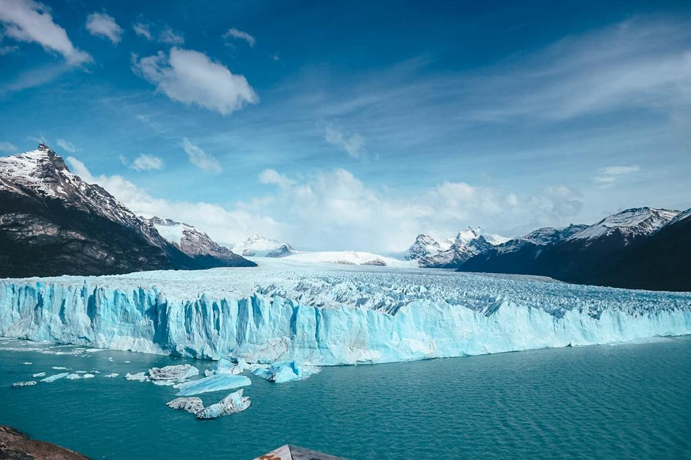

### Hola amigos! The last time I wrote on my blog I told you about my first stop in Argentina. Today I will tell you about our trip to El Calafate and to the Perito Moreno Glacier.

After a couple of days spent in Bariloche, we decided to do something we never tried before: a very long journey by bus!! So, on the 27th of March, we took the 27 hours bus to El Calafate. It was the longest day ever! It was tiring but it is one of those things that you have to try at least once in your life. Only traveling by bus you get to see all the landscapes around you and live every moment of the journey. It was incredible. I spent most of the day looking outside trying to find words to describe the world outside. We got to experience Patagonia and to have a look at all its different shapes.

But guys, we were so wrecked when we finally got to El Calafate. El Calafate is a very nice town. I would recommend making a stop there for a few days. You get to see plenty of tourists and the little wooden souvenir shops are just so cute. I personally loved it and I was glad we decided to stop. I would also recommend staying at the ‘Penguin Hostel’. We shared an 8 mixed dormitory and paid only 36 euros for two nights for two people. The atmosphere was great and the price was just ridiculously cheap.

We decided to take a tour bus from our hostel to Perito Moreno Glacier. You will see innumerable marvelous places on the way to the glacier. It took only 45 minutes for getting to the entrance where you must pay an entrance fee that is 500 Argentinian pesos pp for foreigners. After that, you can start entering in the Glaciers park and you can stop at different viewpoints for admiring the Perito Moreno. It is a very touristic place and people come from all over the world.

At the last stop, we got our 3 hours free time for visiting the place by ourselves. You can get a map where you can see 4 different paths represented by 4 different colors. We had enough time to walk through them all and see the glacier from all the sides: North, front and Southside. We also got to the coast walking on the blue path and seeing the mountains rising close to the glacier is just magical.

Needless to say, that the glacier was stunning from all the viewpoints. I still can’t believe it is something seriously existing in the world. I loved the light blue shining in the front and the noises made by the massive blocks of ice breaking up and falling into the water.

Nature is unexpectedly amazing and it is impossible to explain the beauty of what eyes can see. I will just let the pictures speak and I will just be remembering that 27 hours bus journey and that one day at the Perito Moreno glacier when my heart did swell at such beauty and broke into pieces to the tune of the ice breaking into the water.

