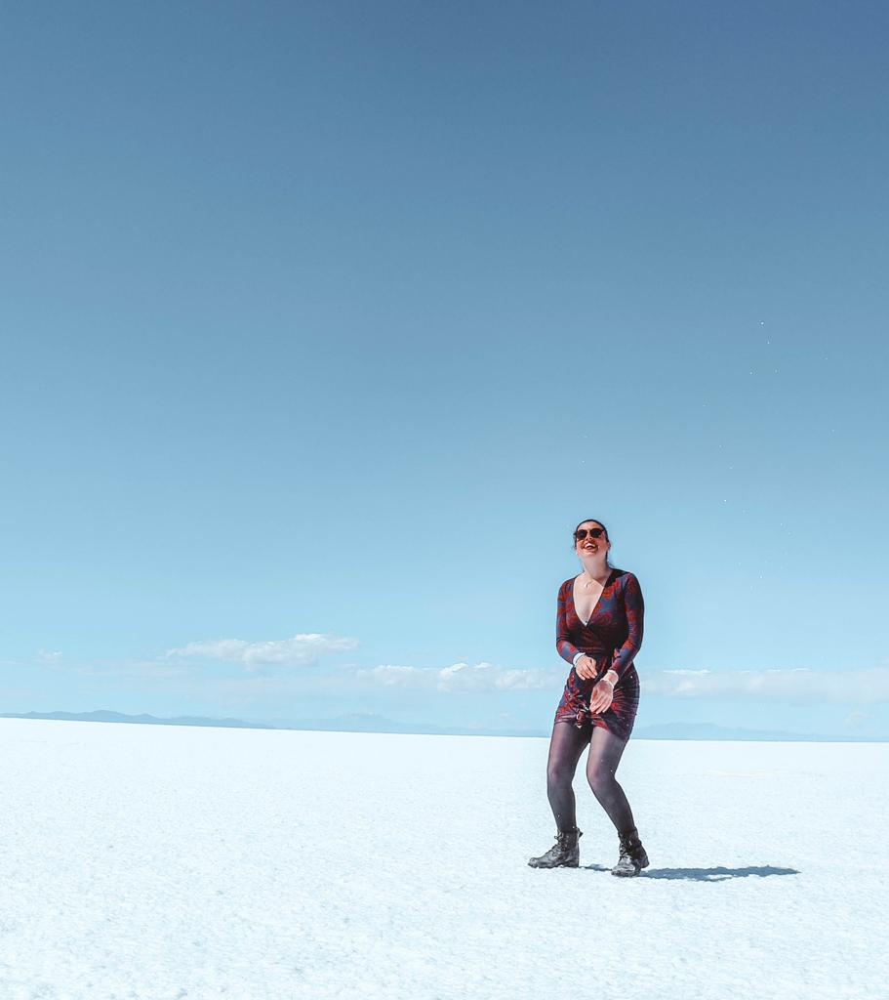
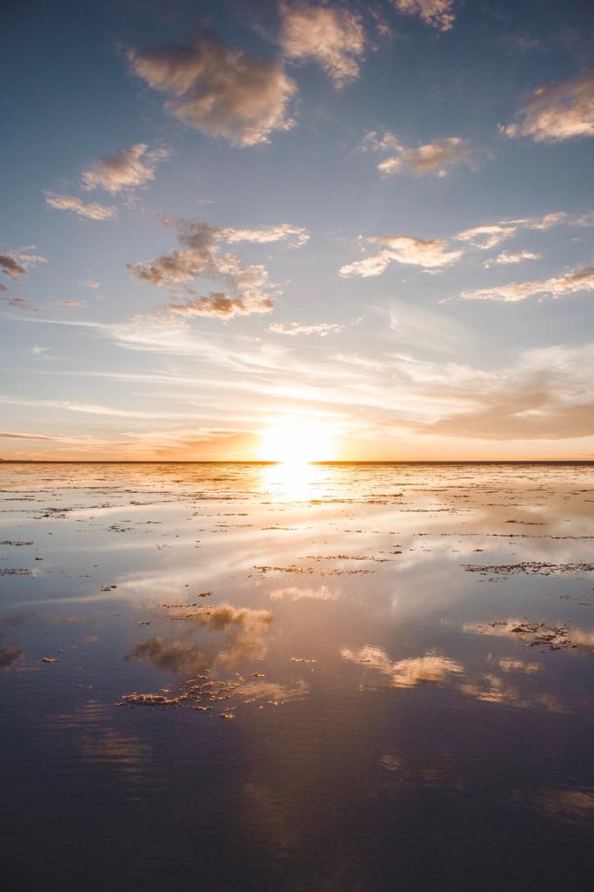
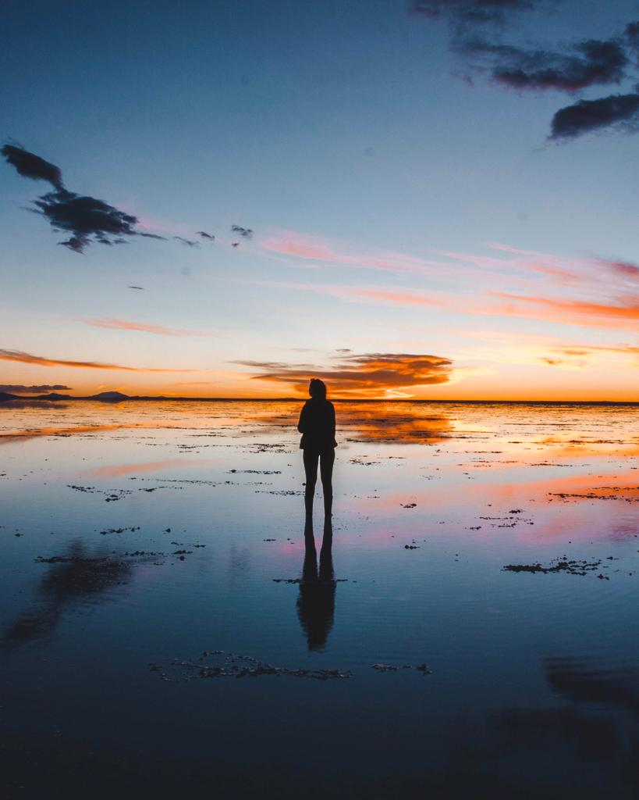

### “When looking at the painting, you can wonder what is imagined and what is real. Is it about the reality of appearances or the appearance of reality? What really is inside, and what is outside? What do we have here: reality or a dream? If a dream is a revelation of waking life, waking life is also a revelation of a dream.”
(René Magritte)

I just want to start my blog about Uyuni with one of my favorite painters’ quotes. Walking on the salt flats, seeing no horizon in front of you and have no limit at all, makes you feel like an element in one of Magritte or Dalí’s paintings.

As my eyes saw the endless salt flats, my mind got reminded of one painting and that’s what I like to compare Uyuni to. In ‘The false mirror’ Magritte raises questions such as ‘Is the sky part of the eye?’ ‘Is the sky reflected by the eye?’ ‘Is the eye a looking glass to see the sky?’

And that’s exactly how you feel when you look at that amazing mirror in front of you. You start thinking it is part of surrealism and that it is only a false mirror, that the sky is actually not reflecting, that somehow the eyes are reflecting a surreal element. Is it real or is it only my imagination?

But then you just pinch yourself and realize that it is not a dream. That this place exists and it is not a fruit of your imagination. And it is really the place where dream and reality collapse.

After this quite long introduction, I am going to tell you all about the unforgettable experience we have had. We arrived in Uyuni from San Pedro de Atacama. It was the craziest day ever. We were supposed to be picked up at 7 am but the bus was not arriving and we started getting worried. About an hour later, we decided to contact them and we got told that they made a mistake printing the list and that it was a bit late in the morning. So, it wasn’t sure we could have made it to Bolivia. They managed to rent a jeep that came to pick us up and the guy started driving at 120 km/h, so we managed to get to the Chilean border on time. We got our exit stamps and back on the jeep. After a couple of seconds, we realized that we had a different driver. We arrived at the Bolivian border and got our entry stamps. Ended up in the jeep with the driver and a policeman. We didn’t have any clue what was going on but all we cared about was getting to Uyuni. And luckily one of the Bolivian drivers accepted to take us on board of his jeep to Uyuni. And there we were, finally on our way to our destination.

7 hours of jeep journey on bumpy roads. Needless to say that my bum was so painful and I was so sleepy after that. But the views we got over the journey made it worth it.

We arrived in Uyuni at 6ish and waited for our free shuttle service to the Palacio de Sal in Colchani. At 8 we finally arrived at the hotel and we loved it. We loved every single detail. The walls made of salt, the chairs, and tables made of salt, the ceiling made of salt. Everything is made of salt!! We could not believe it and our room was just amazing.

The hotel recommended us to take a tour with Hidalgo Tours. We chose the one day tour and they organized our day in a perfect way. Yes, it was a little bit more expensive than other tours but the driver and the guide surely had all the needed knowledge for traveling in the salt flats.

The guide gave us so much information about the salt flats and explained to us everything about the extraction and the packaging of the salt.

We first went to Colchani. A very little town with only one thousand inhabitants. We found a few stands where we bought a couple of souvenirs made of salt and we got to see with our eyes the little factory of salt extraction.

After Colchani, we started our tour into the salt flats. Wonderful use of whites on its palette. We reached the piles of salts.

After that, we reached the famous place of the flags. It was nice to see flags from all over the world because it makes you understand that there is an endless number of people that travel to Bolivia to experience the salt flats.

We saw what is left of the first Palacio de Sal built in 1990. The owner decided to blow it up because the people from Colchani wanted to take it over. So, that’s how we now have another Palacio de Sal situated in Colchani.

Then, we started our an hour drive to the Incahuasi Island. They found a stop and we decided to have our picnic, right in the middle of the salt flats. You breathe freedom and life. We had llama meat and we liked it! But I still feel sorry for the poor llama.

After lunch, we went to the Island. A lot of people think that Inchauasi Island is the Fish Island but that is a mistake. The Fish Island is quite close to it and smaller than the other one. The Incahuasi Island is the Island of the giant cacti. We got told that the cacti grow to one cm every year. The way to the top was tricky and the guide told us that it is as difficult as hiking on Machu Picchu because of the altitude. But once we got there, the view was just a spectacle.

We got back to the jeep and found a spot for taking funny pictures and videos. Our guide and our driver took the best pictures we could have got.

They were super helpful and we also stopped a second time because the guide forgot to take the ‘history’ picture of us on the salt flats.

After that, we went back to the hotel to rest for 45 minutes and then we got picked up again for going to see the sky reflecting on the salt flats with a beautiful sunset. They found the perfect spot and offered wine and snacks. We stayed there, looking at that sky and savoring the moment.

We got home and we could not imagine. We could not imagine our eyes saw what seemed to be like a dream. And that is how the reality of appearances and the appearance of reality collapsed.

