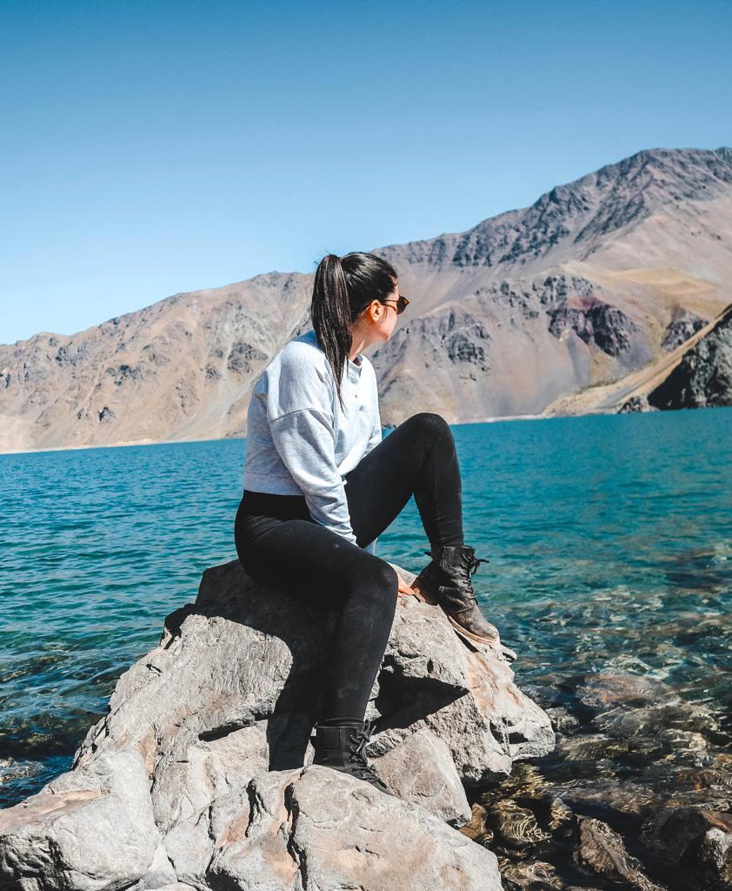
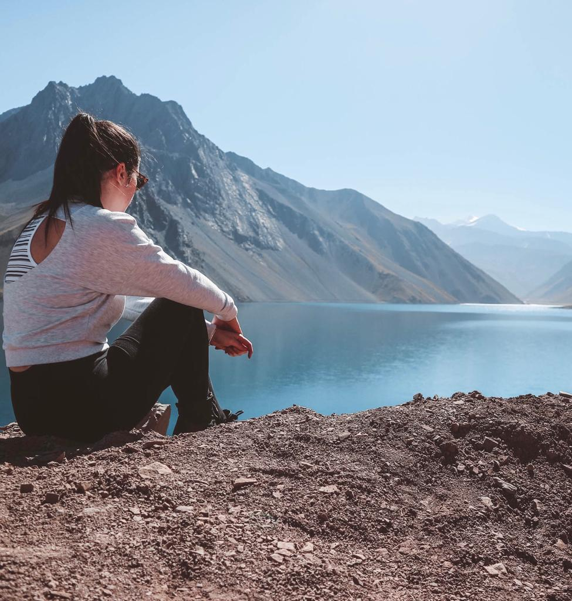
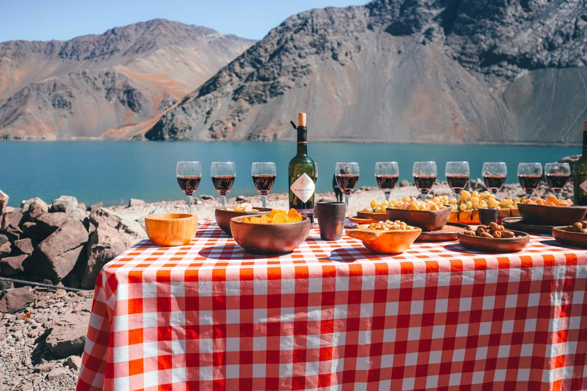

### After been looking at a range of different tours, we decided to book this tour with <a href="https://www.viator.com/tours/Santiago/Full-Day-Tour-to-Cajon-Del-Maipo-and-El-Yeso-Reservoir/d713-28662P1" target="_blank" rel="noopener noreferrer">Viator</a>. We definitely haven't regretted our first choice.

Despite their usual pickup from a central hotel, we got offered to be picked up at our hostel which wasn’t located in the most central area.

They told us to be outside at 8:05 and they were very punctual. At 8:05 we were on the minivan (16 pp in total, including the driver and the guide).

We got to choose an English guide for our tour and he was one of the friendliest and funniest guides I have ever had the pleasure to have on a tour. He gave us a lot of information about the place we were about to visit. On the way to the mountains, we came across a little wooden house that looked like it was made of chocolate. We stopped for a few pictures and then ready to continue our trip.

As we drove, we made periodic stops to take in the view of the stunning landscapes that belong to what is known as ‘Cordillera delle Andes’.

First stop was right in front of the Cordillera. The view was just something that cannot even be described with words. If you will have the possibility to go there, let the heart speaks.

Second stop was what at the end of the tour ended up being called the ‘peepeenada stop’. It is the stop that gave us the chance to go pee (I would recommend using the toilet here because you will have no chance to use the bathroom for at least another couple of hours) and to get a great ‘empanada con queso’ that we absolutely loved as you can see from my mouth full.

After getting back on the minivan, we got brought to what became one of the places I have admired the most in my whole life. Las Yeseras, San José de Maipo, from where you can observe the magnitude of nature and let it sway you to the music of its elements. The guide was just so used to it that he perfectly knew which were the perfect spots to take the pictures from and he kindly offered to take a couple of pictures of us. He also told us that the morning is the best time for stopping to admire the landscape as the water can change its color and get darker depending on the reflection of the sun and that is why you will never see the same shiny blue all the time.

After taking great memories with our cameras, we have moved a little bit further just to find a spot in the middle of nowhere to park the minivan. Twenty minutes for exploring around and getting a full immersion with the beauty of nature. I just decided to get on a rock and sat there watching that incredibly blue-green crystal water.

When we were going up to the minivan direction, we found a majestic picnic with so much tasty food. Some ‘gouda queso’ with a local oil and oregano, salami, olives and other delicious snacks. We also found fourteen wine glasses waiting for us and two bottles of ‘Paso del Sol’ wine, that is exclusively made in Chile. A very delicate red wine for enjoying the tasty picnic facing the Andes. An experience that you must add to your bucket list!

On the way to the last stop, we saw several minivans stopped in spots that weren’t that great. People outside had to put their hands on their mouth covering themselves from the dust due to the big trucks working on those roads. And right then, I was so glad we booked a tour with such professional people that perfectly knew where to stop and what to do for avoiding the dust and for enjoying the panorama.

The last stop was at a hidden waterfall. Not many know about it and tend to stop at the main one. But trust me when I say that these people know what they do and they just brought us on a walk on the discovery of a little treasure of nature.

If you want to enjoy a place like Cajon del Maipo, do not hesitate to book this incredible tour. Click <a href="https://www.viator.com/tours/Santiago/Full-Day-Tour-to-Cajon-Del-Maipo-and-El-Yeso-Reservoir/d713-28662P1" target="_blank" rel="noopener noreferrer">here</a> if you want to book two tickets! You will not regret it and you will live a sensational experience! My smile does not lie!

