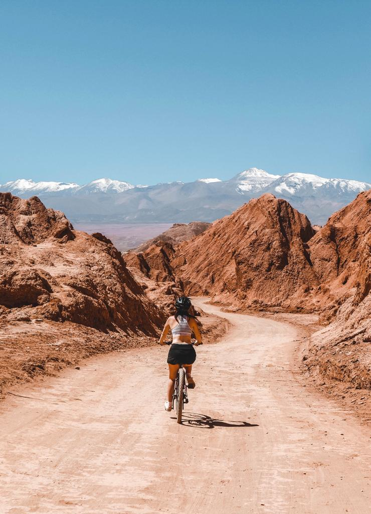
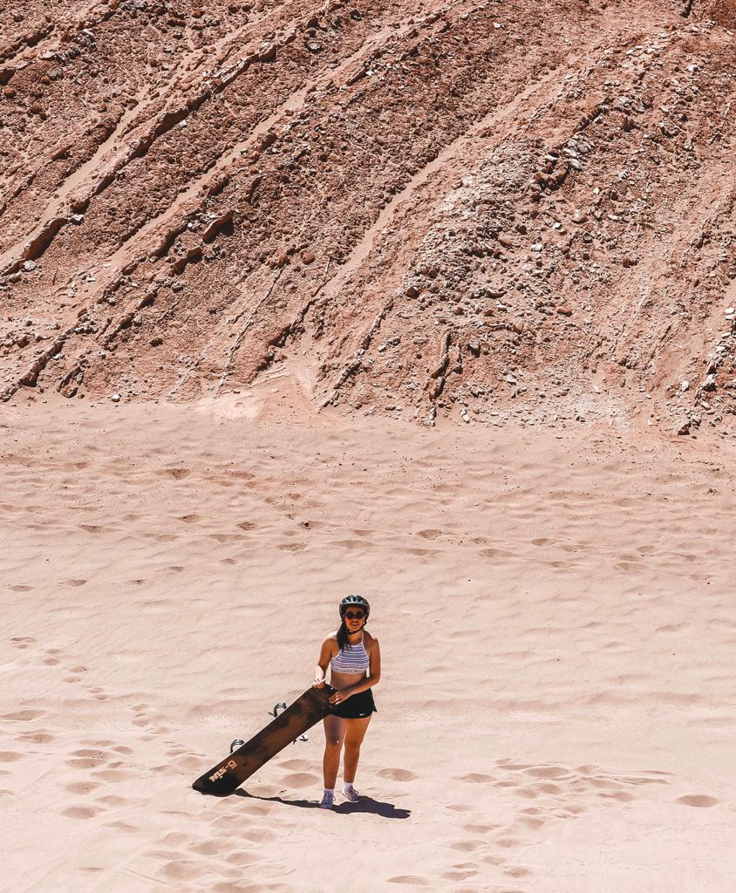

### If you truly want to experience the Death Valley and do it by yourself, just rent a bike and get ready to ride into the driest place in the world!

We arrived in Calama by plane from Santiago and got a shuttle transfer with Transvip. We decided to stay at Ckoi Lodge Atacama which was like a paradise. The style of the room and the decorations outside made us feel like in heaven.

The first day we went around the village. San Pedro is such a cute small village with so many restaurants, cafés, and local souvenir shops. We tried to avoid to go into all of them but they are so full of colors and typical jumpers that we just could not resist.

There is the main square where we found a cute café called ‘Peregrino’ with a couple of benches, chairs, and tables outside and it became the place for our ‘juice time’.

We also found a market on the way with local souvenirs. It is just amazing to experience a different culture and style and it was hard not to buy one of the amazing jumpers (I would not recommend to buy them just because they are supposed to be way cheaper in Bolivia or Peru).

On the last day, we also found a little-hidden café. It is not in the center but it takes only a few minutes to get there and we absolutely loved it. It is called ‘La Franchuteria’ and you can find so many different sorts of bread and croissants. We got two chocolate croissants, two juices and a goat cheese and oregano bread for the evening. The croissants and the bread were some of the best we have ever had in our lives.

In the village, you will also find plenty of tour companies that will offer you tours to the Valleys, the El Tatio Geysers and to Uyuni too. We decided not to take a tour for once and rent two bikes in one of the shops. We were able to rent two bikes and one sandboard for 9000 CLP which is around 12 euros. If you truly want to explore the Valley, trust me. Get a bike and go to the Valley. It is the best way to get around.

We got our bikes around 11 am and we decided to rent them for 6 hours. Only 15/20 minutes for getting to what is considered the driest desert in the world, the Death Valley. The landscapes around are just breathtaking and we could not avoid stopping a few times for taking a good view of all the marvelous places around us.

You just cycle in the middle of nowhere and there are only a few people around. You feel free and literally into the wild. Remember to bring plenty of water and I would recommend going around 11 am as some of the sandboarding tours go earlier in the morning. So, by the time you get to the dunes, you will be by yourself and be free to try this sport without too many crowds around you.

I would not have imagined it, but sandboarding is just so good. I was a bit scared to try at the start but once you get to try it, you can’t stop it. And for being my first time, I was pretty good. I was proud of my achievements. Eoin, instead, decided to try from the highest point of the dune and he fell but he was so happy he got to experience it. I was happy enough with my previous tries.

So, if you want to save some money and be off the bus for a while, just rent a bike. It costs only 3000 CLP and it gives you an experience that you can’t try anywhere else. And after, you can just say you rode the Death Valley. Isn’t that cool?

