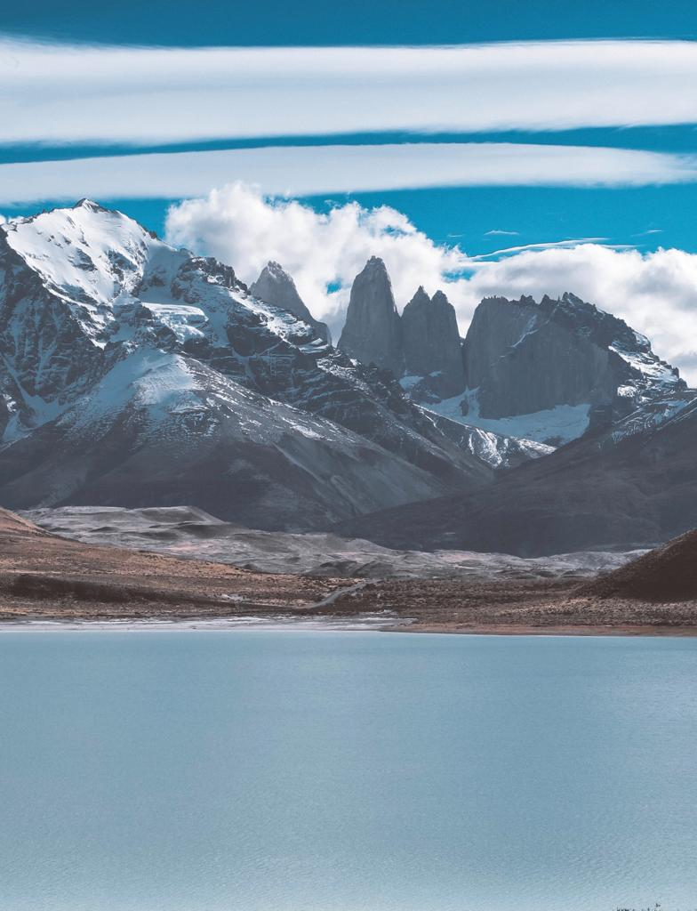
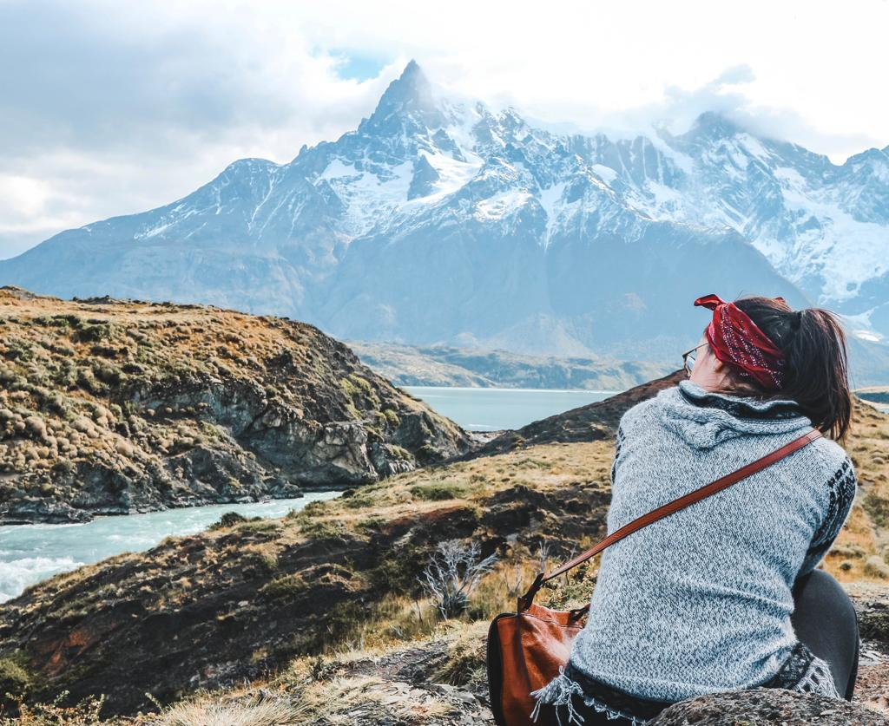
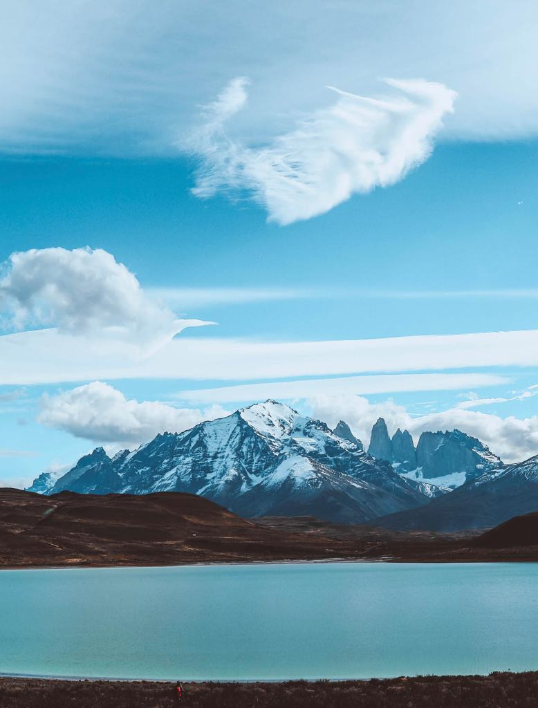

### If you are looking for tips on visiting Chile's most dazzling national park, also know as Torres del Paine, be aware that there is no estimated time for visiting the park.

Most of the people decide to stay at some of the refugees or hostels along the park and decide to try the famous hike named the W because of its shape.

Torres del Paine is a UNESCO World Biosphere Reserve and it includes mountains, glaciers, lakes, beech forests, granite spires, and steppe. People usually think one day is not enough and yes there is so much to see and so many mountains to hike. But I will tell you how to visit most of it in a one day tour. Yes, it sounds a bit like cheating but it is a unique and fantastic way to get around the park and get to see the most beautiful elements that characterize it.

We went for the ‘Parque Nacional Torres del Paine’ tour with Patagonia Adventure, tour company situated in Puerto Natales. This tour starts at 7.30 am in the morning and lasts for 10 hours. It is a pretty long tour but time flies by when you get to see so many amazing places. The guide informed us about all we needed to know and his English was impeccable. So, if you are looking for a tour, I highly recommend to book it with this company. It is also one of the cheapest ones we found while looking around. It costs 35.000 Chilean Pesos pp and there is an entrance fee to the park of 21.000 CLP for foreigners. Pick up from your hotel in Puerto Natales is included and you also get the chance to see the Milodon Caves for 5.000 CLP.

We got picked up from our hostel at 7.30 am and started the journey to Torres del Paine. The guide informed us we could choose if going to see the Caves or stayed on the bus for 25 minutes while waiting for the rest of the group. We opted to stay on the bus and the comments of the people coming back from the Caves didn’t make us have any regrets. They weren’t that impressive and they did not enjoy as much. So, it was a good choice to save that bit of money and keep our enthusiasm for what was ahead of us.

Before entering the park, we stopped at one of the viewpoints. Lago Toro was just breathtaking. It was of emerald green and we really enjoyed it but it was super windy and we were glad we brought our hats with us. We had a few minutes for a couple of pictures and then back to the bus on the way to Lago Grey.

Lago Grey was grey as you could have guessed. It was so windy that we could not even hear each other while talking. We could discern the Glacier and enjoy a long walk along the lake. After an hour, we had to go back to the café and get the bus on the way to the Pehoé Lake.

The Pehoé Lake was definitely one of my favorites. To get a better view we got up the hill and the scenery is just indescribable. A palette full of different tons of greens right in front of you.

After this lake, it was the turn of the waterfall. Salto Grande, also known as ‘big fall’, was the place that most touched my heart. I sat there staring at the landscape around me for about 20 minutes and I just felt home. I felt like I wanted to stay there. When you hear the water flow, and all you hear is just the noises of nature, it is like the best sensation you can get from this world. Because them noises will always belong to your heart and will always make you feel like it is worth to be living.

After these two incredible places, we got to Nordenskjöld Lake. The view was incredible and Eoin and I sat there, without saying any word. We just sat and hugged each other. We just wanted to let the nature talk for us.

Then we finally got to Lago Sarmiento from where we could see the famous three Torres. Our guide told us that most of the times he sadly has to say that because of the weather it is not possible to get to see all the things listed above done. And I actually loved the structure of the sky. I loved that white line that cuts the picture in half. I loved looking at that sky and will always remember all the feelings I have had on that 31st of March.

But we got even luckier because we got to see amazing sceneries and also some Guanacos and other wild animals living there. They are amazing creatures and their look is just so funny. The way they look at you when they hear you close to them just makes me smile. I tried to take a picture of the one that most captured my eye. That Guanaco’s expression is like ‘Ima boss and I know it’. He cracked me up.

So, if you have not enough time for exploring Torres del Paine, you can do like us and ‘cheat’. You definitely will not regret it.

