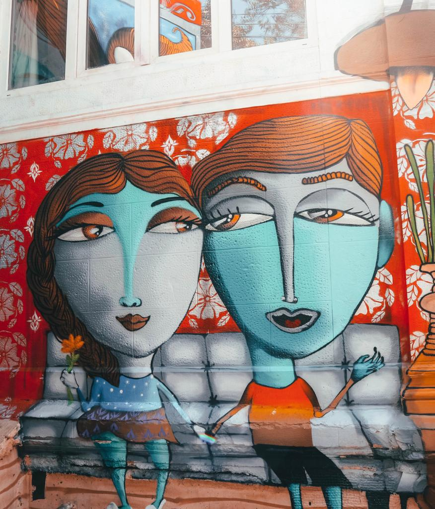
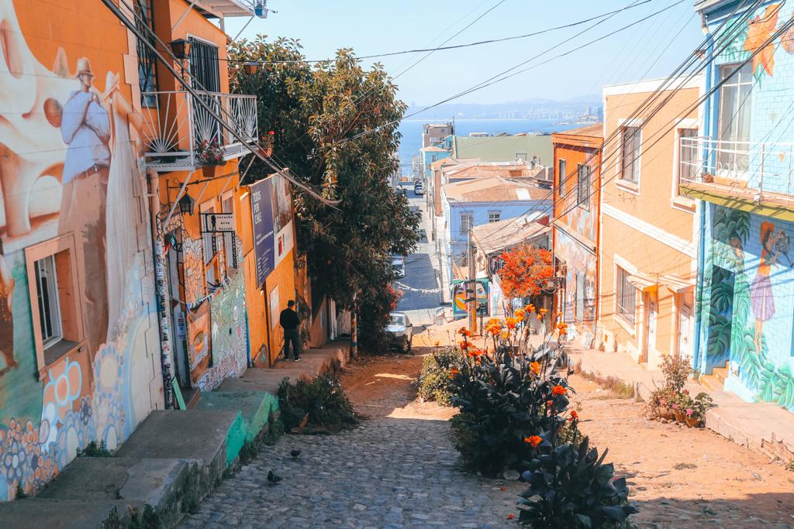
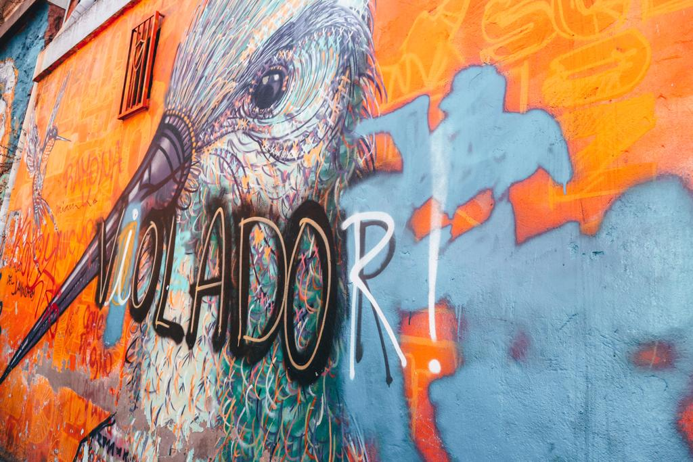

### Thinking about getting out from the chaotic city and taking a trip to Valparaíso? You are in the right place for reading a few tips that will help you organize your trip!

If you are going to take a day-trip to Valparaíso from Santiago, I recommend getting the ‘turbus’ from  Pajaritos. You can easily get to Pajaritos by metro following the Line 1 to San Pablo. Pajaritos will be the third last stop to get off at. Once you are at Pajaritos, just follow the sign ‘Terminal Bus’ and you will find several companies that travel to Valparaíso. We just chose the one that had more positive reviews. Two return tickets for 11.420 pesos which are around 15.20 euros.

It takes about an hour and a half to get to Valparaíso. Once you get off the bus, you will be close to the Market Area and will be surrounded by the crowd. Do not let you down and be disappointed yet because the real and colorful Valparaíso is still about to come. Get yourself ready for a long walk. Wear comfortable shoes and get ready for walking up and down the innumerable hills that characterize the seaside town.

Many are the hillside districts. However, the majority of Valparaíso’s attractions are concentrated on the hillsides which can also be accessed via funiculars. Cerro Conceptión and Cerro Alegre are possibly the most popular and the ones where you can find great restaurants and lovely cafes for relaxing after tiring ups and downs.

Cerro Alegre is definitely my favorite. We decided to walk all up to the hill and enjoy the view of the ocean. The view of the colorful houses facing the ocean and the numerous graffiti painted on the walls will make you truly happy. Everything around you is represented with colors.

Even the stairs are full of yellow, red and blue and their endless shades. And those colors create real masterpieces.

You look at the walls and you see an illustration, you read a story. From the sun that shines on the ‘naranja’ wall to the Peruvian woman represented while doing work. From the landscapes painted on the stairs to the detailed birds that fly on the town bringing that feeling of happiness and freedom.

I also recommend going to what has become my favorite spot of the ‘forgotten city’. ‘We are not hippies. We are happies.’ Could there be a better quote? We are happies and if you do not feel it, just go for a day trip and you will taste that happy flavor around you.

