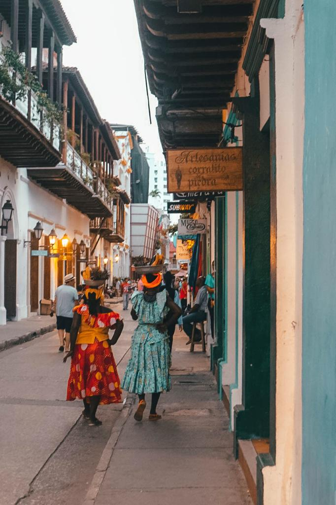
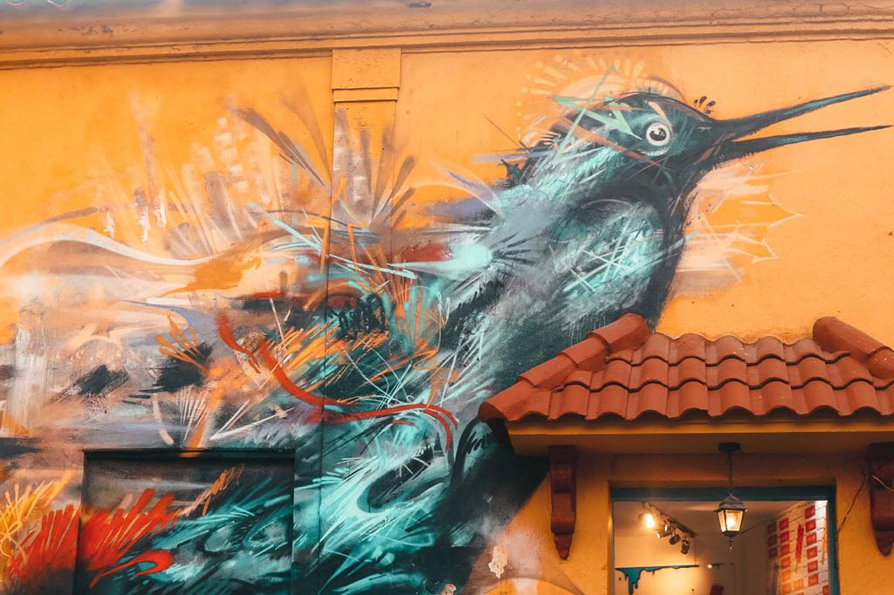
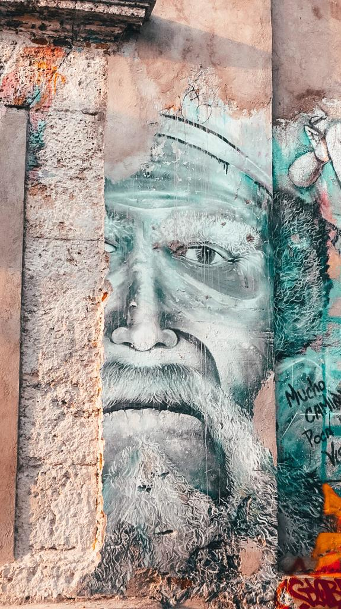

### Here I am, writing from a little café in Colombia about our stay in the happy city of Cartagena.

Cartagena is an array of culture, tradition, and shades of the brightest colors. Walking in Cartagena would make everybody happier. No matter which mood you have on that day, your soul would be definitely filled with the thousand tones of yellows, oranges, pinks, greens, purples, blues and reds all around you.

The houses are all so colorful and people are constantly smiling and very friendly. If you really want to taste the real Colombian culture, Cartagena is one of the best places where you can actually get its savor. We went to Bogotá before stopping in Cartagena and, trust me, Bogotá is quite disappointing and it is even more disappointing when you are walking in Cartagena’s streets. Bogotá has beautiful graffitis, the main square is nice but empty and we felt people were extremely cold. So, it is amazing to get to see the real Colombian culture with our eyes. No matter if you go out during the day or over the night, the squares will be lived by people and music never misses.

If you are in Cartegena, do not miss out on going to Getsemani. It is amazing to see what people can create and paint with their imagination. I love the colors and the details. Art, colors, and images tell a million stories and it is nice to look at those wall pictures and start imagining which sorts of stories are behind them. During the fight for the independence of the country, a lot of artists and personalities decided to bring up their ideas through their art. And now, we can have the privilege to see history and creativity in a neighborhood where life is fully concentrated in. Pubs, cafes, and restaurants are all over the area. Do not forget to write Getsemani on your list!

If you like watching sunsets, I would recommend walking on the old city wall while the sun is setting. It is definitely one of the best moments you can create over your stay in Cartagena. Café del Mar is a perfect spot for admiring the sunset, even though cocktails are a bit overpriced. But we only live once! And after your drink, just sit on the wall and look at the sky. What can be better than a beer and stars above you with the love of your life?

Cartagena has also some of the most amazing souvenir shops I have ever seen in my whole life. Masks, traditional products, paintings and handcraft souvenirs are waiting for you. Buying a souvenir in one of Cartagena’s shops is definitely a must! I can recommend Las Bóvedas for little memories and if you are lucky enough, you might find a beautiful oil painting of Cartagena that we could not avoid buying!

If you have some extra time, I would suggest going to see the 16th-century Spanish castle, San Felipe Castle which is also known as a UNESCO World Heritage site. It is one of the main attractions in the city.

And you will surely pass by the Torre del Reloj which is something you must do in Cartagena! It is a beautiful clock tower located at the entrance to the walled city. There are arches and a beautiful tower of a pastel tone yellow that can’t blend in!

For all the beer lovers, do not miss out on grabbing a bottle in Santo Domingo Square and watch the world going by from one of the busiest spots of the city. It is probably my favorite square as you can see a crazy amount of people and you have a feeling of an endless party that starts late in the evening and ends up late in the following morning. Party is for sure! And if you, like me, are a lover of art, right in the middle of the square there is one of the incredible sculptures by Botero.

Do you feel like you need a pump of adrenaline or a happier place to visit just for taking a break from the chaotic and capital cities? Go to Cartagena. You will be a changed person once you are back!

