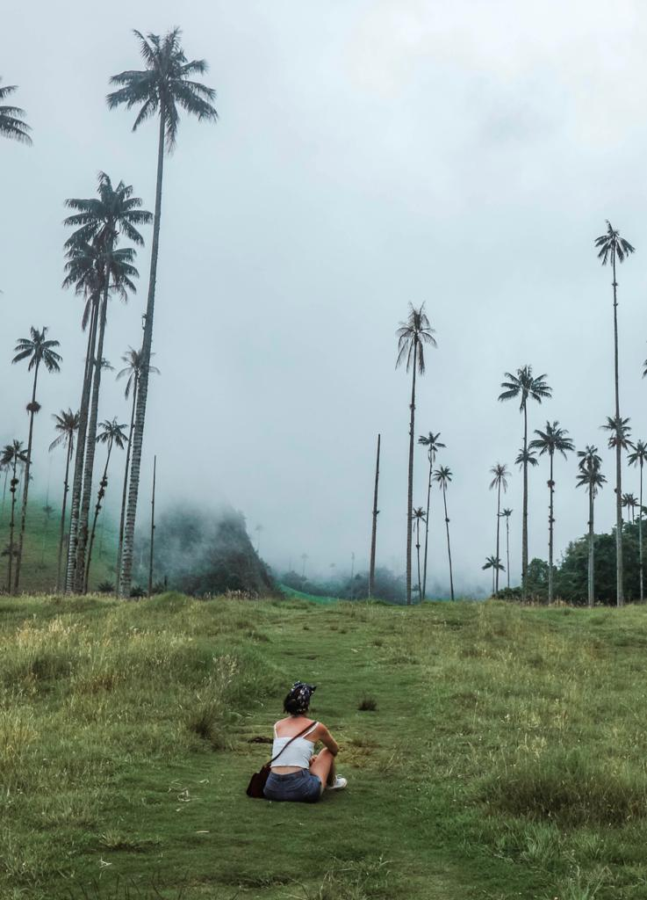

### Coffee is very important for Colombia, environmentally and economically speaking. A lot of people are attracted to Colombia because of its farms and its coffee. There are so many farms you can visit but El Ocasa is definitely one of the best.

El Ocaso is a coffee farm situated in the heart of Salento, only ten minutes away from Salento town center. They offer different coffee tours that are extremely interesting, especially if you are a coffee lover. You just get on board of one of the jeeps in the main square and for less than a euro, you will have the chance to visit what has become one of the main coffee farms in Salento and Colombia.

Do you know who the biggest producers of coffee are? Brazil is the main producer, followed by Vietnam, Colombia, and Indonesia. Colombia is the third main producer and Colombian coffee has a very different taste compared to coffee that you can taste in Europe. Colombia is also known as one of the main sellers of coffee and that is a reason why most of the coffee that Colombians use is dark roasted for commercial use. A big percentage of coffee beans are exported from Colombia to every part of the world. Fortunately, there are a lot of farms that keep a very good quality coffee and sell it to coffee shops in Colombia too. Also, most of the coffee in Colombia is a sustainable and fair trade.

El Ocaso is a farm that is surrounded by a forest and that is definitely a good aspect for growing coffee. It is good for the environment but, more specifically, for the quality of the coffee itself. Lemon and banana trees help the coffee with giving nutritive elements for better growth. Also, when coffee grows in the shade, it tends to grow slower than usual. That permits to get more sugars and some substances that are responsible for receiving acidity. So, coffee will have more body and more flavor.

There are 70 different species of trees in El Ocaso and 60 % of the fertilization used for the farm is completely organic and produced in the farm.

The tour started in the coffee plantation. We got some wooden baskets around our waist and we were ready to pick as many cherries as we could. Coffee can be a red cherry or a yellow cherry before becoming seeds/beans. Red cherries are the most common while yellow cherries are harder to find. There is not a substantial difference between the two, as cherries are only the involucre that contains coffee seeds. Inside the cherries, you will always find two seeds (more common) or only one seed (called ‘peaberry’) due to the separation that didn’t happen. Some people think that peaberries have a stronger flavor compared to normal coffee beans. Once the cherries are dried, they can be used as a natural fertilizer. Nowadays, they are also used for making Cascara which is a sort of tea made exclusively with coffee cherries and it is the first ingredient that is used for the production of a Cascara Latte!

For determining the ripeness of the coffee, you just need to observe the color of the cherries. They have to be totally red or totally yellow. If some green appears, the cherries are not ready to be picked. Also, you can determine its ripeness by squeezing the cherries. The seeds will come out easily when ripe.

When we squeezed the cherries, we found out that there is a liquid substance inside. That is why the seeds taste sweet and they have a taste that is far from the coffee one.

When you visit a coffee plantation, you actually understand how long it takes for coffee beans to be ready for being commercializing and you understand the real value of coffee. After squeezing the cherries and finding the seeds, these seeds get planted in some soil and when they reach a couple of dozens of centimeters, these little plants get moved and planted in a better way just to have every plant one meter apart from each other. Afterward, you will have coffee trees growing (2 years for the actual growth) that will be producing cherries for 5 years. After 5 years, these trees need to be chopped for having another 5 years cycle of cherries production. There can be only 3 cycles of cherries production and the last one can only last for 4 years. No more cherries will be produced as the coffee tree will be dead. The lifespan of the coffee tree will be 20 years altogether.

White flowers will appear during the harvest and each flower is a cherry. Millions of white flowers will bloom just before the rainy season and last for only three days. These flowers are extremely important for the growing cycle of coffee. In fact, a node will form where each flower bloomed and from this node, a cherry with the coffee beans that we consume and use every day will be formed.

Let’s deal with the bacteria topic now! There are mainly two biggest issues that can be very bad for the growth of coffee. One is a fungus that brings to the death of the trees. The leaves start becoming yellowish and that means the coffee tree is sick. Symptoms commonly develop on lower leaves and then spread. We got told that there is a solution. Mixing two different species of tree and creating a new one.

The biggest enemy of the coffee trees is the black coffee twig borer. The female twig borer puts eggs in the coffee cherries and this compromises the quality of the seeds in the cherries. This insect undergoes up to 5 generations per year and it seems to be the worst problem during the growth. Unfortunately, no solution has been found. The only remedy would be a chemical one and El Ocaso and all the fair trade farms in Colombia do not use any kind of chemicals. Chemical substances, in fact, would drastically change the quality and the taste of the coffee.

It was very interesting to get to see the work that is behind the final ground coffee. The best part was making some coffee and tasting it. They use different techniques and it was just amazing to see the passion they put into it. And it is amazing to see different methods of preparation of coffee. It was a perfect cup of sustainable coffee!

We also decided to try their coffee in their café. We got a latte and a flat white and it was surprising to see that they put only one shot of coffee in the latte and two in the flat white. They did not use any ristretto coffee but only espresso for both the hot beverages.

Coffee is important for Americans, but when it comes to Colombia, it really means the world to them. Without coffee, Colombia’s economy would drastically fail and collapse. You can imagine that Colombians drink the best coffee in the world. For talking about it, it is necessary to make a distinction between Tinto and Coffee. Tinto is just a more concentrated coffee and usually served in small cups. You can buy a tinto for only .10/.20 $ a cup!

Colombia is the third biggest producer of coffee but the majority of the high-quality coffee beans has to be exported and that is why everything below stays in Colombia for domestical use. That’s how tinto is one of the first things you come across when visiting Colombia and that’s why most people say coffee in Colombia is the worst coffee in the world. But do not dwell on tintos and you will definitely find amazing coffee. El Ocaso is one of them.

