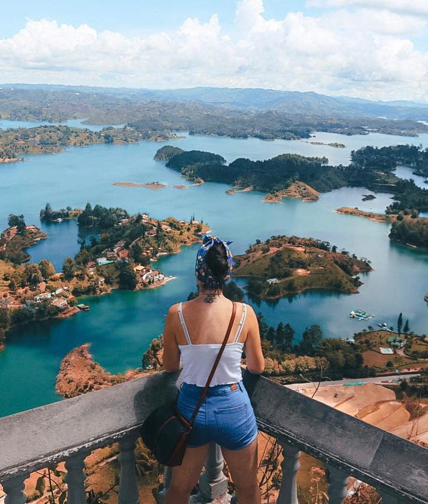
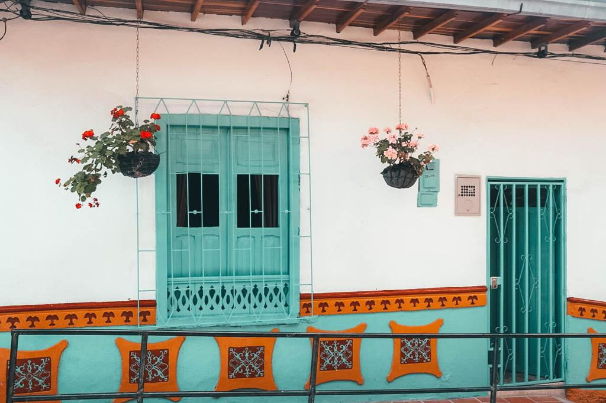
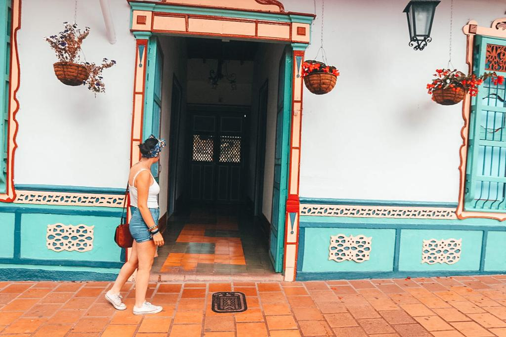

Guatapé is a two hours bus ride away from Medellín. If you want to get to Guatapé by bus from the city of Medellín, you can go to Terminal Norte. You can reach the terminal by taxi which would be around 8 euros or by metro. The terminal is situated close to the stop Caribe. It is visible, once you are out of the metro station and you can’t miss it. The ride by metro would cost 2400 Colombian Pesos which is less than a euro.

Once you are at the metro, you can get the bus tickets from desk 9 or 14. We opted for desk 14 and the ticket was 14000 Colombian Pesos for going to Guatapé.

The bus will make random stops in the middle of nowhere for letting people come on and off the bus. It will stop in El Peñon. So, if you want to just stop at the famous rock, you can get off at the El Peñon stop. Otherwise, stay on the bus for another 30 minutes and you will arrive at the center of Guatapé.

Guatapé is considered one of the most colorful towns in the whole world and definitely the most colorful in Colombia. If you are in Medellín, it is definitely worth a visit. It is so nice and relaxing walking in its streets and being surrounded by so many vibrant colors. The zocalos on the walls make the place even cooler and particular. I have tried to look for information on blogs and asked but nobody really knows why all the houses have the zocalos as decorations. But all we know is that Guatapé wouldn’t be the same without them.

Guatapé is quite small and everything is reachable by foot. Just wander around its streets and do not forget to go to see the beautiful colorful stairs and the sculpture right above them. It is a very cute little square and it is inevitable falling in love with it. Even the souvenirs look way too cute for avoiding to buy them.

One day is enough to see all the town but if you have an extra day, I would recommend going to see the lake, which is only a few minutes away from the center. You could also get a boat and have a great time wandering in the amazing landscapes around Guatapé.

But what is really a must if you visit Guatapé? You can’t visit Guatapé and not be going to El Peñon! You must see the famous rock with its 659 steps that go all around the rock. From the center, you can get a tuk-tuk for only 8000 Colombian pesos.

But if you don’t mind and you prefer walking, it will take around 40/50 minutes to reach the famous stairs. For entering, you will need to pay 18000 pesos which are around 6 euros. I have read many blogs where they say that the climb is quite difficult. We found it quite easy and it only took us 15/20 minutes to the top.

Considering that Eoin had his feet burnt and with blisters, we also had to go a bit slower. So, only 659 steps for reaching the top and have an amazing view!! We loved it and we are glad we didn’t give up doing it. Some people say it is one of the most amazing views in the world. To be honest, there are better views. So do not have many expectations. But it is definitely an enjoyable and breathtaking view that is worth a visit!

If you need to go back to Medellín, you can take the bus at the same point where you got dropped off. You don’t need to book or buy a ticket in advance. Just tell the driver where you want to go, and you will pay at the end of your journey.

And if you are looking for a place to stay, I would highly recommend <a href="https://www.booking.com/hotel/co/oak-tree-house.es.html" target="_blank" rel="noopener noreferrer">Oak Tree House</a>, a beautiful house only ten minutes walking from the city center. Eliana was a super host and she was our favorite between all the hosts we had all over South America in these past two months. They gave us a cream for Eoin’s feet and constantly checked on him if all was okay. We felt like surrounded by friends and the atmosphere was just perfect.

Do not miss out on visiting Guatapé during your stay in Colombia. Happiness will be spread out by every single corner of this amazing colorful town!

