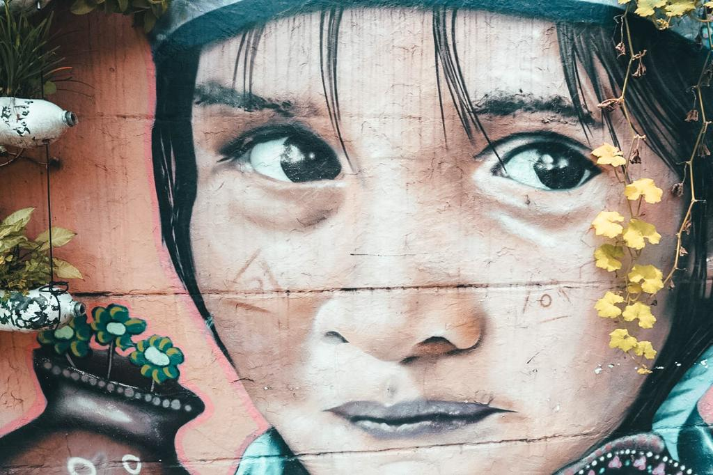

### Medellín is known for being once one of the most dangerous cities in the world. Nowadays, things have changed and Medellín is far from being as dangerous as in the past, much so people are coming from all over the world to visit it.

Some people are still concerned about visiting what was once the most dangerous city in the world, but I personally think that nobody should judge a city for its past, the way that nobody should judge people from their look. It was one of my biggest dreams to see with my own eyes how Medellín has become and what story it has to tell. People keep thinking that Colombia is not a place to visit, but since when we are traveling in Colombia, I just realize every day how much I love it, how friendly people are and, also, how safe Colombia is. It is sad to see that people still judge things based on what they hear and not what they actually see. But you can’t know about something if you don’t first see it. And you certainly can’t know about Colombia just because you watched Narcos. Because trust me, Colombia is so much more than just Narcos. So, do not hear what people have to say but go and visit. Visit Colombia and visit Medellín.

Medellín is a big city and it has a nice metro and cable cars that make it so much easier to get from a part to another of the city. Every journey ticket is 2400 COP which is less than a euro. And if you are staying for longer than just a couple of days, I would recommend getting the CIVICA card which would make you save 18 cents for every journey you are going to make.

There is a lot to do in Medellín, but what we loved most was wandering on the streets of Comuna 13, the area that was once the most dangerous one. It is known for its beautiful graffitis. You can get to Comuna 13 by metro. You can get off at the stop San Javier, exit the station, take your right and enjoy a walk to the Comuna 13 area. You can’t miss it as you will start seeing innumerable graffiti on the walls. There is so many to choose from for picking your favorite but I loved two in particular. One is the graffiti that most of the tourists visit Comuna 13 for. It is the favorite of tourists and the most known on Instagram.

The other one represents a lion with two faces. I studied the history of art for 8 years in school and studied many pieces of art. The story behind every creation always fascinated me. I always liked to give my personal ‘what’s the story behind it?’ And then I like learning what the artist actually wanted to express through the art. So, yesterday, I did this game ‘what’s the story behind it?’ for every graffiti we saw and this graffiti is the one that most captured my thoughts. I think it shows the two faces of the world. Everything has two faces. Things can be good or bad. Full of joy or pain. Full of colors or with the absence of them. Black or white. Kind or mean. People have always two faces and there is always something that remains hidden to people that only know you superficially. And isn’t it that cities also have two faces? There are good things about them and bad things about them. And this lion could represent Medellín. The two faces of Medellín. Its past and its revival. And no matter how things are good or bad, they are always beautiful. Like this lion. Like this city. Like this country.

On the way up to the top, which is not hard at all to get to because you will find some escalators right in the middle of nowhere, you will find spots for admiring amazing views over the city. It is really a particular, interesting and beautiful place. It is so mysterious too and gives that feeling of terribly beautiful and beautifully terrible which would capture the interest of everybody.

There are so many other things to see, from the many Botero’s sculptures that are located in the main square and all over the city to the Parque de las luces that really shows innovation and underlines the desire of revival of Medellín. If you have an extra day, you could also take a cable car and visit Parque Arvi. It would be a good pretext for getting away from the city and having a full immersion into the wild. Plus, trying the cable cars is always a good idea. We got them in La Paz, during our stay in Bolivia and we found them cool. They are such a cooler way for transport than just a car or a metro.

If you are hesitating on stopping in Medellín, I would recommend going beyond what people think and what the past was. Go visit Comuna 13, get a touch of its story and make this place become part of your heart.

