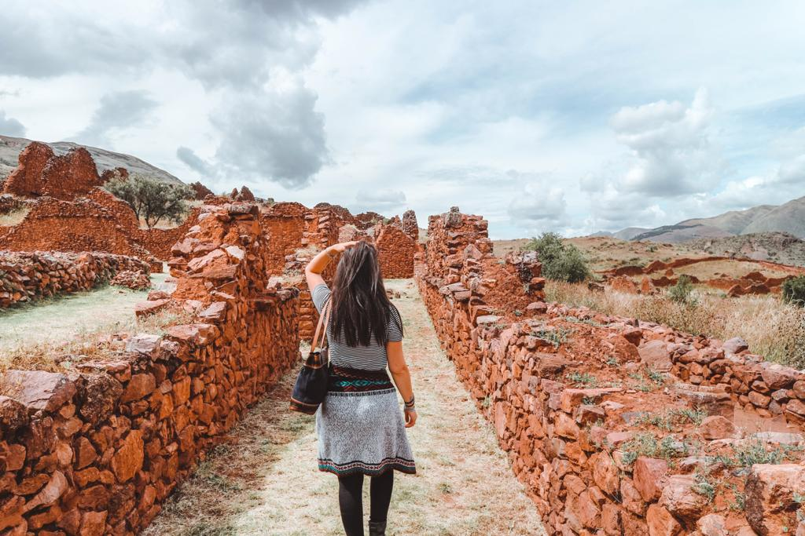
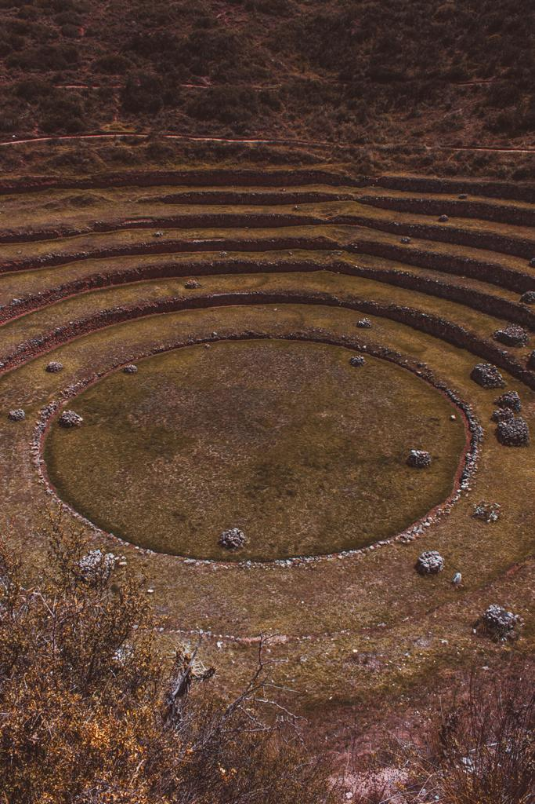
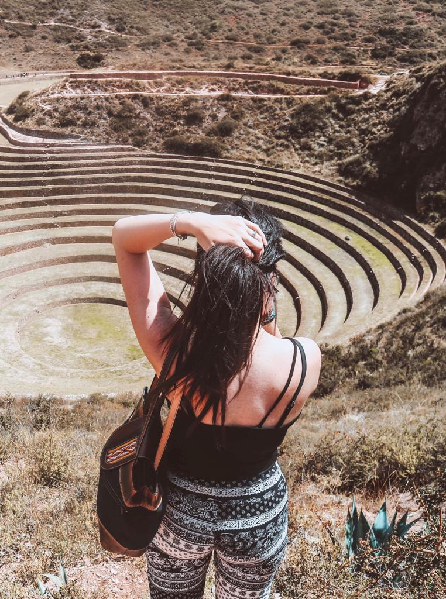
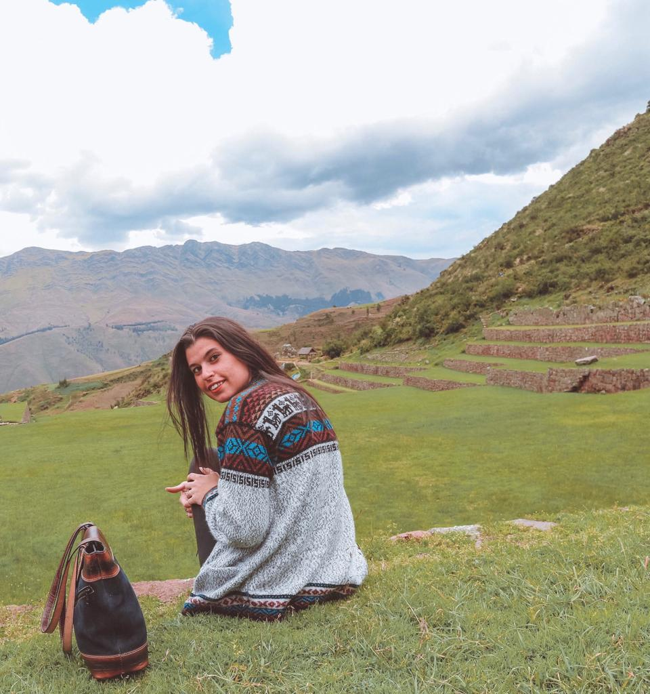

### Have you ever felt home in a city that is not your home city? Have you ever felt like you have been to a place before, even though it is completely different than the places you are used to living in? Have you ever felt just happy to be in a city? Well, I have. Cusco was the city that most made me feel like home and I am so glad we decided to stop for twelve days in this amazing Peruvian spot.

Cusco can be defined as the belly button of the past Inca Empire and the current cradle of Inca ruins, art, history and culture. Past and present seem to collapse. Visiting Cusco and all the sites around the city, it brings you back through time. There is so much to do and see you also consider the fact that Cusco is the perfect location for a trip to Agua Calientes and Machu Picchu.

#### Cusco city

Plaza de Armas is probably my favorite plaza in South America so far. Architecture and art are all around. So many souvenir stands and the Centro Artesanal is a must if you want to find real Peruvian art at a cheaper price. Try to negotiate the price. All they want is selling their products so they would make the price lower instead of losing a customer. The Mercado de San Pedro is a typical big market where you can find souvenirs, flowers, food, juices, and snacks.

I would also recommend walking uphill to San Blas, not far from Limbus Bar. You will get to have one of the best views of Cusco from the very top.

#### If you are looking for places to eat, we found two lovely cafes.

La Valeriana has a wide range of cakes and sweets and salty pastries or empanadas. The atmosphere is so nice and reminds me of Paris. But the best part is all the post-it notes on the big wall from all around the world!!

Museo del Café offers amazing food and I have had one of the best Mochaccinos ever. The chocolate tasted just so good. And their sandwiches are just a perfect meal that meets a good quality and price relation. Staff was always so friendly and the atmosphere is very nice. You can also get to enter the museum of coffee for free and if you want, you could book a course with them.

#### What's near Cusco

For visiting many of the main sites that are situated around Cusco city, the best thing to do is getting a Boleto Turistico. It costs 130 Soles, which is about 35 euros and it includes the entry in most of the beautiful ruins around the city. You can buy it at the COSITUC office on 103 Avenida del Sol in the center of Cusco.

#### Sacsaywamán

The meaning of the word is ‘satisfied falcon’ but people will remember the name for a soundalike with the words ‘sexy woman’. All we can see is only the rest (only the 20 %) of what was a bigger structure in the origins. The walk was only about 20 minutes and it is amazing when you get to the top and you can have time for yourself and be free to explore around.

We got to see an amazing view of Cusco from the top and the ruins were just so magical. They call it the house of the sun and now, I know why.

#### Tipon, Pikillacta, and Anahuaylillas in half day from Cusco.

We booked one of the innumerable tours that people offered in the city. This part of Peru is just incredible and if you are in Cusco, I would recommend to get a half day and visit these three archeological ruins. You can get to see beautiful landscapes and a lot of green in Tipon, a lot of architecture and ruins in Pikillacta and a beautiful chapel in Andahuaylillas. The entry to the ‘sistine chapel of the Andes’ is not included in the Boleto Turistico but only costs 15 Soles (about 4 euros). The church is very simple on the outside but inside it is a pure masterpiece.

My favorite was Tipon because I just felt I was back in the Incas’ time. But all the three sites are worth a visit!

#### Moray, Maras, and Chinchero in one day from Cusco.

If you are in Cusco, these three are definitely a must. The Sacred Valley is located between Cusco and Machu Picchu and it is the heart of historical times. The landscapes around you will charm you and give you that sensation of picturesque.

Moray was amazing. You get to see such beautiful circular archeological terraces and you get to discover more about the developed crops used by the Inca.

Las Salinas in Maras is such an incredible place to visit. It is a totally different place compared to Uyuni Salt Flats. It is nice to get to see a different salt-producing center that is also dated back to the Inca time.

Last stop of the tour is Chincero. A typical town with some ruins still visible. We enjoyed Chincero also because we had the luck to experience the art of Andean textiles. The woman was so kind and we learned so much about wool. How they color it, how they dry it and the differences between llama, alpaca,  and baby alpaca’s wool. It was very interesting and a full immersion in their culture.

If you want to get to see the Inca ruins with your eyes and have a memorable time getting to know more about the Peruvian culture, those places are just needed to be added on your list of places to go to!!

