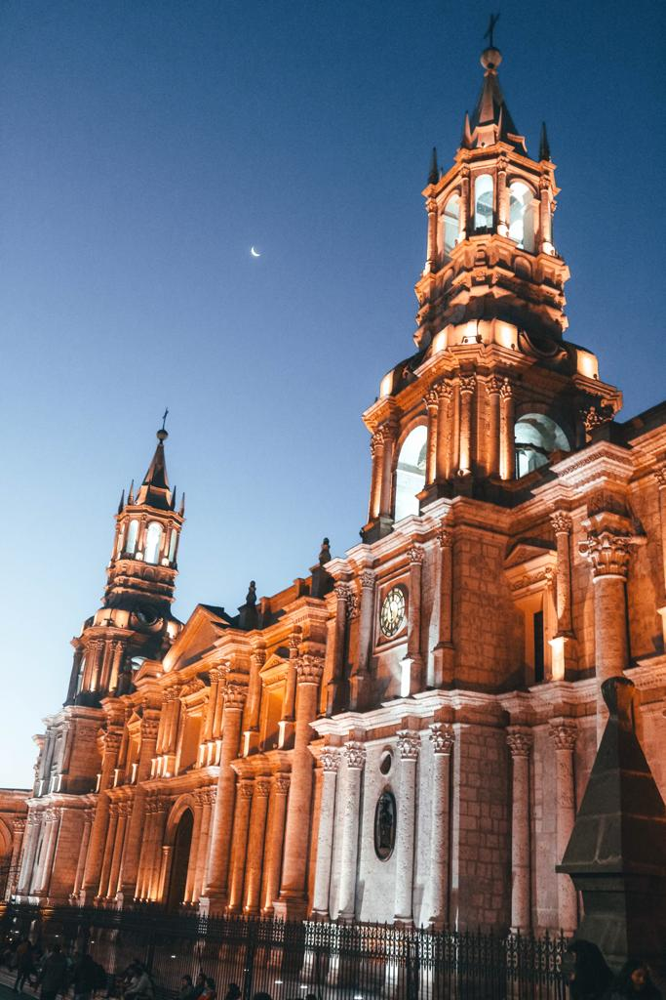
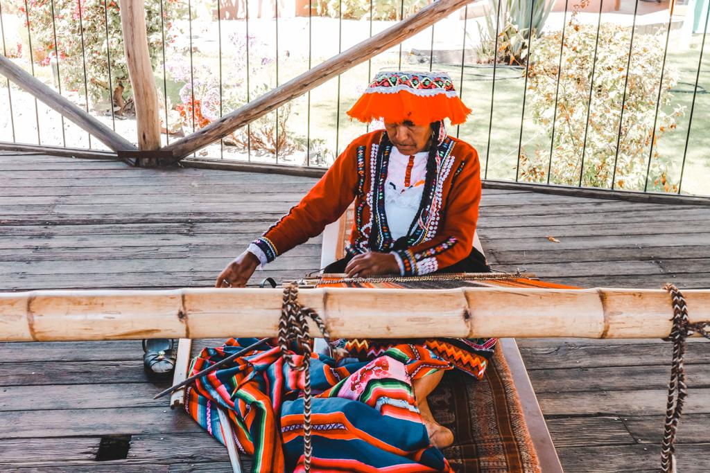
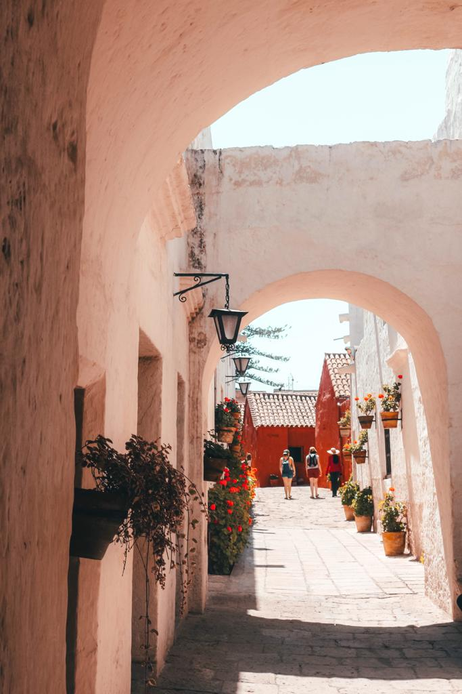

### I did not expect Arequipa to be such as beautiful as it is.

It does look like a European city. Spanish colonialism characterizes most of the biggest South American cities. And Arequipa is a kind of a mix between Spanish architectures and one of the towns along the sea in Italy, with their amazing squares with palms and a lot of green.

It has been only one day since we left Arequipa and I already miss walking in its streets, passing by the majestic basilica and seeing its cute local cafes and souvenir shops.

Here, 5 reasons why you shouldn’t visit Arequipa:

**Santa Catalina**, its blue and red walls, will definitely blow you away. The entrance fee is 60 soles and you also have the possibility to take a guide for 20 soles. We decided to wander on our own and let the atmosphere around amaze us. We spent about two hours in there and time literally flew by. If you don’t want your soul to be totally soaked up by the colorful atmosphere around you, do not visit this stunning monastery.

**Plaza de Armas** will take your knees out. A reminder of my childhood. A square with the basilica that leaves you speechless, especially when the sun is about to set. The moon stands out so perfectly and becomes a perfect adornment to the cathedral.

**Mercado San Camilo** will make you feel happy. So much fresh fruit and souvenir stand around you. It will immerse you in a mundane world and make you live a direct experience with the Peruvian local products and culture. Did you know Peru has more than 4000 different types of potatoes? You can get to see a lot of them in the Mercado.

**Mundo Alpaca** is the perfect ecological complex located in the city center where you can take a tour through the process of production of the wool and you can also get to see a demonstration of a woman while weaving. At the end of the tour, you will be able to see different Alpacas and Llamas and get to learn the differences between the two species of animals.

**Chaqchao cafe** is the perfect place for tasting real chocolate. After a class at Chaqchao, you will know the differences between real and fake chocolate and you will love chocolate even more than before. Is that positive or negative? Considering the fact that all real chocolate is good for your health, I would say that loving it more than before is a positive thing.

Arequipa is my favorite South American city so far and I would not recommend doing the above-listed things if you don’t want to leave a piece of your heart in Peru. I did and I just left my vital organ in what is known as the house of the Incas.

Oh blue, blue and blue… How could I not love you?

