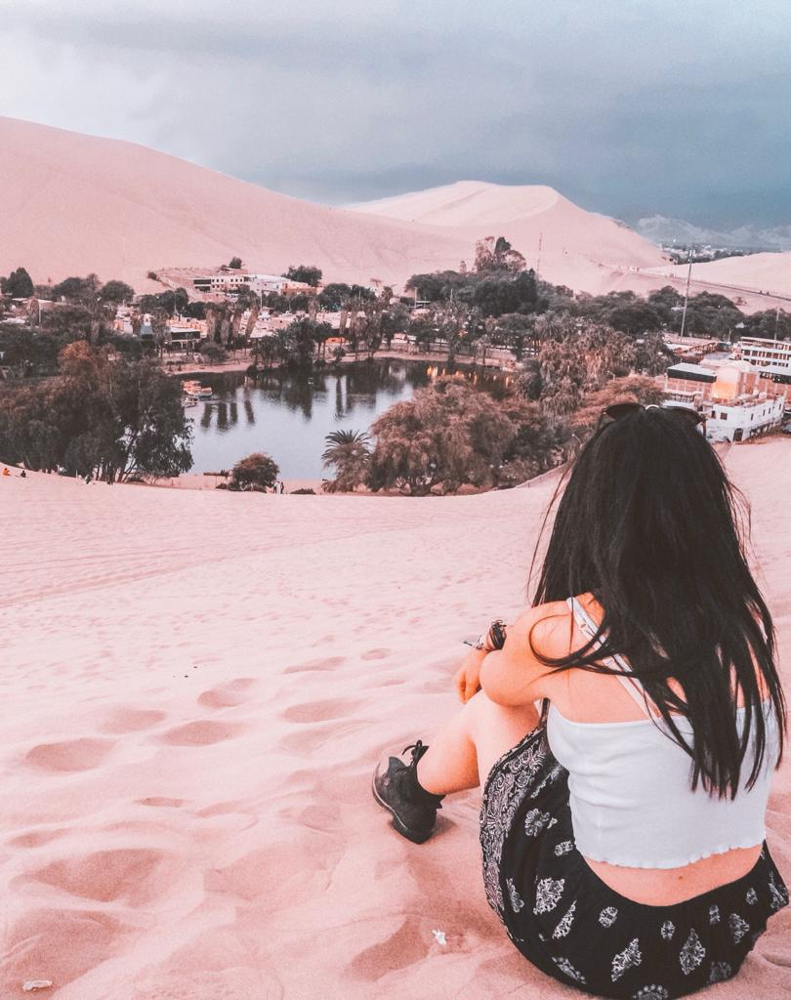

Huacachina is a must stop if you are visiting Lima. Only 20 minutes away from Ica, it is the perfect location for experiencing some of the best activities you can do in the desert. Dune-buggy and sandboarding.

Looking at all the pictures I took in Huacachina, I just feel I want to share one of the quotes taken from my second favorite book ‘Tracks’ by Robyn Davidson.

‘As I look back on the trip now, as I try to sort out fact from fiction, try to remember how I felt at that particular time, or during that particular incident, try to relive those memories that have been buried so deep, and distorted so ruthlessly, there is one clear fact that emerges from the quagmire. The trip was easy. It was no more dangerous than crossing the street, or driving to the beach, or eating peanuts. The two important things that I did learn were that you are as powerful and strong as you allow yourself to be and that the most difficult part of any endeavor is taking the first step, making the first decision. And I knew even then that I would forget them time and time again and would have to go back and repeat those words that had become meaningless and try to remember. I knew even then that, instead of remembering the truth of it, I would lapse into a useless nostalgia. Camel trips, as I suspected all along, and as I was about to have confirmed, do not begin or end, they merely change form.’

If you are in Lima, you can get a bus to Ica. We got a bus with the company Cruz del Sur. Cruz del Sur is actually our favorite bus company in Peru. The buses are very comfy, the prices are budget prices and there is entertainment on all their buses. It takes about 4 hours to get to Ica. We decided to spend a couple of nights in Ica, at La Angostura hotel. We had such an amazing time and the hotel will tell you more about tours to Huacachina. So, the manager of the hotel brought us to Huacachina and from there, we got a dune-buggy and we were well ready to ride the desert. It was our first time on a dune-buggy and it was freaking amazing! We absolutely loved it and it was a real adrenaline rush!

Huacachina is like a little paradise. It appears as an oasis in the desert and you would stay sitting to admire it for all day if you could. The tour brought us to the highest point from where we could enjoy sandboarding. And after that, we stopped at different points for admiring the sun setting. The sunset was pretty amazing. A mix of oranges and purples were dancing in the sky.

The sun was setting and leaving space for some stars. The time to capture amazing moments and then we were back on the dune-buggy in the direction of the oasis. The town is pretty amazing from the top. It really looks like it is only a vision. Like it doesn’t exist for real. We sat and enjoyed the sunset from this part of the desert. The tour lasted for a couple of hours and it is an experience that everybody should try once in their life.

You can decide if staying in Huacachina or Ica. We just opted for staying in Ica because we found a great deal and could not find anything cheap at that time. But I’d say that staying in Huacachina would give you more time for experiencing the desert in all its facets. It takes only 20 minutes to climb up and you could have a romantic view of the sun rising or setting over some of the tallest dunes in the world.

Not a lot of people would make a stop in the desert. They would just skip it and stop over in Cusco and Lima. It only takes 4 hours and it could be done in one day. To be honest, Huacachina is so much more than Lima. Lima is the capital and is a city that is worth to see in your life. But it is not an adventure and adrenalized as Huacachina! Make a stop, book a dune-buggy and start your journey in the desert! What are you waiting for?

