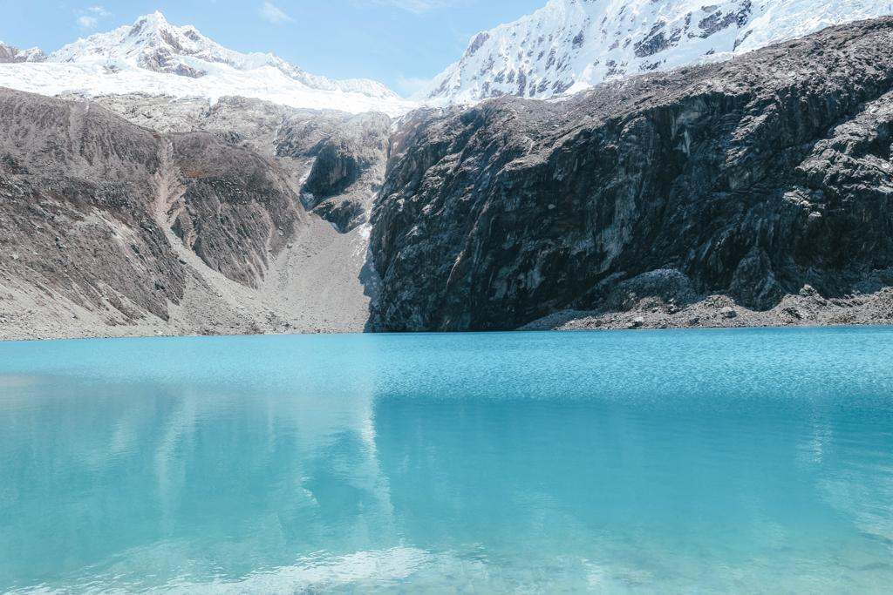

I have been following so many bloggers traveling in South America and not many of them mention any stop in Huaraz over their stay in Peru. Peru’s main stops are Cusco for getting to one of the seven wonders and Lima which is a great spot for reaching Huacachina, known also as the Peruvian desert. But Peru is more than just Machu Picchu. Peru is more than just the rainforest. Peru is more than just Arequipa, Cusco and Lima. Peru is also Huaraz.

Huaraz did not particularly persuade us as a city but it is a perfect location for people who love hiking. There is so many different tours to choose from and different hikes you can consider but we opted to do two days of a hike. On the first day, we went to Laguna Paron from where you can have a perfect view of the mountain that appears on the Paramount logo, before the start of the movies. How cool is that? Every time you will see that logo broadcasted before a movie in the cinema, you will think about the experience you have had and just give an image to that symbolic logo.

We did not expect a hike on that day as we were told that there would have been a walk of ten minutes for reaching the top. Well, it was about 40 minutes of a hike. And it is pretty much all rocks and most of them move and made it even harder. Rather than that, the view was just breathtaking. A spectacle, a palette of blues, a majestic mountain in front of your eyes. I felt like I was on top of the world. I felt invincible and free. I always loved mountains since when I was a child as I grew up not far from the Alps, in Italy. But all the time I hike a mountain in South America, I never get disappointed when I reach the top. My heart always gets melted and filled with the eyes of nature.

On the second day, we went for what was on my list since before leaving for South America, Laguna 69. People come from all over the world for the challenge of the hike of Laguna 69. I was looking at pictures and was amazed by them. I always thought it could be Photoshop. That a place like that doesn’t really exist.

The hike was probably the most difficult hike we have had including Rainbow Mountain and Machu Picchu. It is a looooong hike, about 3 hours before seeing the famous lake. Another 2 hours for getting to the start point. So, a total of 5 hours hike.

Is it worth it? It is definitely worth all the efforts we have made. We were wrecked and had pains all over our bodies, also because we had to wake up at 4.30 am for getting to the mountain on time before the crowds start arriving.

But when you start seeing that blue ocean color appearing and developing in your eyes, you forget about all the rest. You forget about the 3 hours of ‘oh fuck, I don’t know if I can make it to the top’. You just stay there and stare at that blue. That blue that means freedom. That blue that is the color of the sky and the color of the sea. That blue that looks so innocent and so clear that could come across like colorless. That blue that affects your soul and finds a place in the heart. Not just for one day. Till the end of your days.

There is no tour I would highly recommend. They all offer the same things for the same prices. Just be aware that it is like having just transportation. There are guides but they say very little. Most of them also say that an English guide is included but, in most of the cases, there is no English guide. Just pay the least you can pay and enjoy the hikes and the views.

For staying: Villa Valencia in Huaraz. We booked a bungalow/apartment for 4 nights and 5 days. Breakfast was included. We only paid 110 euros for the 4 nights. The location is very good and the atmosphere is nice.

For eating: California Café. We absolutely loved it! It was so yellow and bright and just made me happy. I had one of the best brownies ever! And the staff was super friendly and helpful. Also, if you, like us, are thinking about getting a night bus to Lima, this café closes at 10 PM from Monday to Saturday and you won’t feel like they want you to pay and go. We spent an entire day in the café and enjoyed it a lot. There is also a lot of books, guides, and board games. Definitely a must in Huaraz!

