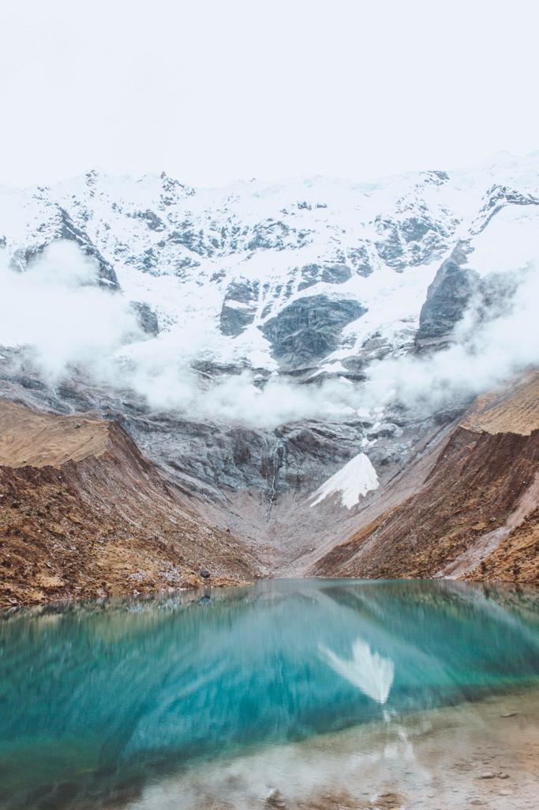
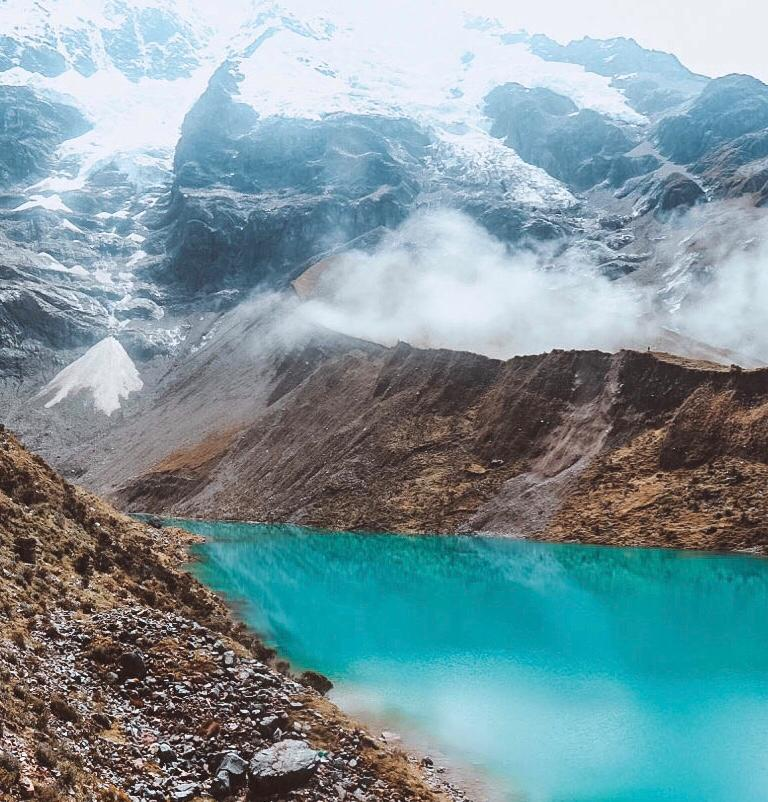
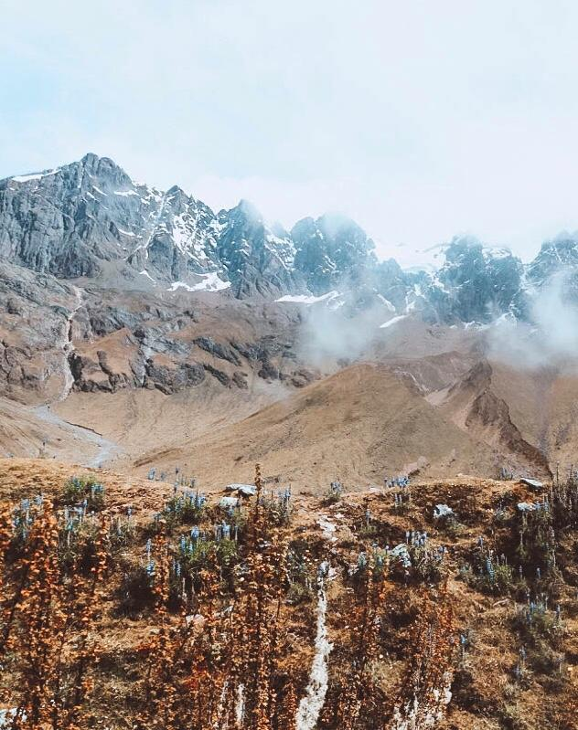

### If you are in Cusco, get one more day to see this turquoise-green lake. You definitely will not regret it.

There are so many tours to choose from but I would highly recommend <a href="https://www.salkantaytrekking.com/" target="_blank" rel="noopener noreferrer">Salkantay Trekking company</a>. They are super friendly and we felt like a part of a big family. We got picked up at 4.05 am and we got to sleep for a couple of hours on the minibus. After two hours, we stopped for getting a continental breakfast. After about 45 minutes, we started the last hour of our journey to Lago Humantay. The road wasn’t the best road ever but our driver was extremely good and we arrived safely at our destination.

From there, it takes about an hour for getting to the top. I personally don’t do exercise often and I think it wasn’t as difficult as some people might describe. The nice thing about <a href="https://www.salkantaytrekking.com/traditional/cusco/humantay-lake-full-day/" target="_blank" rel="noopener noreferrer">this tour</a> is that we got to take our time for taking pictures and taking breaks as the altitude can make the air thinner and slow you down a bit. ‘Vamos Giorgia, you can make it’, the guide said. And after a few more efforts, we got to the top. I couldn’t believe this place is real. A mirror reflection of the mountain. A green lake. Clouds that are so low and give you the feeling that you are nearly able to touch them.

We got free time for more than an hour and our guide suggested to walk up the hill on the left. We decided to listen to him and it was the best decision we could have made. Everybody was going on the right side and, once we got to the top of the left hill, we could admire the lake in all its beauty just by ourselves. There was nobody else around us. We found a rock and sat there to admire the landscape from the very top. Needless to say that we got so much freedom and calm around us. I have never seen a lake as beautiful. Lago Humantay is a proper masterpiece of nature. You see so many colors all together and it looks like one of the most famous paintings. It looks like it is not even real. We could not avoid stopping to admire what the nature created and be overwhelmed with it. What a sense of peace you get once you reach the top. You can say you made it and you can say you really were in a magical place. A bit like in a fairy tale. I am still amazed by it. I literally lost my heart in that place. I got so many pictures that don’t even make justice to it. What is for sure is that I will never forget the sense of freedom that I got while I was sitting on that rock and admiring the beauty of nature around me.

It was hard to start going down as I did not really want to leave the place. I stopped so many times on the way down for admiring the green fields around us. 4200 meters and you feel like you are in the sky.

After about 40 mins, we arrived at what previously was our destination point and we got an amazing lunch. Around 2 pm, we were ready to go back to Cusco. An unforgettable day that I would recommend to everybody. If you are ever in Cusco, Lago Humantay has to be a must. It is really one of the best spotlights between all the many things you can do in Cusco.

Oh, <a href="https://www.salkantaytrekking.com/" target="_blank" rel="noopener noreferrer">Salkantay Trekking</a> also gave us a beautiful t-shirt that we are glad we can keep a memory of this amazing experience! Thanks, guys for making this day even more unforgettable!

An amazing experience but I’m still not done, I’m only halfway there. I’m a million miles ahead of where I’m from, but there’s still another million miles to come.

