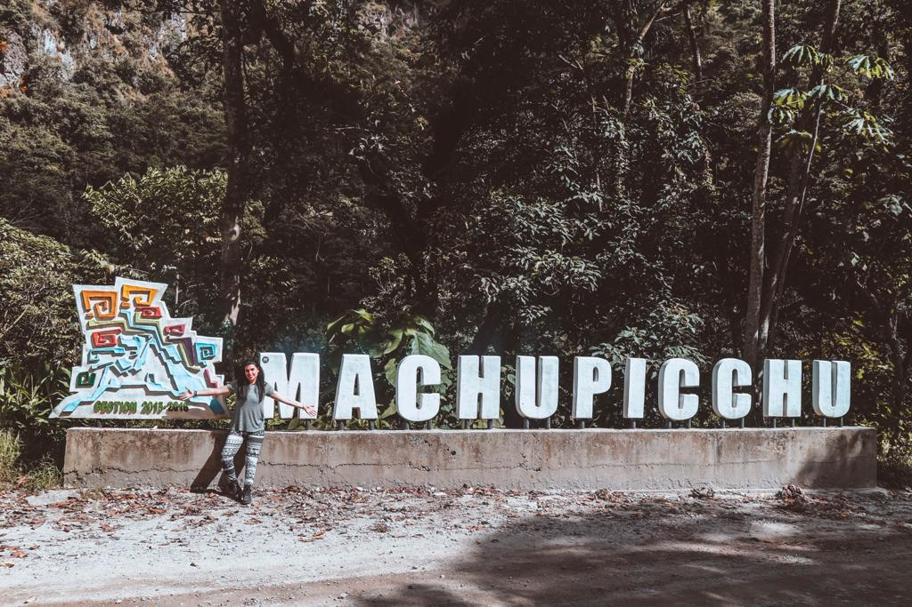
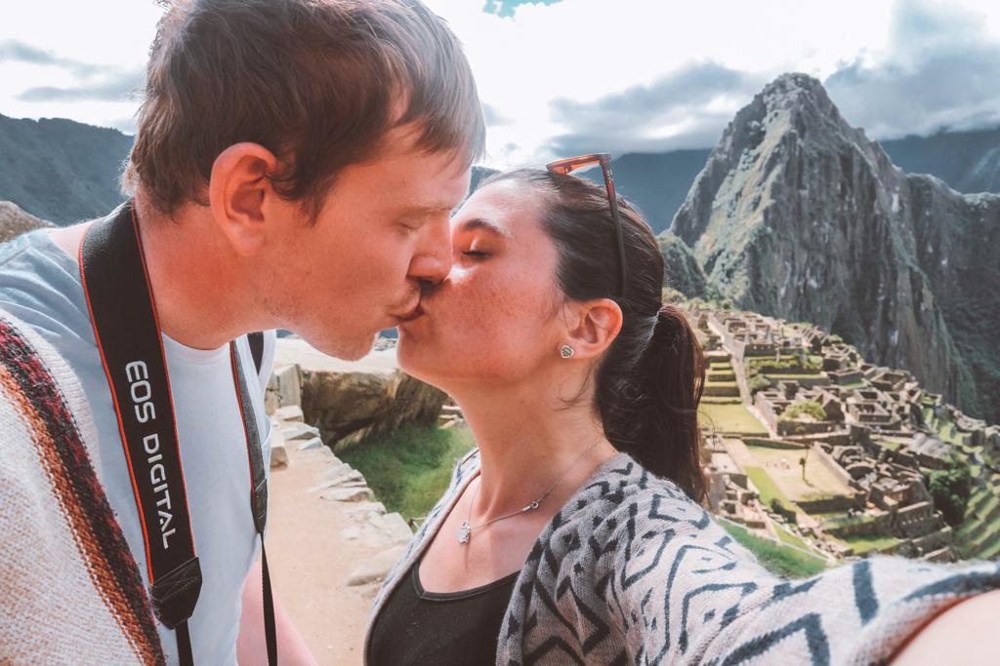
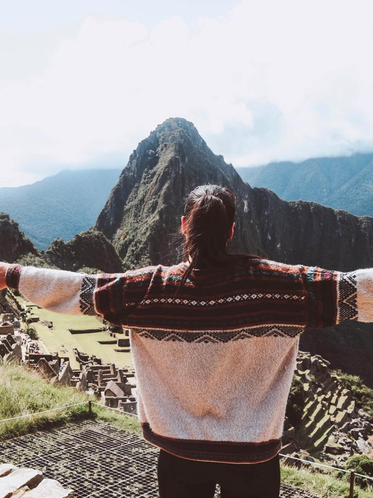

### There are many different ways to visit Machu Picchu and nobody can really tell you which is the best one. I will tell you how we went ot the vast Inca citadel of Machu Picchu and some useful tips to write down if you ever decide to visit what is now called 'one of the seven wonders'.

First of all, if you ever decide to do the Inca trail, I would recommend going with <a href="https://www.salkantaytrekking.com/" target="_blank" rel="noopener noreferrer">Salkantay Trekking</a>. We went to Rainbow Mountain and Lago Humantay with them and we had some of the best experiences we could possibly have. They organize different paths depending on the days you have available. These paths include a stay at the bottom of Lago Humantay and a couple of days in the jungle.

We decided to do different tours and heading to Machu Picchu by train instead. We really wanted to climb the mountain by ourselves and take as much time as we wanted to, without needing to rush any part of it. 

#### Where to start from

If you want to visit Machu Picchu by yourself, the best way to start is staying for a couple of nights in Cusco, a city that would pour yourself in the real essence of Peru. There are many things you can do around Cusco and if you need some tips, you can find them [here](blog/destinations/posts/south_america/peru/a_guide_of_things_to_see_if_you_are_in_cusco/).

From Cusco, you will be able to book both tickets and train. I would not book the tickets for Machu Picchu online, as you just need to go to the Ministry of Culture in Cusco and buy your pass (note that there are different passes you can get; if you are interested in climbing the mountain, you will need to buy the ticket Machu Picchu + Mountain which is 86 USD if you are a foreigner). Just a reminder for you that it is best to book it in advance as there are only limited tickets and so many people wanting to go!

#### Transportation

We opted for the PeruRail VistaDome trains. They have panoramic windows located beside and above your seat that will allow you to admire the nature around on the way to Aguas Calientes. The last stop is the closest stop to Machu Picchu. VistaDome was a great way of transportation. You get to admire the nature around you and you also get some food, drinks, and snacks on board. We found a great deal because of PeruRail’s birthday, but I can tell you that it is worth every kind of price. 

#### Where to stay

We decided to stay a night in Aguas Calientes and do the climbing on the following day. We stayed at <a href="https://www.booking.com/hotel/pe/rupa-wasi-eco-lodge.en-gb.html?aid=356980;label=gog235jc-1DCAsosQFCE3J1cGEtd2FzaS1lY28tbG9kZ2VIM1gDaHGIAQGYAQm4AQfIAQzYAQPoAQGIAgGoAgM;sid=399a4fc88c781c5e70a372e5e650eab1;dist=0&keep_landing=1&sb_price_type=total&type=total&" target="_blank" rel="noopener noreferrer">Rupa Wasi Eco Lodge</a> and we loved it. They also have a restaurant that we decided to try for dinner and we absolutely loved it! The wooden houses are just so cute and beautiful. You will feel surrounded by nature and taking a relaxing bath was possibly my favourite part!

#### How to get to the mountain

Make sure you know how to get to the mountain. You can get the bus (make sure to book it at a little stand in Aguas Calientes. Just ask someone for information about where to find the stand and you won’t miss it as there is always a long queue. That it is also where the bus starts the journey from). Or you can be more adventurous and go by foot (just keep in mind that you will need to wake up at least around 4 am in the morning for getting to the mountain on time before the crowd will start coming). We took the bus and we went to the bus stop around 4 AM. We didn’t expect to find as many people. The queue was long and we were on the bus only after an hour. Also, don’t forget to bring a raincoat. If you don’t have one and it starts pouring rain, you can buy one while queuing for the bus. 

#### The climb to Machu Picchu

It was raining a lot and that made the steps slippy and the climb harder. Rather than that, it wasn’t a very hard climb compared to the one we did a few days before on the way to Rainbow Mountain. It took us 2 hours and once we were at the top all we could see was clouds. I am glad we didn’t book with any tour as we decided to stay at the top until the clouds were clearing up a bit. Machu Picchu is an experience you do once in your life and you can’t allow anybody to mess it up. We stayed and we started thinking the worst. We will never see the Inca ruins. After about an hour, the clouds opened up a bit. It would be pointless to tell you how excited we were to see the ruins showing up. How many times we saw pictures of Machu Picchu and how many times we tried to imagine it? Seeing it with your own eyes is something that you will never forget. And no matter how tired and wet we were. No matter how much money we spent. If we could go back, we would do it again while sticking to the same plan again. 

