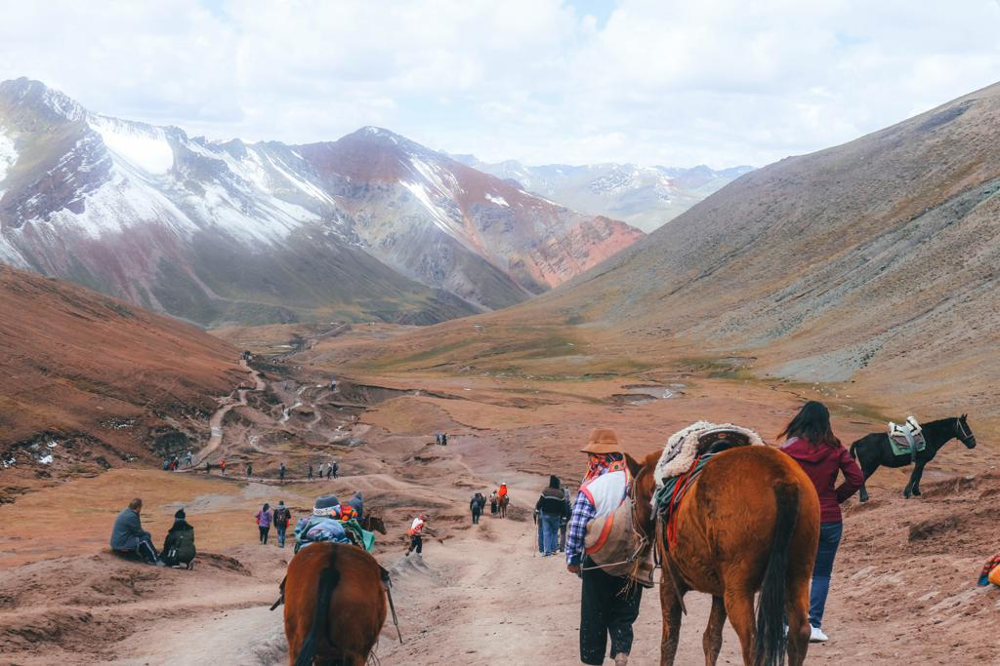
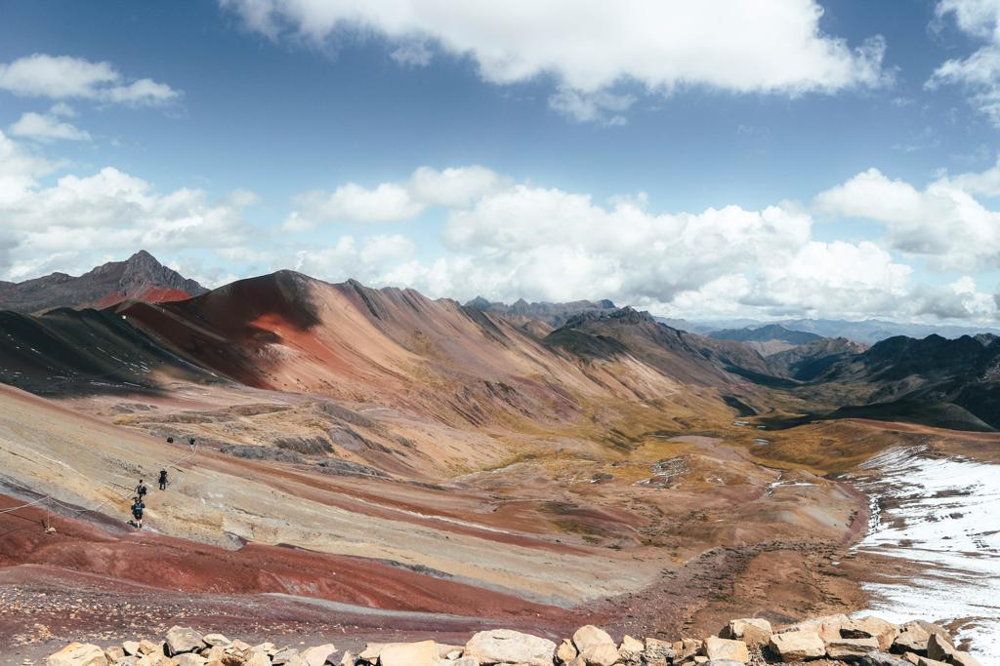
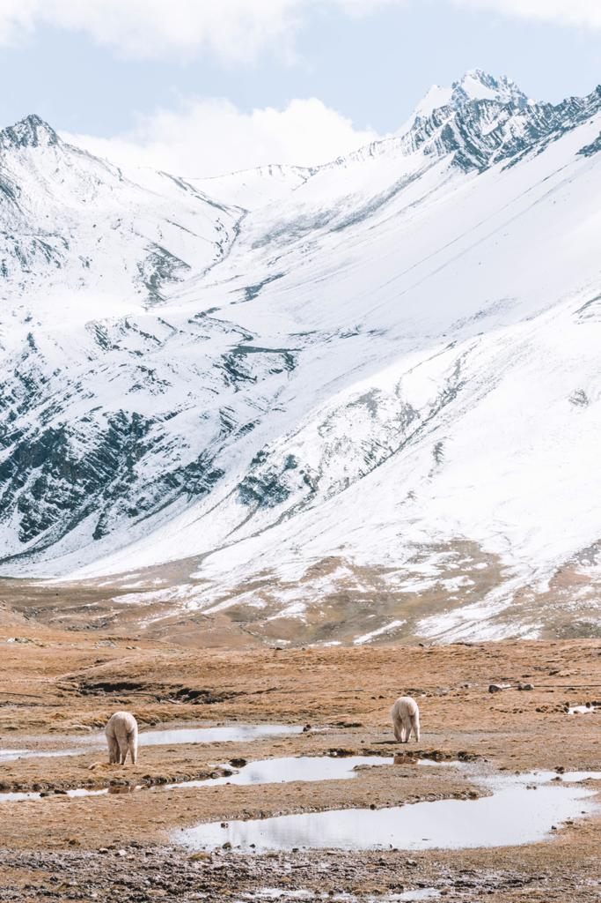

On Monday 30th of April, we went to what is known as Rainbow Mountain. I am not going to lie saying that it was an easy hike to the top. I have read different posts and I have always read so many different opinions about how hard getting to the top could be. I personally think that the hike is less hard than the one to Lago Humantay but way longer. It can take from two to three hours and the weather can change so quickly so don’t be surprised if you get to see the four seasons in one day.

We decided to trust <a href="https://www.salkantaytrekking.com/" target="_blank" rel="noopener noreferrer">Salkantay Trekking Company</a> again as our trip to Lago Humantay was just perfect and unforgettable. These guys are just amazing and they really know how to do their job. Nearly all the tours we saw have an early start in the morning. We got picked up at 3.30 am and after about 2 hours, we got to our first stop for having a good breakfast. What I recommend – especially for the people who just arrived in Cusco/Peru – is chewing some coca leaves and having a coca tea. It really does help people who suffer the altitude a lot and make the hike a bit easier. From the breakfast place, we drove for another hour and a half before getting to the start point. What I love from this tour is that the guide never rushes you and you can feel free to take as much time as you need. It is not a competition and you should just walk at your own pace.

Before starting we took a group photo and our guide was just so funny. 3, 2, 1, everybody says ‘sexy baby llama’! We all laughed and had an amazing start to a day.

I didn’t expect to see so many horses and to see so many people decide to go on a horse instead of trying to walk to the top of the mountain.

One of the guys in our group started feeling sick and the only option was getting a horse. And after only a few minutes, another of our guys started feeling bad and needed oxygen. I never had any problem while all my travels in South America so I didn’t imagine that the altitude could cause so many physical problems.

We started our journey to the top and stopped several times for taking pictures with some sexy llamas and alpacas, and for taking some deep breaths before continuing. Our first stop was after about 15 minutes.

It is such a long walk and one second you feel so warm and the second after you feel like it is winter. But the views around you make you forget about all the efforts you are making. They just leave you completely speechless.

Our guide told us that the day before was snowing! We were lucky enough to have a quite sunny day that allowed you to have the view of such beautiful landscapes.

It took us around 2 hours to get to the top of the Rainbow mountain and only an hour for going back to the start point.

I have read blogs that said that the colors of the mountain are not like the ones that they try to advertise. I have read that most of the pictures we see on Internet are just edited with Photoshop. I was curious and hopeful that after the hard hike, the view would have been breathtaking. And it was. The mountain was very colorful and I have no regrets about the tour. I think the weather can make your day. With bad weather, clouds, and rain, the mountain wouldn’t look as good as it really is. But would I recommend this tour to everybody? I certainly would. I grew up near the Alps and trust me, this mountain is something completely different. You will never see something like this. In any other part of the world.

So, if you want to have such a unique experience and see a rainbow of colors painted on a very high rock, do not hesitate and book <a href="https://www.salkantaytrekking.com/traditional/cusco/rainbow-mountain/" target="_blank" rel="noopener noreferrer">this tour</a>!! You won’t regret it!

